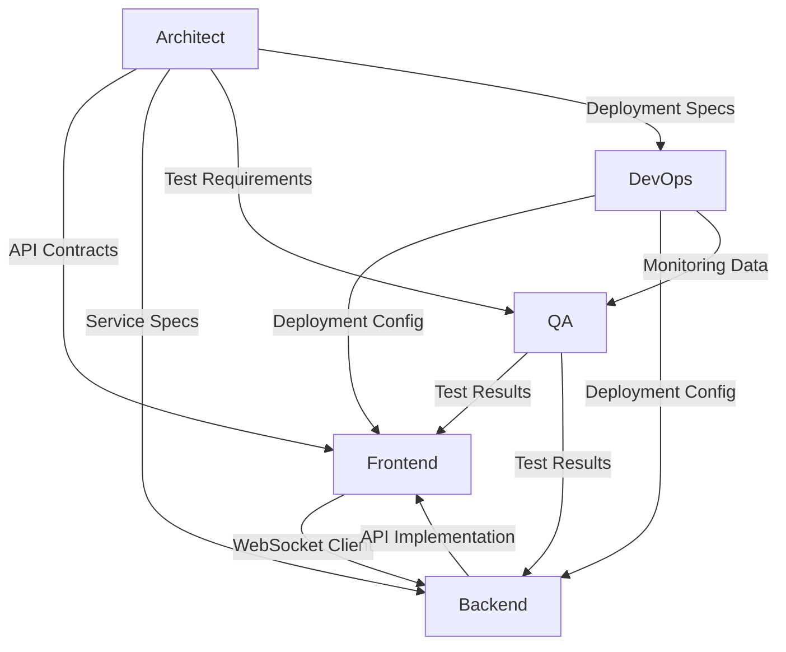

# Hive Mind Task Assignments for Real-Time Collaborative Dashboard

## 🐝 Swarm Coordination Plan

This document contains specific task assignments for each worker agent in the Hive Mind swarm. Each agent should coordinate through the shared memory system.

### Memory Coordination Protocol
- **Check assignments**: `npx claude-flow@alpha memory query "swarm/architect/assignments"`
- **Report progress**: `npx claude-flow@alpha memory store "swarm/[agent]/progress" "{status}"`
- **Share findings**: `npx claude-flow@alpha memory store "swarm/[agent]/decisions" "{decisions}"`

---

## 👷 Frontend Developer Agent Tasks

### Primary Objectives
1. **Implement WebSocket Provider System**
   - Create `WebSocketProvider.tsx` with automatic reconnection
   - Implement connection state management with Zustand
   - Add exponential backoff for reconnection attempts
   - Handle authentication token refresh on reconnect

2. **Build Collaborative Editor Components**
   - Implement `CollaborativeEditor.tsx` with Y.js integration
   - Create `CursorOverlay.tsx` for real-time cursor tracking
   - Build `SelectionOverlay.tsx` for multi-user selections
   - Add `PresenceList.tsx` showing active users

3. **Develop Dashboard Layout System**
   - Create responsive `GridLayout.tsx` with drag-and-drop
   - Implement `WidgetContainer.tsx` with resize handles
   - Build `DashboardCanvas.tsx` with infinite scroll
   - Add touch support for mobile devices

4. **Implement State Synchronization**
   - Create `useCollaboration` hook for operation handling
   - Build `usePresence` hook for cursor/selection tracking
   - Implement optimistic updates with rollback
   - Add conflict resolution UI components

### Technical Requirements
```typescript
// WebSocket connection configuration
const wsConfig = {
  url: process.env.NEXT_PUBLIC_WS_URL,
  reconnectInterval: 1000,
  maxReconnectInterval: 30000,
  reconnectDecay: 1.5,
  timeoutInterval: 2000,
  enableCompression: true
};

// Component performance budgets
const performanceBudgets = {
  cursorUpdateDebounce: 60, // ms
  selectionUpdateDebounce: 100, // ms
  operationBatchWindow: 50, // ms
  renderBudget: 16.67 // ms (60 FPS)
};
```

---

## 🔧 Backend Developer Agent Tasks

### Primary Objectives
1. **Implement WebSocket Gateway**
   - Create scalable WebSocket server with uWebSockets.js
   - Implement sticky session routing for load balancing
   - Add connection pooling and management
   - Build heartbeat/ping-pong system

2. **Build Operation Processing Engine**
   - Implement Operational Transformation algorithm
   - Create operation queue with priority handling
   - Build transformation matrix for concurrent ops
   - Add operation validation and sanitization

3. **Develop Synchronization Service**
   - Implement checkpoint creation system
   - Build version control for document states
   - Create efficient diff/patch algorithms
   - Add data compression for large documents

4. **Create Presence Management System**
   - Build real-time presence tracking
   - Implement awareness protocol
   - Add presence garbage collection
   - Create presence persistence for recovery

### Technical Implementation
```typescript
// WebSocket server configuration
const serverConfig = {
  port: process.env.WS_PORT || 3001,
  perMessageDeflate: {
    zlibDeflateOptions: {
      level: 1,
      memLevel: 8,
      strategy: 0
    },
    threshold: 1024
  },
  maxPayloadLength: 16 * 1024 * 1024, // 16MB
  idleTimeout: 60,
  compression: 1
};

// Operation processing pipeline
class OperationProcessor {
  async process(operation: Operation): Promise<TransformedOperation> {
    // 1. Validate operation
    // 2. Check version compatibility
    // 3. Transform against concurrent ops
    // 4. Apply to document state
    // 5. Broadcast to clients
    // 6. Persist to database
  }
}
```

---

## 🧪 QA Engineer Agent Tasks

### Primary Objectives
1. **Implement E2E Testing Suite**
   - Create Playwright tests for multi-user scenarios
   - Test cursor synchronization across browsers
   - Verify conflict resolution mechanisms
   - Test connection failure and recovery

2. **Build Load Testing Framework**
   - Implement k6 scripts for WebSocket load testing
   - Simulate 1000+ concurrent users
   - Test operation processing under load
   - Measure latency distribution

3. **Create Integration Tests**
   - Test WebSocket gateway failover
   - Verify Redis pub/sub message delivery
   - Test database transaction integrity
   - Validate authentication flows

4. **Develop Performance Benchmarks**
   - Measure operation round-trip time
   - Track memory usage patterns
   - Monitor CPU utilization
   - Benchmark synchronization speed

### Test Scenarios
```typescript
// Critical test scenarios
const testScenarios = [
  {
    name: "Concurrent editing conflict",
    users: 5,
    operations: 1000,
    expectedBehavior: "All operations converge to same state"
  },
  {
    name: "Mass disconnect/reconnect",
    users: 100,
    disconnectPercent: 50,
    expectedBehavior: "State recovery within 5 seconds"
  },
  {
    name: "Network partition",
    duration: 30000, // 30 seconds
    expectedBehavior: "Automatic reconciliation on rejoin"
  }
];
```

---

## 🚀 DevOps Engineer Agent Tasks

### Primary Objectives
1. **Implement Kubernetes Deployment**
   - Create Helm charts for all services
   - Configure horizontal pod autoscaling
   - Set up pod disruption budgets
   - Implement rolling update strategies

2. **Build CI/CD Pipeline**
   - Create GitHub Actions workflows
   - Implement automated testing gates
   - Set up ArgoCD for GitOps deployment
   - Add rollback mechanisms

3. **Configure Monitoring Stack**
   - Deploy Prometheus for metrics collection
   - Create Grafana dashboards for real-time monitoring
   - Implement Jaeger for distributed tracing
   - Set up alerting rules and PagerDuty integration

4. **Implement Infrastructure as Code**
   - Create Terraform modules for cloud resources
   - Build Redis cluster configuration
   - Set up PostgreSQL with replication
   - Configure CDN and load balancers

### Infrastructure Requirements
```yaml
# Kubernetes resource requirements
resources:
  websocket-gateway:
    replicas: 3-10  # HPA controlled
    cpu: 2000m
    memory: 4Gi
    
  backend-services:
    replicas: 2-5   # Per service
    cpu: 1000m
    memory: 2Gi
    
  redis:
    mode: cluster
    nodes: 6
    memory: 8Gi
    
  postgresql:
    primary: 1
    readReplicas: 2
    storage: 100Gi
```

---

## 📊 Coordination Timeline

### Phase 1: Foundation (Days 1-3)
- Frontend: WebSocket provider and basic components
- Backend: Gateway implementation and basic operations
- QA: Test environment setup
- DevOps: Local development environment

### Phase 2: Core Features (Days 4-7)
- Frontend: Collaborative editor and presence
- Backend: OT engine and synchronization
- QA: Integration test suite
- DevOps: Kubernetes deployment

### Phase 3: Scale & Polish (Days 8-10)
- Frontend: Performance optimization
- Backend: Scaling and caching
- QA: Load testing and benchmarks
- DevOps: Monitoring and alerting

### Phase 4: Production Ready (Days 11-14)
- All agents: Bug fixes and optimization
- QA: Final test passes
- DevOps: Production deployment
- Architect: Final review and documentation

---

## 🔄 Inter-Agent Dependencies



---

## 📝 Success Criteria

### Frontend Success Metrics
- Sub-100ms cursor update latency
- 60 FPS during active collaboration
- < 3 second initial load time
- Zero UI freezes during sync

### Backend Success Metrics
- < 50ms operation processing time
- Support 1000+ concurrent connections per instance
- 99.9% uptime availability
- < 1% conflict rate

### QA Success Metrics
- 100% E2E test coverage for critical paths
- All load tests passing at 2x expected load
- Zero data loss scenarios
- < 0.1% error rate in production

### DevOps Success Metrics
- < 5 minute deployment time
- Zero-downtime deployments
- < 1 minute incident detection
- Automatic scaling response < 30 seconds

---

## 🐝 Hive Mind Coordination

Remember to:
1. Check memory for updates: `npx claude-flow@alpha memory query "swarm/*"`
2. Store progress regularly: `npx claude-flow@alpha memory store "swarm/[agent]/progress"`
3. Coordinate through shared memory, not direct communication
4. Follow the Queen's (Architect's) guidance and architectural decisions

Let's build an amazing real-time collaborative dashboard together! 🚀