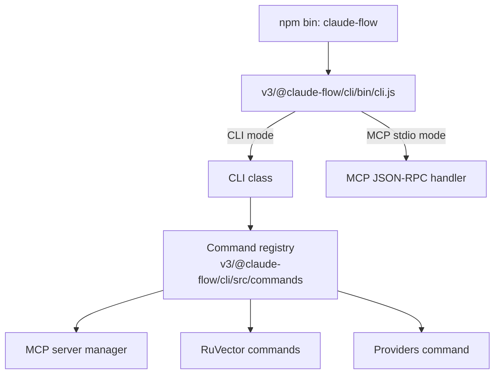
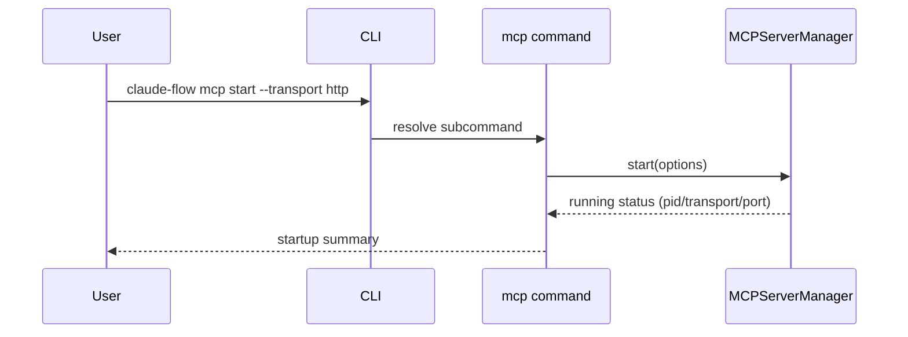

# Claude Flow


## Mission

Claude Flow is a CLI-first codebase for orchestrating multi-agent workflows and MCP tools in Node.js/TypeScript. The repository currently combines modular V3 packages under `v3/@claude-flow/*` with legacy integration code under `v3/src`.

## Tech Stack

- Node.js (declared `>=20` at root)
- TypeScript
- Vitest
- npm + pnpm workspace metadata
- GitHub Actions workflows (`ci.yml`, `v3-ci.yml`)
- Docker Compose assets for RuVector PostgreSQL setup

## Features (Implemented Today)

- CLI command registry with eager and lazy command loading.
- MCP server management command surface: `start`, `stop`, `status`, `health`, `restart`, `tools`, `toggle`, `exec`, `logs`.
- MCP stdio mode with JSON-RPC handling (`initialize`, `tools/list`, `tools/call`, `ping`).
- RuVector helper commands: `setup`, `import`, `init`, `migrate`, `status`, `benchmark`, `optimize`, `backup`.
- Multi-provider abstraction modules (Anthropic, OpenAI, Google, Cohere, Ollama, RuVector).
- Plugin SDK packages and plugin implementations under `v3/plugins/*`.

## Architecture





## Getting Started

### Prerequisites

- Node.js 20+
- npm

### Local CLI Build (required before running `bin/cli.js`)

```bash
cd v3/@claude-flow/cli
npm install
npm run build
node bin/cli.js --help
```

### MCP and RuVector Commands

```bash
# From v3/@claude-flow/cli after build
node bin/cli.js mcp status
node bin/cli.js mcp start --transport stdio
node bin/cli.js ruvector setup --output ./ruvector-postgres
```

### Workspace Tests (scripts available in `/v3`)

```bash
cd v3
npm run test:integration:mcp
npm run test:integration:plugin
```

## API Overview

### CLI Surface

- Core orchestration commands include `agent`, `swarm`, `task`, `session`, `memory`, `workflow`, `hive-mind`.
- MCP and provider operations are exposed via `mcp` and `providers` command groups.
- RuVector operations are exposed via the `ruvector` command group.

### MCP RPC Methods (stdio mode)

- `initialize`
- `tools/list`
- `tools/call`
- `ping`

## Roadmap (Future)

- Remove stale root scripts that reference missing entrypoints.
- Align documentation claims with automated doc-vs-code checks.
- Replace scaffolded plugin handlers with fully implemented domain logic.
- Consolidate legacy `v3/src` and modular `v3/@claude-flow/*` boundaries.

## Implementation Status

- Overall status: `Partially Implemented`.
- Primary runnable entrypoint is the V3 CLI package build (`v3/@claude-flow/cli`).
- QE and Coherence plugin domains expose real interfaces plus scaffold behavior.

## Evidence

- CLI binary mapping: `package.json:7`, `package.json:8`
- CLI runtime behavior: `v3/@claude-flow/cli/bin/cli.js:15`, `v3/@claude-flow/cli/bin/cli.js:146`
- Command registry and lazy loading: `v3/@claude-flow/cli/src/commands/index.ts:32`, `v3/@claude-flow/cli/src/commands/index.ts:63`
- MCP command surface: `v3/@claude-flow/cli/src/commands/mcp.ts:747`, `v3/@claude-flow/cli/src/commands/mcp.ts:750`
- MCP transport options: `v3/@claude-flow/cli/src/commands/mcp.ts:70`, `v3/@claude-flow/cli/src/commands/mcp.ts:75`
- RuVector command surface: `v3/@claude-flow/cli/src/commands/ruvector/index.ts:36`, `v3/@claude-flow/cli/src/commands/ruvector/index.ts:45`
- RuVector setup file generation: `v3/@claude-flow/cli/src/commands/ruvector/setup.ts:739`, `v3/@claude-flow/cli/src/commands/ruvector/setup.ts:750`
- Provider modules and initialization surface: `v3/@claude-flow/providers/src/provider-manager.ts:117`, `v3/@claude-flow/providers/src/provider-manager.ts:129`
- Claude Opus 4.6 provider support: `v3/@claude-flow/providers/src/anthropic-provider.ts:61`, `v3/@claude-flow/providers/src/anthropic-provider.ts:77`
- CI workflows: `.github/workflows/ci.yml:3`, `.github/workflows/v3-ci.yml:6`

## Known Limitations

- `v3/@claude-flow/cli/bin/*.js` imports `../dist/src/*`; `dist` is not committed by default.
- Root workflow compatibility scripts are lightweight wrappers and may no-op when package-level suites are unavailable.
- Some command outputs are demonstrative rather than telemetry-backed (for example provider usage tables).
- Performance numbers found in comments/templates are not validated in-repo benchmarks.

## Contributing

See [CONTRIBUTING.md](CONTRIBUTING.md).

## License

MIT, see [LICENSE](LICENSE).
