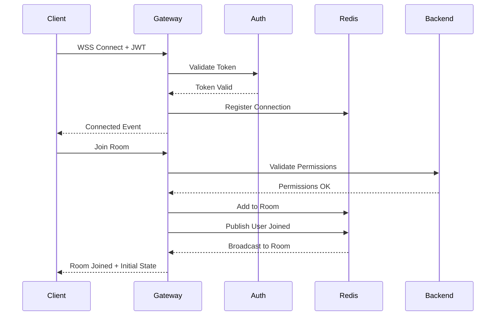

# WebSocket Protocol Specification

## Protocol Overview

This document defines the WebSocket protocol for the real-time collaborative dashboard system.

### Connection Lifecycle



## Message Format

### Base Message Structure
```typescript
interface WebSocketMessage {
  // Message metadata
  id: string;              // UUID v4
  type: MessageType;       // Event type enum
  version: number;         // Protocol version (currently 1)
  timestamp: number;       // Unix timestamp in ms
  
  // Authentication
  sessionId?: string;      // Optional session ID
  
  // Payload
  payload: any;           // Type-specific payload
  
  // Optional fields
  roomId?: string;        // Target room/dashboard
  targetUserId?: string;  // For direct messages
  acknowledgment?: boolean; // Requires ACK
}
```

### Message Types

#### Client → Server Messages

```typescript
// Connection Management
interface ConnectMessage {
  type: 'connect';
  payload: {
    token: string;        // JWT auth token
    deviceId: string;     // Unique device identifier
    clientVersion: string; // Client app version
  };
}

interface JoinRoomMessage {
  type: 'join_room';
  payload: {
    roomId: string;       // Dashboard/document ID
    lastSyncVersion?: number; // For state recovery
  };
}

// Collaboration Messages
interface CursorMoveMessage {
  type: 'cursor_move';
  payload: {
    x: number;            // Cursor X position
    y: number;            // Cursor Y position
    viewportX: number;    // Viewport X offset
    viewportY: number;    // Viewport Y offset
    timestamp: number;    // Client timestamp
  };
}

interface SelectionChangeMessage {
  type: 'selection_change';
  payload: {
    ranges: SelectionRange[]; // Selected ranges
    color: string;           // User's selection color
  };
}

interface OperationMessage {
  type: 'operation';
  payload: {
    operation: Operation;    // OT operation
    version: number;         // Document version
    checksum?: string;       // Optional checksum
  };
}
```

#### Server → Client Messages

```typescript
// Connection Events
interface ConnectedMessage {
  type: 'connected';
  payload: {
    connectionId: string;
    userId: string;
    serverTime: number;
    protocol: number;
  };
}

interface RoomJoinedMessage {
  type: 'room_joined';
  payload: {
    roomId: string;
    participants: Participant[];
    documentState: DocumentState;
    version: number;
  };
}

// Collaboration Events
interface PresenceUpdateMessage {
  type: 'presence_update';
  payload: {
    userId: string;
    presence: PresenceData;
    timestamp: number;
  };
}

interface OperationBroadcastMessage {
  type: 'operation_broadcast';
  payload: {
    operation: Operation;
    userId: string;
    version: number;
    transformedVersion: number;
  };
}

// System Events
interface ErrorMessage {
  type: 'error';
  payload: {
    code: ErrorCode;
    message: string;
    details?: any;
    recoverable: boolean;
  };
}
```

## Binary Protocol for Performance

For high-frequency updates (cursor movements), use binary frames:

```
Binary Frame Structure (Big Endian):
[0-1]   uint16  Message Type (0x01 = cursor, 0x02 = selection)
[2-5]   uint32  User ID
[6-9]   float32 X Position
[10-13] float32 Y Position
[14-17] uint32  Timestamp
[18-21] float32 Viewport X (optional)
[22-25] float32 Viewport Y (optional)
```

## Compression

### Per-Message Deflate Configuration
```javascript
const compressionOptions = {
  threshold: 1024,          // Compress messages > 1KB
  level: 1,                 // Fast compression
  memLevel: 8,
  strategy: 0,              // Default strategy
  concurrencyLimit: 10
};
```

## Error Handling

### Error Codes
```typescript
enum ErrorCode {
  // Connection Errors (1xxx)
  INVALID_TOKEN = 1001,
  CONNECTION_LIMIT = 1002,
  RATE_LIMIT = 1003,
  
  // Room Errors (2xxx)
  ROOM_NOT_FOUND = 2001,
  ROOM_FULL = 2002,
  NO_PERMISSION = 2003,
  
  // Operation Errors (3xxx)
  INVALID_OPERATION = 3001,
  VERSION_MISMATCH = 3002,
  CHECKSUM_FAILED = 3003,
  
  // System Errors (5xxx)
  INTERNAL_ERROR = 5001,
  SERVICE_UNAVAILABLE = 5002
}
```

### Reconnection Protocol
```typescript
interface ReconnectionFlow {
  1. Client detects disconnect
  2. Wait (backoff algorithm)
  3. Attempt reconnect with:
     - Previous connectionId
     - Last known version
     - Pending operations
  4. Server responds with:
     - Recovery possible: Send missed operations
     - Recovery impossible: Full sync required
}
```

## Security Considerations

### Authentication
- JWT tokens in connection headers
- Token refresh on reconnection
- Session validation every 5 minutes

### Rate Limiting
```typescript
const rateLimits = {
  cursorUpdates: 60,        // per second
  operations: 30,           // per second
  connections: 5,           // per user
  rooms: 10                 // per user
};
```

### Input Validation
- All messages validated against schema
- Operation size limits (max 1MB)
- Sanitize user-generated content
- Prevent script injection

## Performance Optimizations

### Message Batching
```typescript
// Batch multiple operations in a single frame
interface BatchMessage {
  type: 'batch';
  payload: {
    messages: WebSocketMessage[];
    compressed: boolean;
  };
}
```

### Debouncing
- Cursor updates: 16.67ms (60 FPS)
- Selection changes: 100ms
- Presence updates: 500ms

### Caching
- Cache user profiles
- Cache room participants
- Cache recent operations

## Monitoring & Telemetry

### Metrics to Track
```typescript
interface ConnectionMetrics {
  latency: number;          // Round-trip time
  messageRate: number;      // Messages per second
  errorRate: number;        // Errors per minute
  reconnections: number;    // Reconnection count
  bandwidth: {
    inbound: number;        // Bytes per second
    outbound: number;       // Bytes per second
  };
}
```

### Health Check Protocol
```typescript
// Ping-Pong for connection health
interface PingMessage {
  type: 'ping';
  payload: {
    timestamp: number;
  };
}

interface PongMessage {
  type: 'pong';
  payload: {
    timestamp: number;
    serverTime: number;
  };
}
```

## Client Libraries

### JavaScript/TypeScript SDK
```typescript
class CollaborativeClient {
  constructor(config: ClientConfig);
  
  connect(): Promise<void>;
  disconnect(): void;
  
  joinRoom(roomId: string): Promise<Room>;
  leaveRoom(roomId: string): void;
  
  on(event: string, handler: Function): void;
  off(event: string, handler: Function): void;
  
  sendOperation(operation: Operation): Promise<void>;
  updateCursor(position: Position): void;
  updateSelection(ranges: Range[]): void;
}
```

### React Hooks
```typescript
// Usage in React components
function CollaborativeEditor() {
  const { client, connected, error } = useWebSocket();
  const { cursor, selection } = usePresence(client);
  const { document, version } = useDocument(client);
  
  return (
    <Editor
      onCursorMove={cursor.update}
      onSelectionChange={selection.update}
      onContentChange={document.update}
    />
  );
}
```