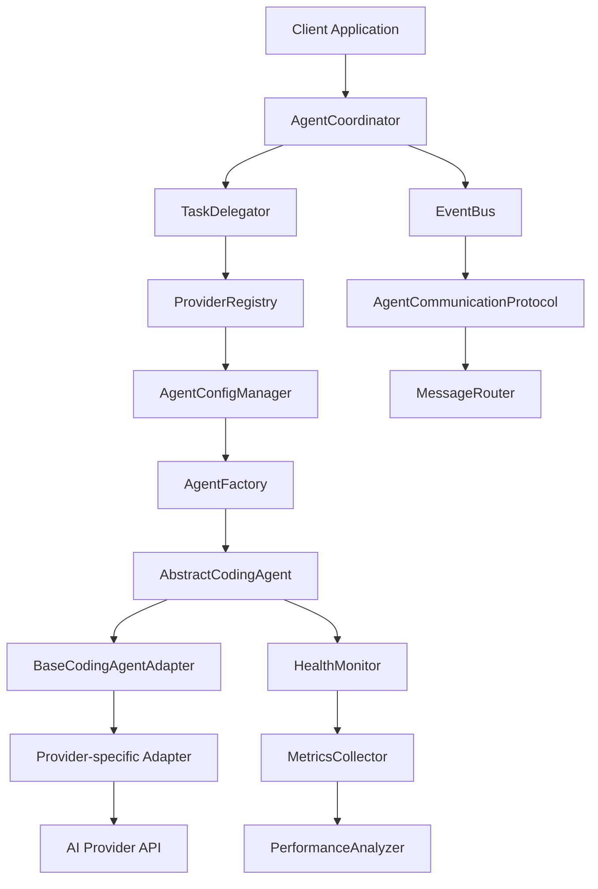

# Subagents Integration Documentation

## Overview

The Subagents Integration system enables running subagents with any coding agents like Codex, Cursor-agent, Gemini, Claude Code and others through a unified interface. This documentation provides everything needed to understand, implement, and integrate the subagents system.

## Core Documentation

### 📋 [Requirements](./REQUIREMENTS.md)
**What the system must do**
- Functional requirements for multi-provider AI agent support
- Non-functional requirements for performance, security, and reliability
- Use cases and acceptance criteria
- Constraints and dependencies

### 🔧 [Specifications](./SPECIFICATIONS.md)
**How the system works technically**
- Interface specifications and data models
- Communication protocols and event types
- Configuration schemas and validation
- Error handling and performance specifications
- Integration specifications with Claude-Flow

### 🎯 [Steering Document](./STEERING.md)
**Why and how to implement**
- Architecture decisions and rationale
- Design principles and integration guidelines
- Implementation best practices and standards
- Code organization and testing guidelines
- Standards and conventions

## Quick Start

### 1. Installation
```bash
npm install @claude-flow/abstract-agents
```

### 2. Basic Usage
```typescript
import { AgentCoordinator, ClaudeCodeAgentAdapter } from '@claude-flow/abstract-agents';

// Create coordinator
const coordinator = new AgentCoordinator();

// Create agent
const agent = new ClaudeCodeAgentAdapter('claude-1', {
  provider: 'anthropic-claude-code',
  authentication: {
    type: 'api_key',
    credentials: { apiKey: process.env.ANTHROPIC_API_KEY }
  }
});

// Register agent
await coordinator.registerAgent(agent);

// Execute task
const result = await coordinator.executeTask({
  type: 'code_generation',
  description: 'Generate a React component',
  requirements: { language: 'typescript', framework: 'react' }
});
```

### 3. Multi-Agent Coordination
```typescript
// Create multiple agents
const agents = await Promise.all([
  coordinator.createAgent('claude-1', 'anthropic-claude-code'),
  coordinator.createAgent('codex-1', 'openai-codex'),
  coordinator.createAgent('gemini-1', 'google-gemini')
]);

// Register all agents
await Promise.all(agents.map(agent => coordinator.registerAgent(agent)));

// Execute task with coordination
const result = await coordinator.coordinateTask({
  strategy: 'parallel',
  participants: ['claude-1', 'codex-1', 'gemini-1'],
  task: {
    type: 'code_review',
    description: 'Review the authentication implementation',
    requirements: { language: 'typescript' }
  }
});
```

## Key Features

### 🌟 Multi-Provider Support
- **Anthropic Claude Code**: Advanced coding assistance
- **OpenAI Codex**: Code generation and completion
- **Google Gemini**: Multimodal AI assistance
- **Cursor AI**: Intelligent code editing
- **Extensible**: Easy to add new providers

### 🔄 Coordination Strategies
- **Sequential**: Tasks executed in order
- **Parallel**: Tasks executed simultaneously
- **Pipeline**: Tasks executed in stages
- **Consensus**: Agents vote on decisions
- **Voting**: Majority rule decision making
- **Hierarchical**: Centralized decision making
- **Peer-to-peer**: Distributed decision making

### ⚡ Performance Features
- **Load Balancing**: Intelligent task distribution
- **Fault Tolerance**: Automatic fallback mechanisms
- **Caching**: Multi-level caching strategies
- **Monitoring**: Real-time performance monitoring
- **Scaling**: Horizontal and vertical scaling

### 🔒 Security Features
- **Authentication**: Multi-factor authentication
- **Authorization**: Role-based access control
- **Encryption**: Data encryption at rest and in transit
- **Audit Logging**: Comprehensive security event logging
- **Compliance**: GDPR, SOC 2, ISO 27001 compliance

## Architecture Overview



## File Structure

```
src/abstract-agents/
├── interfaces/
│   ├── abstract-coding-agent.ts      # Core agent interfaces
│   ├── agent-communication.ts        # Communication protocols
│   ├── task-definitions.ts           # Task specifications
│   └── result-formats.ts             # Standardized results
├── adapters/
│   ├── base-adapter.ts               # Base adapter class
│   ├── claude-code-adapter.ts        # Claude Code adapter
│   └── codex-adapter.ts              # OpenAI Codex adapter
├── coordination/
│   ├── agent-coordinator.ts          # Multi-agent coordination
│   └── task-delegator.ts             # Task delegation system
└── configuration/
    ├── agent-config-manager.ts       # Configuration management
    └── provider-registry.ts           # Provider registry
```

## Benefits

### 🎯 Provider Agnostic
- Easy to switch between different AI providers
- Consistent interface regardless of underlying provider
- Cost optimization through provider comparison

### 🚀 Performance
- Intelligent task delegation and load balancing
- Fault tolerance with automatic fallback
- High throughput and low latency

### 🔧 Extensibility
- Simple to add new providers and capabilities
- Plugin-like architecture for easy extension
- Comprehensive configuration management

### 🛡️ Reliability
- Comprehensive error handling and recovery
- Health monitoring and alerting
- High availability and fault tolerance

### 🔒 Security
- Built-in security from the ground up
- Comprehensive audit logging
- Compliance with industry standards

## Detailed Documentation

For comprehensive implementation details, see the [detailed documentation](./detailed/):

- **[API Documentation](./detailed/API.md)** - Complete API reference with examples
- **[Architecture Design](./detailed/ARCHITECTURE.md)** - Detailed architecture and design decisions
- **[Deployment Guide](./detailed/DEPLOYMENT.md)** - Complete deployment and configuration guide
- **[Integration Guide](./detailed/INTEGRATION.md)** - Comprehensive integration patterns
- **[Migration Guide](./detailed/MIGRATION.md)** - Migration strategies and procedures
- **[Performance Guide](./detailed/PERFORMANCE.md)** - Performance optimization and monitoring
- **[Security Guide](./detailed/SECURITY.md)** - Security best practices and compliance
- **[Testing Guide](./detailed/TESTING.md)** - Comprehensive testing strategies

## Getting Help

### 📚 Documentation
- [Requirements](./REQUIREMENTS.md) - System requirements
- [Specifications](./SPECIFICATIONS.md) - Technical specifications
- [Steering Document](./STEERING.md) - Architecture and implementation guidance
- [Detailed Documentation](./detailed/) - Comprehensive implementation guides

### 🆘 Support
- **Issues**: [GitHub Issues](https://github.com/ruvnet/claude-flow/issues)
- **Discussions**: [GitHub Discussions](https://github.com/ruvnet/claude-flow/discussions)
- **Documentation**: [Claude-Flow Docs](https://github.com/ruvnet/claude-flow)

### 🤝 Contributing
- **Contributing Guide**: [CONTRIBUTING.md](https://github.com/ruvnet/claude-flow/CONTRIBUTING.md)
- **Code of Conduct**: [CODE_OF_CONDUCT.md](https://github.com/ruvnet/claude-flow/CODE_OF_CONDUCT.md)

## Version History

| Version | Date | Author | Changes |
|---------|------|--------|---------|
| 1.0.0 | 2024-01-XX | System Architect | Initial documentation release |

## License

This project is licensed under the MIT License - see the [LICENSE](https://github.com/ruvnet/claude-flow/LICENSE) file for details.

---

**Subagents Integration** - Enabling seamless multi-provider AI coding agent coordination through a unified interface.