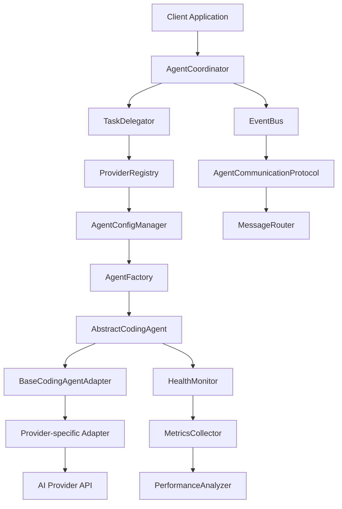

# Abstract Subagent Architecture Documentation

## Overview

The Abstract Subagent Architecture enables running subagents with any coding agents like Codex, Cursor-agent, Gemini, Claude Code and others through a unified interface. This comprehensive documentation provides everything needed to understand, implement, and deploy the system.

## Documentation Structure

### 📋 Core Documentation

#### [Requirements Document](./REQUIREMENTS.md)
Comprehensive functional and non-functional requirements for the Abstract Subagent Architecture.
- **Functional Requirements**: Multi-provider support, unified interface, task delegation, coordination
- **Non-Functional Requirements**: Performance, scalability, reliability, security
- **Use Cases**: Multi-provider code generation, load balancing, fault tolerance
- **Constraints and Assumptions**: System limitations and dependencies

#### [Technical Specifications](./SPECIFICATIONS.md)
Detailed technical specifications and API documentation.
- **Interface Specifications**: Core interfaces and data models
- **Communication Protocols**: Event-driven communication patterns
- **Configuration Specifications**: Agent and provider configuration schemas
- **Error Handling**: Comprehensive error handling strategies
- **Performance Specifications**: Performance targets and metrics

#### [Architecture Design Document](./ARCHITECTURE.md)
Architecture overview with design decisions and principles.
- **Design Principles**: Provider agnostic, extensibility, fault tolerance
- **Architecture Decisions**: ADRs with rationale and consequences
- **Component Architecture**: Core components and interactions
- **Integration Architecture**: Claude-Flow integration points
- **Security Architecture**: Multi-layered security approach

### 🔧 Implementation Guides

#### [API Documentation](./API.md)
Complete API documentation with examples and SDKs.
- **Authentication and Authorization**: Multi-factor authentication
- **Core API Interfaces**: AbstractCodingAgent, AgentCoordinator, TaskDelegator
- **Data Models**: CodingTask, CodingResult, AgentCapabilities
- **API Endpoints**: RESTful API with comprehensive examples
- **SDK Documentation**: TypeScript and Python SDKs

#### [Integration Guide](./INTEGRATION.md)
Comprehensive integration guide for Claude-Flow.
- **Claude-Flow Integration Points**: Event Bus, Memory System, Configuration
- **Integration Patterns**: Adapter, Observer, Strategy, Factory patterns
- **Migration Path**: Step-by-step migration from existing systems
- **Best Practices**: Configuration, error handling, performance optimization
- **Troubleshooting**: Common issues and solutions

### 🧪 Testing and Quality

#### [Testing Strategy](./TESTING.md)
Comprehensive testing strategy and frameworks.
- **Testing Pyramid**: Unit tests (70%), Integration tests (20%), E2E tests (10%)
- **Testing Frameworks**: Jest, Mocha, Chai, Sinon, Supertest
- **Unit Testing**: Agent interfaces, adapters, configuration
- **Integration Testing**: Provider integration, multi-agent coordination
- **Performance Testing**: Load testing, stress testing, benchmarks

### 🚀 Deployment and Operations

#### [Deployment Guide](./DEPLOYMENT.md)
Complete deployment and configuration guide.
- **Installation Methods**: NPM, Docker, Kubernetes
- **Configuration**: Environment-specific configurations
- **Deployment Strategies**: Single instance, multi-instance, distributed
- **Monitoring and Observability**: Prometheus, Grafana, logging
- **Security Configuration**: SSL/TLS, firewall, authentication

#### [Performance Requirements](./PERFORMANCE.md)
Performance requirements and optimization strategies.
- **Performance Requirements**: Response times, throughput, scalability
- **Performance Benchmarks**: Baseline and load testing benchmarks
- **Optimization Strategies**: Caching, asynchronous processing, resource optimization
- **Performance Monitoring**: Metrics collection and dashboards
- **Performance Testing**: Load testing, stress testing, optimization guidelines

### 🔒 Security and Compliance

#### [Security Best Practices](./SECURITY.md)
Comprehensive security requirements and best practices.
- **Authentication and Authorization**: Multi-factor authentication, RBAC
- **Data Protection**: Encryption standards, data classification
- **Network Security**: HTTPS, certificate management, firewall
- **Security Implementation**: JWT management, API key management, encryption
- **Security Compliance**: GDPR, SOC 2, ISO 27001, NIST framework

### 🔄 Migration and Maintenance

#### [Migration Guide](./MIGRATION.md)
Complete migration guide for existing systems.
- **Migration Strategies**: Big bang, gradual, parallel, strangler fig
- **Pre-Migration Assessment**: System analysis, risk assessment
- **Migration Planning**: Timeline, checklist, implementation
- **Testing and Validation**: Parallel testing, data validation
- **Rollback Procedures**: Automated and manual rollback strategies

## Quick Start

### 1. Installation
```bash
# Install globally
npm install -g @claude-flow/abstract-agents

# Or install locally
npm install @claude-flow/abstract-agents
```

### 2. Basic Usage
```typescript
import { AgentCoordinator, ClaudeCodeAgentAdapter } from '@claude-flow/abstract-agents';

// Create coordinator
const coordinator = new AgentCoordinator();

// Create agent
const agent = new ClaudeCodeAgentAdapter('claude-1', {
  provider: 'anthropic-claude-code',
  authentication: {
    type: 'api_key',
    credentials: { apiKey: process.env.ANTHROPIC_API_KEY }
  }
});

// Register agent
await coordinator.registerAgent(agent);

// Execute task
const result = await coordinator.executeTask({
  type: 'code_generation',
  description: 'Generate a React component',
  requirements: { language: 'typescript', framework: 'react' }
});
```

### 3. Multi-Agent Coordination
```typescript
// Create multiple agents
const agents = await Promise.all([
  coordinator.createAgent('claude-1', 'anthropic-claude-code'),
  coordinator.createAgent('codex-1', 'openai-codex'),
  coordinator.createAgent('gemini-1', 'google-gemini')
]);

// Register all agents
await Promise.all(agents.map(agent => coordinator.registerAgent(agent)));

// Execute task with coordination
const result = await coordinator.coordinateTask({
  strategy: 'parallel',
  participants: ['claude-1', 'codex-1', 'gemini-1'],
  task: {
    type: 'code_review',
    description: 'Review the authentication implementation',
    requirements: { language: 'typescript' }
  }
});
```

## Key Features

### 🌟 Multi-Provider Support
- **Anthropic Claude Code**: Advanced coding assistance
- **OpenAI Codex**: Code generation and completion
- **Google Gemini**: Multimodal AI assistance
- **Cursor AI**: Intelligent code editing
- **Extensible**: Easy to add new providers

### 🔄 Coordination Strategies
- **Sequential**: Tasks executed in order
- **Parallel**: Tasks executed simultaneously
- **Pipeline**: Tasks executed in stages
- **Consensus**: Agents vote on decisions
- **Voting**: Majority rule decision making
- **Hierarchical**: Centralized decision making
- **Peer-to-peer**: Distributed decision making

### ⚡ Performance Features
- **Load Balancing**: Intelligent task distribution
- **Fault Tolerance**: Automatic fallback mechanisms
- **Caching**: Multi-level caching strategies
- **Monitoring**: Real-time performance monitoring
- **Scaling**: Horizontal and vertical scaling

### 🔒 Security Features
- **Authentication**: Multi-factor authentication
- **Authorization**: Role-based access control
- **Encryption**: Data encryption at rest and in transit
- **Audit Logging**: Comprehensive security event logging
- **Compliance**: GDPR, SOC 2, ISO 27001 compliance

## Architecture Overview



## File Structure

```
src/abstract-agents/
├── interfaces/
│   ├── abstract-coding-agent.ts      # Core agent interfaces
│   ├── agent-communication.ts        # Communication protocols
│   ├── task-definitions.ts           # Task specifications
│   └── result-formats.ts             # Standardized results
├── adapters/
│   ├── base-adapter.ts               # Base adapter class
│   ├── claude-code-adapter.ts        # Claude Code adapter
│   └── codex-adapter.ts              # OpenAI Codex adapter
├── coordination/
│   ├── agent-coordinator.ts          # Multi-agent coordination
│   └── task-delegator.ts             # Task delegation system
└── configuration/
    ├── agent-config-manager.ts       # Configuration management
    └── provider-registry.ts           # Provider registry
```

## Benefits

### 🎯 Provider Agnostic
- Easy to switch between different AI providers
- Consistent interface regardless of underlying provider
- Cost optimization through provider comparison

### 🚀 Performance
- Intelligent task delegation and load balancing
- Fault tolerance with automatic fallback
- High throughput and low latency

### 🔧 Extensibility
- Simple to add new providers and capabilities
- Plugin-like architecture for easy extension
- Comprehensive configuration management

### 🛡️ Reliability
- Comprehensive error handling and recovery
- Health monitoring and alerting
- High availability and fault tolerance

### 🔒 Security
- Built-in security from the ground up
- Comprehensive audit logging
- Compliance with industry standards

## Getting Help

### 📚 Documentation
- [Requirements Document](./REQUIREMENTS.md) - System requirements
- [Technical Specifications](./SPECIFICATIONS.md) - Technical details
- [Architecture Design Document](./ARCHITECTURE.md) - Architecture overview
- [API Documentation](./API.md) - Complete API reference
- [Integration Guide](./INTEGRATION.md) - Integration instructions
- [Testing Strategy](./TESTING.md) - Testing guidelines
- [Deployment Guide](./DEPLOYMENT.md) - Deployment instructions
- [Performance Requirements](./PERFORMANCE.md) - Performance guidelines
- [Security Best Practices](./SECURITY.md) - Security guidelines
- [Migration Guide](./MIGRATION.md) - Migration instructions

### 🆘 Support
- **Issues**: [GitHub Issues](https://github.com/ruvnet/claude-flow/issues)
- **Discussions**: [GitHub Discussions](https://github.com/ruvnet/claude-flow/discussions)
- **Documentation**: [Claude-Flow Docs](https://github.com/ruvnet/claude-flow)
- **Examples**: [Example Projects](https://github.com/ruvnet/claude-flow/examples)

### 🤝 Contributing
- **Contributing Guide**: [CONTRIBUTING.md](https://github.com/ruvnet/claude-flow/CONTRIBUTING.md)
- **Code of Conduct**: [CODE_OF_CONDUCT.md](https://github.com/ruvnet/claude-flow/CODE_OF_CONDUCT.md)
- **Development Setup**: [DEVELOPMENT.md](https://github.com/ruvnet/claude-flow/DEVELOPMENT.md)

## Version History

| Version | Date | Author | Changes |
|---------|------|--------|---------|
| 1.0.0 | 2024-01-XX | System Architect | Initial documentation release |

## License

This project is licensed under the MIT License - see the [LICENSE](https://github.com/ruvnet/claude-flow/LICENSE) file for details.

## Acknowledgments

- **Claude-Flow Team**: Core architecture and implementation
- **AI Provider Communities**: Anthropic, OpenAI, Google, Cursor AI
- **Open Source Contributors**: Community contributions and feedback
- **Beta Testers**: Early testing and feedback

---

**Abstract Subagent Architecture** - Enabling seamless multi-provider AI coding agent coordination through a unified interface.