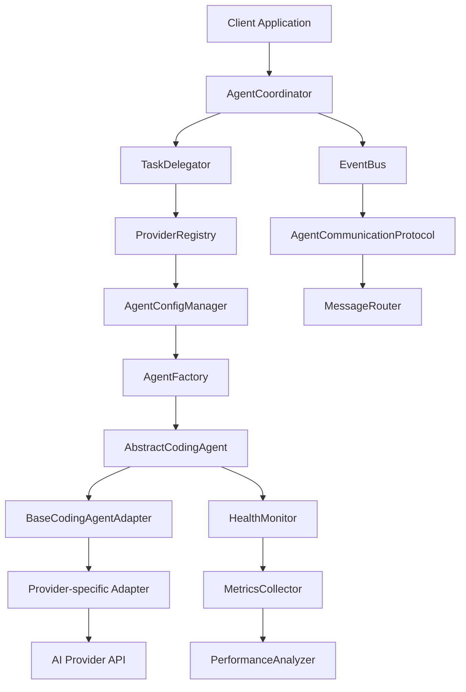

# Abstract Subagent Architecture - Architecture Design Document

## Architecture Overview

The Abstract Subagent Architecture is designed as a provider-agnostic system that enables seamless integration of multiple AI coding agents through a unified interface. The architecture follows a layered approach with clear separation of concerns, ensuring maintainability, extensibility, and reliability.

## Design Principles

### 1. Provider Agnostic
The system should work with any AI coding agent without being tied to specific implementations. This is achieved through the adapter pattern and abstract interfaces.

### 2. Extensibility
New providers and capabilities should be easy to add without modifying core system components. The architecture supports this through plugin-like adapters and configuration-driven capabilities.

### 3. Fault Tolerance
The system should handle failures gracefully with automatic fallback mechanisms and recovery strategies.

### 4. Performance
The system should be performant and scalable, supporting high-throughput task processing with efficient resource utilization.

### 5. Security
Security should be built into the architecture from the ground up, with proper authentication, authorization, and data protection.

### 6. Observability
The system should provide comprehensive monitoring, logging, and metrics for operational visibility.

### 7. Consistency
Consistent interfaces and behaviors should be maintained across all providers and components.

### 8. Simplicity
The system should be simple to use and configure while maintaining powerful capabilities.

### 9. Compatibility
The system should integrate seamlessly with existing Claude-Flow architecture without breaking changes.

### 10. Maintainability
The system should be easy to maintain, debug, and extend over time.

## Architecture Decisions

### ADR-001: Adapter Pattern for Provider Integration
**Status**: Accepted
**Context**: Need to integrate multiple AI coding agents with different APIs and capabilities
**Decision**: Use the adapter pattern to create provider-specific implementations that conform to a common interface
**Consequences**:
- **Positive**: Easy to add new providers, consistent interface, loose coupling
- **Negative**: Additional abstraction layer, potential performance overhead
**Rationale**: The adapter pattern provides the best balance of flexibility and consistency for integrating diverse AI providers.

### ADR-002: Event-Driven Communication
**Status**: Accepted
**Context**: Need for loose coupling between agents and real-time coordination
**Decision**: Implement event-driven communication using publish/subscribe pattern
**Consequences**:
- **Positive**: Loose coupling, real-time updates, scalable communication
- **Negative**: Increased complexity, potential message ordering issues
**Rationale**: Event-driven communication enables better scalability and real-time coordination between agents.

### ADR-003: Multiple Coordination Strategies
**Status**: Accepted
**Context**: Different use cases require different coordination approaches
**Decision**: Implement multiple coordination strategies (sequential, parallel, pipeline, consensus, voting, hierarchical, peer-to-peer)
**Consequences**:
- **Positive**: Flexibility for different use cases, optimal task distribution
- **Negative**: Increased complexity, more configuration options
**Rationale**: Different coordination strategies are needed for different scenarios and optimization requirements.

### ADR-004: Centralized Configuration Management
**Status**: Accepted
**Context**: Need to manage configurations for multiple providers and agents
**Decision**: Implement centralized configuration management with validation and persistence
**Consequences**:
- **Positive**: Centralized control, validation, consistency
- **Negative**: Single point of failure, potential bottleneck
**Rationale**: Centralized configuration provides better control and consistency across the system.

### ADR-005: Provider Registry Pattern
**Status**: Accepted
**Context**: Need to manage multiple providers dynamically
**Decision**: Implement a provider registry for dynamic provider discovery and management
**Consequences**:
- **Positive**: Dynamic provider management, capability discovery
- **Negative**: Additional complexity, registry maintenance
**Rationale**: Provider registry enables dynamic provider management and capability discovery.

### ADR-006: Base Adapter Class
**Status**: Accepted
**Context**: Need to reduce code duplication across provider adapters
**Decision**: Create a base adapter class with common functionality
**Consequences**:
- **Positive**: Code reuse, consistent behavior, easier maintenance
- **Negative**: Inheritance complexity, potential over-abstraction
**Rationale**: Base adapter class reduces code duplication and ensures consistent behavior across adapters.

### ADR-007: Intelligent Task Delegation
**Status**: Accepted
**Context**: Need to optimize task assignment based on capabilities and load
**Decision**: Implement intelligent task delegation with capability matching and load balancing
**Consequences**:
- **Positive**: Optimal task distribution, better performance
- **Negative**: Increased complexity, delegation overhead
**Rationale**: Intelligent delegation optimizes system performance and resource utilization.

### ADR-008: Comprehensive Health Monitoring
**Status**: Accepted
**Context**: Need to monitor system health and performance
**Decision**: Implement comprehensive health monitoring with metrics collection
**Consequences**:
- **Positive**: Better observability, proactive issue detection
- **Negative**: Monitoring overhead, additional complexity
**Rationale**: Health monitoring is essential for maintaining system reliability and performance.

## Component Architecture

### Core Components

#### 1. Abstract Agent Interface Layer
- **AbstractCodingAgent**: Core interface for all agents
- **AgentCapabilities**: Capability definitions
- **CodingTask**: Task specification
- **CodingResult**: Result format

#### 2. Communication Layer
- **AgentCommunicationProtocol**: Communication interface
- **EventBus**: Event handling
- **MessageRouter**: Message routing
- **CoordinationProtocol**: Coordination interface

#### 3. Adapter Layer
- **BaseCodingAgentAdapter**: Base adapter implementation
- **ClaudeCodeAgentAdapter**: Claude Code specific adapter
- **CodexAgentAdapter**: OpenAI Codex specific adapter
- **Provider-specific adapters**: Additional provider adapters

#### 4. Coordination Layer
- **AgentCoordinator**: Multi-agent coordination
- **TaskDelegator**: Task delegation
- **ConflictResolver**: Conflict resolution
- **LoadBalancer**: Load balancing

#### 5. Configuration Layer
- **AgentConfigManager**: Agent configuration management
- **ProviderRegistry**: Provider registry
- **ConfigurationValidator**: Configuration validation
- **ConfigurationPersistence**: Configuration storage

#### 6. Monitoring Layer
- **HealthMonitor**: Health monitoring
- **MetricsCollector**: Metrics collection
- **PerformanceAnalyzer**: Performance analysis
- **AlertManager**: Alert management

### Component Interactions

## Data Flow Architecture

### Task Execution Flow

1. **Task Submission**: Client submits task to AgentCoordinator
2. **Task Analysis**: TaskDelegator analyzes task requirements
3. **Agent Selection**: Suitable agents are selected based on capabilities
4. **Task Delegation**: Task is delegated to selected agents
5. **Task Execution**: Agents execute tasks using provider-specific adapters
6. **Result Collection**: Results are collected and aggregated
7. **Result Validation**: Results are validated for quality and completeness
8. **Result Return**: Final results are returned to client

### Coordination Flow

1. **Coordination Initiation**: Coordination session is initiated
2. **Participant Registration**: Agents register for coordination
3. **Strategy Selection**: Coordination strategy is selected
4. **Task Distribution**: Tasks are distributed according to strategy
5. **Execution Monitoring**: Execution is monitored for conflicts and issues
6. **Conflict Resolution**: Conflicts are detected and resolved
7. **Result Aggregation**: Results are aggregated and validated
8. **Coordination Completion**: Coordination session is completed

## Integration Architecture

### Claude-Flow Integration

The Abstract Subagent Architecture integrates with existing Claude-Flow components:

#### 1. Event Bus Integration
- Uses existing IEventBus for event communication
- Publishes events for task lifecycle and coordination
- Subscribes to relevant Claude-Flow events

#### 2. Memory System Integration
- Uses DistributedMemorySystem for state management
- Stores agent configurations and capabilities
- Caches task results and metrics

#### 3. Configuration Integration
- Extends existing configuration system
- Uses configuration validation and persistence
- Integrates with environment variable management

#### 4. Logging Integration
- Uses existing logging infrastructure
- Follows logging standards and formats
- Integrates with log aggregation and analysis

#### 5. CLI Integration
- Extends existing CLI commands
- Adds agent management commands
- Integrates with existing command structure

### External Provider Integration

#### 1. API Integration
- RESTful API integration with providers
- Authentication and authorization handling
- Rate limiting and error handling

#### 2. WebSocket Integration
- Real-time communication where supported
- Event streaming and updates
- Connection management and recovery

#### 3. SDK Integration
- Provider-specific SDK integration
- Wrapper implementations for consistency
- Error handling and retry mechanisms

## Security Architecture

### Security Layers

#### 1. Authentication Layer
- API key management and validation
- Token-based authentication
- Multi-factor authentication support

#### 2. Authorization Layer
- Role-based access control
- Permission-based authorization
- Resource-level access control

#### 3. Data Protection Layer
- Encryption at rest and in transit
- Data sanitization and validation
- Secure data storage and retrieval

#### 4. Network Security Layer
- TLS/SSL encryption
- Network segmentation
- Firewall and intrusion detection

#### 5. Audit Layer
- Comprehensive audit logging
- Security event monitoring
- Compliance reporting

### Security Controls

1. **Input Validation**: All inputs are validated and sanitized
2. **Output Encoding**: All outputs are properly encoded
3. **Error Handling**: Secure error handling without information leakage
4. **Session Management**: Secure session management and timeout
5. **Access Control**: Proper access control and authorization

## Scalability Architecture

### Horizontal Scaling

1. **Agent Scaling**: Multiple agent instances can be deployed
2. **Load Balancing**: Tasks are distributed across multiple agents
3. **Resource Pooling**: Resources are pooled and shared
4. **Auto-scaling**: Automatic scaling based on load

### Vertical Scaling

1. **Resource Optimization**: Efficient resource utilization
2. **Performance Tuning**: Performance optimization and tuning
3. **Caching**: Intelligent caching strategies
4. **Connection Pooling**: Connection pooling and reuse

### Performance Optimization

1. **Asynchronous Processing**: Asynchronous task processing
2. **Batch Processing**: Batch processing for efficiency
3. **Caching**: Multi-level caching strategies
4. **Compression**: Data compression for network efficiency

## Deployment Architecture

### Deployment Models

#### 1. Single Instance Deployment
- Single instance for development and testing
- Simple deployment and configuration
- Limited scalability

#### 2. Multi-Instance Deployment
- Multiple instances for production
- Load balancing and failover
- High availability and scalability

#### 3. Distributed Deployment
- Distributed deployment across multiple nodes
- Geographic distribution
- Maximum scalability and fault tolerance

### Containerization

1. **Docker Containers**: Containerized deployment
2. **Kubernetes**: Orchestration and management
3. **Service Mesh**: Service-to-service communication
4. **Monitoring**: Container monitoring and logging

## Monitoring Architecture

### Monitoring Layers

#### 1. Application Monitoring
- Application performance monitoring
- Business metrics tracking
- User experience monitoring

#### 2. Infrastructure Monitoring
- System resource monitoring
- Network monitoring
- Storage monitoring

#### 3. Security Monitoring
- Security event monitoring
- Threat detection
- Compliance monitoring

### Observability Stack

1. **Metrics**: Prometheus for metrics collection
2. **Logging**: ELK stack for log aggregation
3. **Tracing**: Jaeger for distributed tracing
4. **Alerting**: AlertManager for alerting
5. **Visualization**: Grafana for visualization

## Version History

| Version | Date | Author | Changes |
|---------|------|--------|---------|
| 1.0.0 | 2024-01-XX | System Architect | Initial architecture document |

## References

- [Requirements Document](./REQUIREMENTS.md)
- [Technical Specifications](./SPECIFICATIONS.md)
- [API Documentation](./API.md)
- [Integration Guide](./INTEGRATION.md)
- [Claude-Flow Core Documentation](../../../README.md)