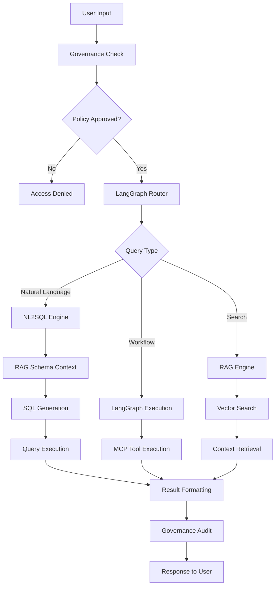
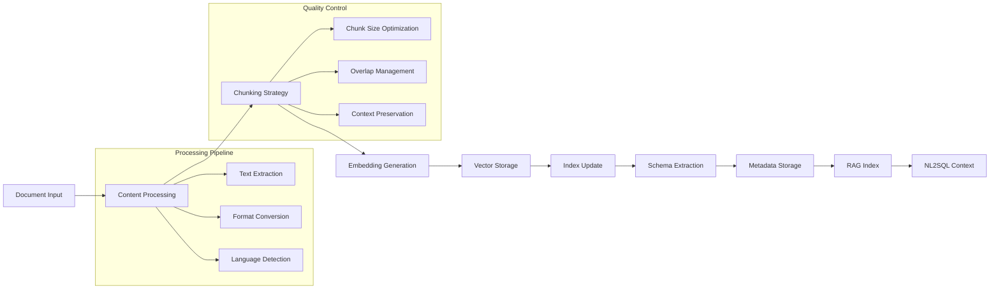
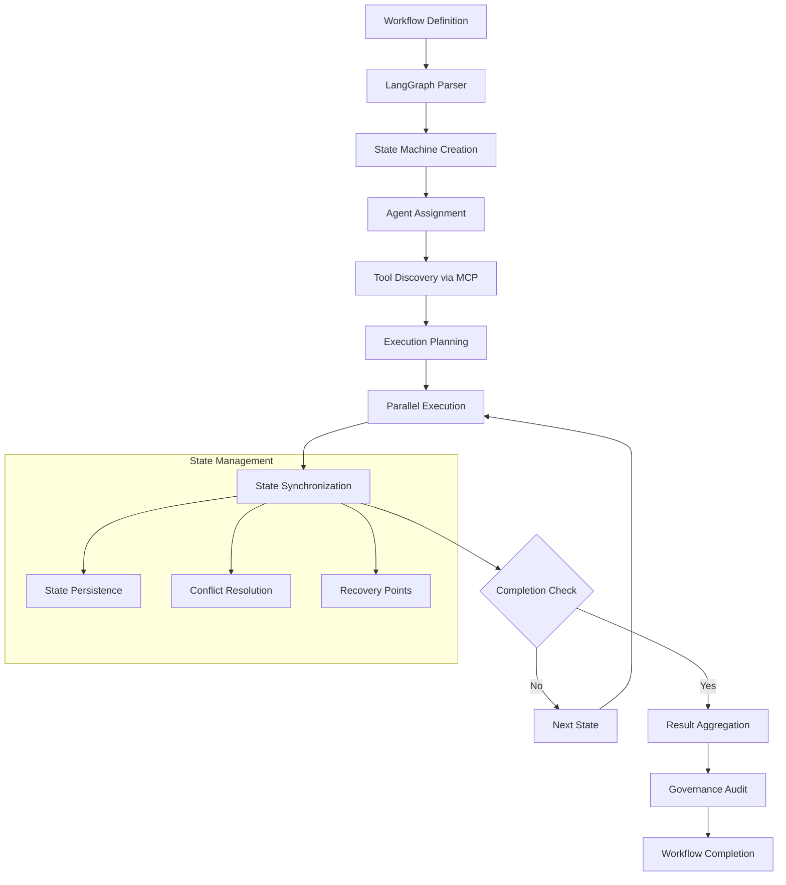
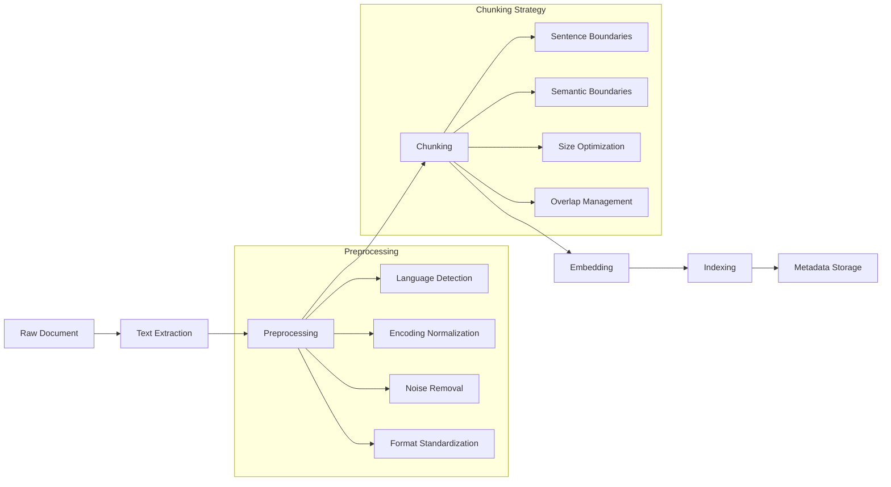
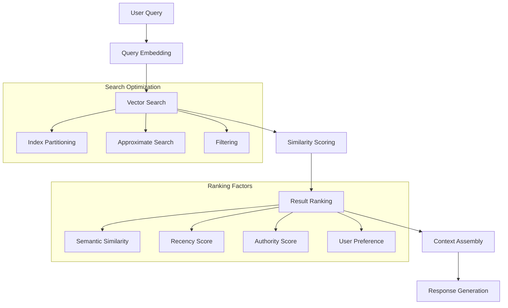
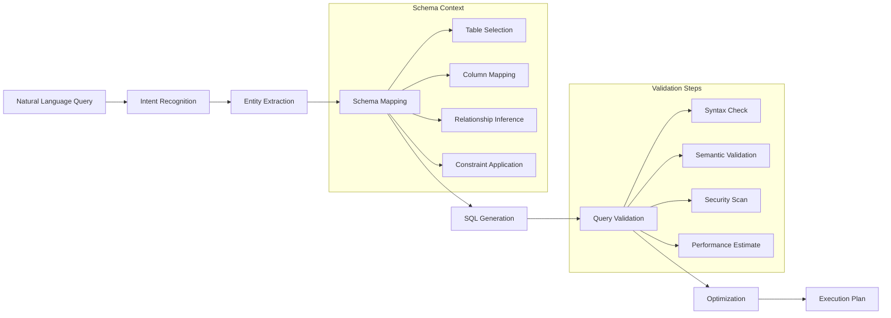
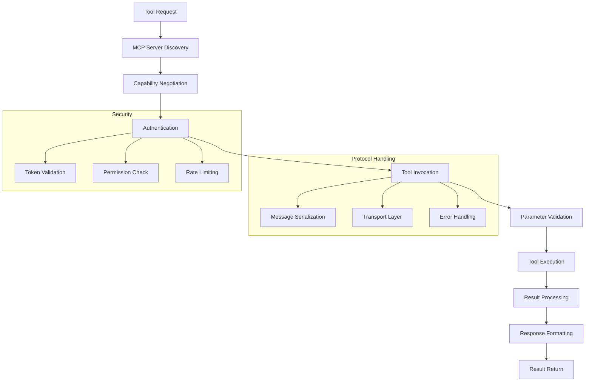
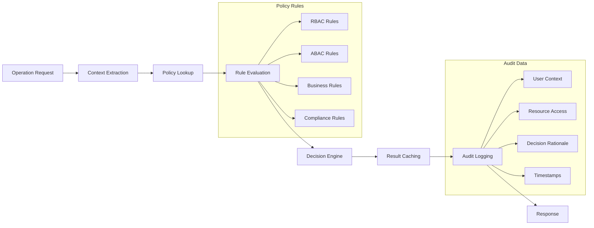
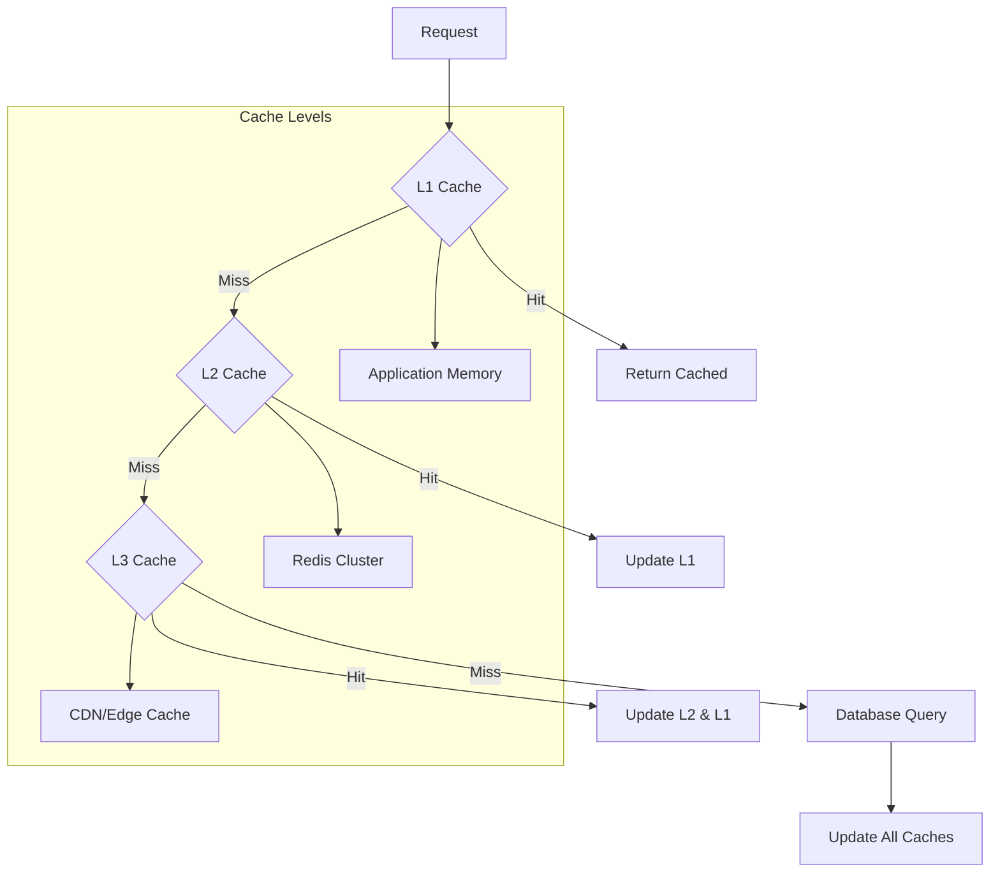
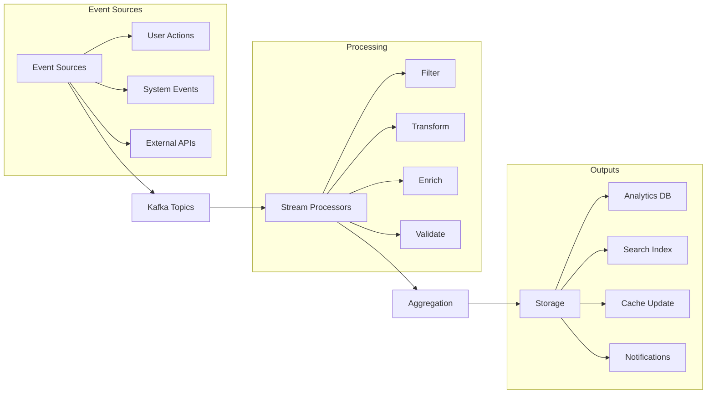

# LALO MVP Data Flow Analysis

## Data Flow Overview

The LALO MVP orchestrates complex data flows between five core components. This analysis defines the data transformation pipelines, flow patterns, and optimization strategies required for efficient system operation.

## Primary Data Flow Patterns

### 1. User Query Processing Flow



#### Data Transformation Points
1. **Input Sanitization**: User input → Sanitized query
2. **Policy Evaluation**: User context → Access decision
3. **Query Classification**: Natural language → Query type
4. **Context Enrichment**: Query → Contextual information
5. **Result Aggregation**: Multiple sources → Unified response
6. **Audit Logging**: Operation data → Audit records

### 2. Knowledge Management Flow



#### Data Formats
- **Input**: PDF, DOCX, TXT, HTML, JSON, CSV
- **Intermediate**: Structured text chunks with metadata
- **Storage**: Vector embeddings + relational metadata
- **Output**: Contextual information for queries

### 3. Workflow Orchestration Flow



#### State Data Structure
```typescript
interface WorkflowState {
  id: string
  definition: WorkflowDefinition
  currentState: StateName
  context: Record<string, unknown>
  history: StateTransition[]
  agents: AgentContext[]
  tools: ToolResult[]
  metadata: {
    created: Date
    updated: Date
    owner: UserContext
    permissions: Permission[]
  }
}
```

## Component-Specific Data Flows

### LangGraph Data Processing

#### Input Data Types
```yaml
Workflow Inputs:
  - Workflow Definition (YAML/JSON)
  - Initial State Data
  - User Context
  - Environment Variables
  - Tool Configurations

Runtime Data:
  - State Transitions
  - Agent Communications
  - Tool Execution Results
  - Error Conditions
  - Performance Metrics
```

#### Data Transformation Pipeline
1. **Definition Parsing**: YAML/JSON → Internal AST
2. **Validation**: AST → Validated workflow
3. **Compilation**: Validated workflow → Executable state machine
4. **State Management**: Execution events → State updates
5. **Result Synthesis**: State data → Output format

#### State Persistence
```sql
-- Workflow state table structure
CREATE TABLE workflow_states (
    id UUID PRIMARY KEY,
    workflow_definition JSONB NOT NULL,
    current_state VARCHAR(255) NOT NULL,
    context JSONB NOT NULL,
    created_at TIMESTAMP WITH TIME ZONE DEFAULT NOW(),
    updated_at TIMESTAMP WITH TIME ZONE DEFAULT NOW(),
    owner_id UUID NOT NULL,
    status VARCHAR(50) NOT NULL
);

-- State transition log
CREATE TABLE state_transitions (
    id UUID PRIMARY KEY,
    workflow_id UUID REFERENCES workflow_states(id),
    from_state VARCHAR(255),
    to_state VARCHAR(255) NOT NULL,
    transition_data JSONB,
    timestamp TIMESTAMP WITH TIME ZONE DEFAULT NOW()
);
```

### RAG Engine Data Processing

#### Document Processing Pipeline


#### Vector Storage Schema
```typescript
interface DocumentChunk {
  id: string
  documentId: string
  chunkIndex: number
  content: string
  embedding: number[]
  metadata: {
    startOffset: number
    endOffset: number
    tokens: number
    language: string
    source: string
    created: Date
  }
  relationships: {
    previousChunk?: string
    nextChunk?: string
    parentDocument: string
    relatedChunks: string[]
  }
}
```

#### Query Processing


### NL2SQL Data Processing

#### Query Translation Pipeline


#### Schema Information Flow
```typescript
interface DatabaseSchema {
  database: string
  tables: {
    name: string
    columns: {
      name: string
      type: string
      nullable: boolean
      primaryKey: boolean
      foreignKey?: {
        referencedTable: string
        referencedColumn: string
      }
    }[]
    indexes: Index[]
    constraints: Constraint[]
    statistics: {
      rowCount: number
      avgRowSize: number
      lastUpdated: Date
    }
  }[]
  relationships: Relationship[]
  businessRules: BusinessRule[]
}
```

### MCP Protocol Data Flow

#### Tool Discovery and Execution


#### Message Format
```json
{
  "jsonrpc": "2.0",
  "method": "tools/invoke",
  "params": {
    "name": "search_database",
    "arguments": {
      "query": "SELECT * FROM users WHERE age > 25",
      "limit": 100
    }
  },
  "id": "request-123"
}
```

### Governance Data Flow

#### Policy Evaluation Pipeline


#### Audit Record Structure
```typescript
interface AuditRecord {
  id: string
  timestamp: Date
  eventType: AuditEventType
  user: {
    id: string
    roles: string[]
    session: string
    ip: string
  }
  resource: {
    type: ResourceType
    id: string
    path: string
    action: string
  }
  outcome: {
    decision: 'allow' | 'deny'
    reason: string
    policyIds: string[]
  }
  metadata: {
    component: string
    requestId: string
    duration: number
    additionalData?: Record<string, unknown>
  }
}
```

## Data Optimization Strategies

### Caching Architecture

#### Multi-Level Caching


#### Cache Strategy
```yaml
Caching Strategy:
  L1 (Application):
    TTL: 5 minutes
    Size: 100MB per instance
    Eviction: LRU
    Data: Frequently accessed queries
  
  L2 (Redis):
    TTL: 1 hour
    Size: 10GB cluster
    Eviction: LRU with TTL
    Data: Query results, user sessions
  
  L3 (CDN):
    TTL: 24 hours
    Size: Unlimited
    Eviction: TTL only
    Data: Static content, schema info
```

### Data Partitioning

#### Horizontal Partitioning Strategy
```sql
-- Time-based partitioning for audit logs
CREATE TABLE audit_logs (
    id UUID,
    timestamp TIMESTAMP,
    event_data JSONB,
    ...
) PARTITION BY RANGE (timestamp);

-- Hash partitioning for user data
CREATE TABLE user_workflows (
    id UUID,
    user_id UUID,
    workflow_data JSONB,
    ...
) PARTITION BY HASH (user_id);

-- List partitioning for multi-tenant data
CREATE TABLE tenant_data (
    id UUID,
    tenant_id UUID,
    data JSONB,
    ...
) PARTITION BY LIST (tenant_id);
```

### Stream Processing

#### Real-time Data Pipeline


## Data Quality Management

### Quality Metrics
```yaml
Data Quality Metrics:
  Completeness:
    Target: >95%
    Measure: Non-null required fields
    Monitoring: Real-time validation
  
  Accuracy:
    Target: >98%
    Measure: Schema compliance
    Monitoring: Automated validation
  
  Consistency:
    Target: >99%
    Measure: Cross-component data sync
    Monitoring: Periodic reconciliation
  
  Timeliness:
    Target: <5 seconds lag
    Measure: Data freshness
    Monitoring: Timestamp comparison
```

### Data Validation Pipeline
```typescript
interface DataValidation {
  schema: {
    validator: JSONSchema
    strictMode: boolean
    customRules: ValidationRule[]
  }
  
  businessRules: {
    validators: BusinessValidator[]
    severity: 'error' | 'warning' | 'info'
    autoCorrection: boolean
  }
  
  qualityChecks: {
    duplicateDetection: boolean
    anomalyDetection: boolean
    completenessCheck: boolean
    consistencyCheck: boolean
  }
}
```

## Monitoring and Observability

### Data Flow Monitoring
```yaml
Monitoring Metrics:
  Throughput:
    - Messages per second
    - Bytes processed per minute
    - Query execution rate
  
  Latency:
    - End-to-end processing time
    - Component processing time
    - Queue wait time
  
  Quality:
    - Data validation failures
    - Schema violations
    - Business rule violations
  
  Resource Usage:
    - Memory consumption
    - CPU utilization
    - Storage growth
```

### Alerting Strategy
```yaml
Alerts:
  Critical:
    - Data processing stopped
    - High error rate (>5%)
    - Queue backup (>1000 messages)
  
  Warning:
    - Processing lag (>30 seconds)
    - Quality degradation (>2%)
    - Resource usage (>80%)
  
  Info:
    - Schema updates
    - New data sources
    - Configuration changes
```
