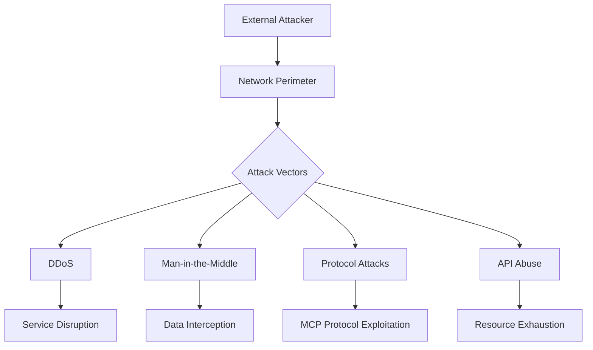
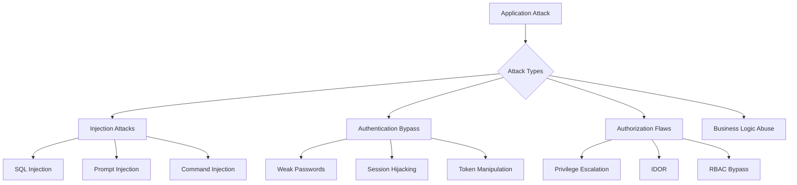
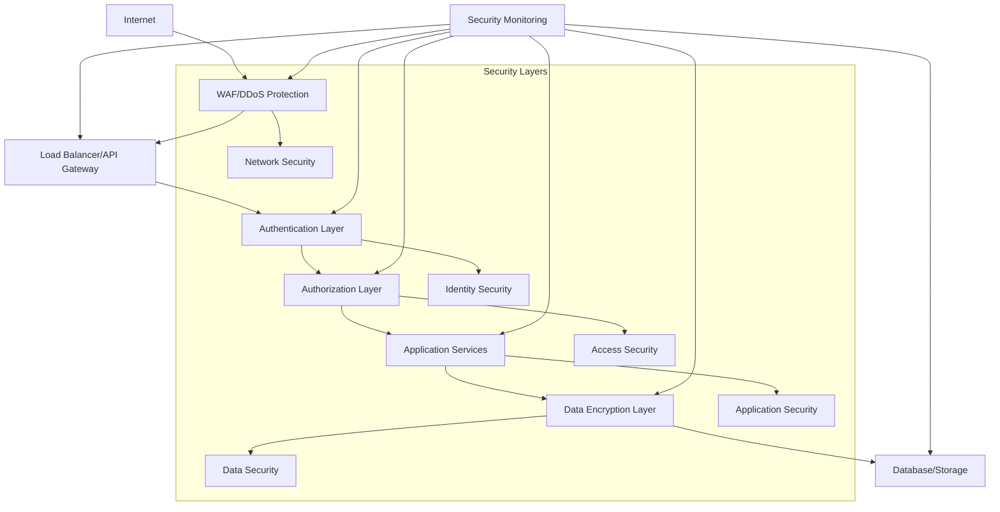
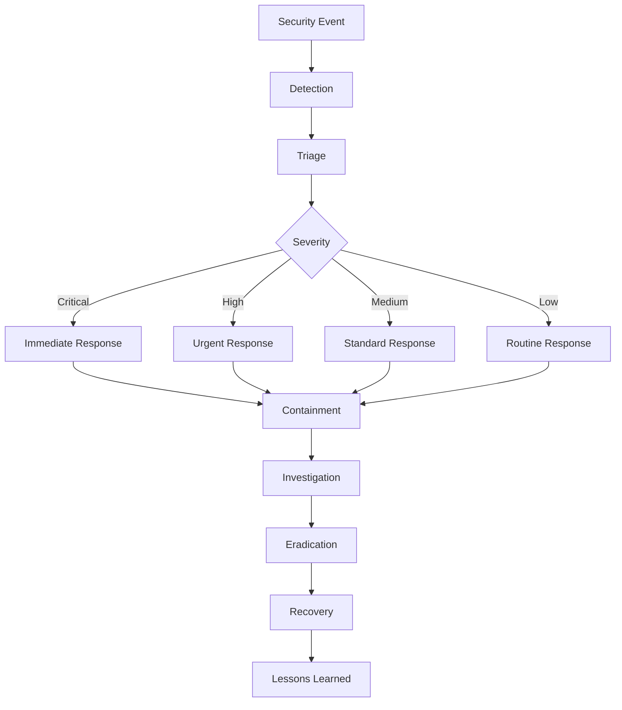

# LALO MVP Security Assessment

## Executive Summary

This security assessment analyzes the LALO MVP's threat landscape, identifies potential vulnerabilities, and provides comprehensive security recommendations for the integrated LangGraph, Governance, MCP, RAG, and NL2SQL components.

## Threat Model

### Asset Classification

#### Critical Assets
1. **User Data**: Personal information, query history, preferences
2. **Database Content**: Sensitive business data accessed via NL2SQL
3. **Knowledge Base**: Proprietary documents in RAG system
4. **Workflow Definitions**: Business logic and automation rules
5. **Authentication Credentials**: API keys, tokens, certificates
6. **Audit Logs**: Compliance and security event records

#### Asset Risk Matrix
| Asset | Confidentiality | Integrity | Availability | Business Impact |
|-------|----------------|-----------|--------------|------------------|
| User Data | High | High | Medium | High |
| Database Content | Critical | Critical | High | Critical |
| Knowledge Base | High | High | Medium | High |
| Workflow Definitions | Medium | High | High | Medium |
| Auth Credentials | Critical | Critical | Critical | Critical |
| Audit Logs | Medium | Critical | Medium | High |

### Threat Actors

#### External Threats
1. **Cybercriminals**: Financial motivation, data theft
2. **Nation-State Actors**: Espionage, disruption
3. **Competitors**: Intellectual property theft
4. **Script Kiddies**: Opportunistic attacks

#### Internal Threats
1. **Malicious Insiders**: Privileged access abuse
2. **Negligent Users**: Accidental data exposure
3. **Compromised Accounts**: Credential theft and misuse

#### Supply Chain Threats
1. **Third-party Dependencies**: Vulnerable libraries
2. **Cloud Provider**: Infrastructure compromise
3. **AI Model Providers**: Model poisoning or backdoors

### Attack Vectors

#### Network-Based Attacks


#### Application-Level Attacks


## Component-Specific Security Analysis

### LangGraph Security

#### Security Concerns
1. **Workflow Injection**: Malicious workflow definitions
2. **State Manipulation**: Unauthorized state modifications
3. **Agent Impersonation**: Rogue agents in swarm
4. **Resource Exhaustion**: Infinite loops or resource abuse

#### Threat Scenarios
```yaml
LangGraph Threats:
  Workflow Poisoning:
    Description: Injecting malicious code in workflow definitions
    Impact: Code execution, data exfiltration
    Likelihood: Medium
    Mitigation: Sandboxing, code review, validation
  
  State Tampering:
    Description: Unauthorized modification of workflow state
    Impact: Business logic bypass, data corruption
    Likelihood: High
    Mitigation: State encryption, integrity checks, audit trails
  
  Agent Takeover:
    Description: Compromising agent communication
    Impact: Unauthorized actions, data access
    Likelihood: Medium
    Mitigation: Agent authentication, encrypted communication
```

#### Security Controls
```typescript
interface LangGraphSecurity {
  workflowValidation: {
    syntaxValidation: boolean
    semanticAnalysis: boolean
    securityScanning: boolean
    sandboxExecution: boolean
  }
  
  stateProtection: {
    encryption: 'AES-256-GCM'
    integrityCheck: 'HMAC-SHA256'
    accessControl: 'RBAC'
    auditLogging: boolean
  }
  
  agentSecurity: {
    authentication: 'mTLS'
    authorization: 'capability-based'
    communication: 'encrypted'
    monitoring: 'real-time'
  }
}
```

### RAG Engine Security

#### Security Concerns
1. **Data Poisoning**: Malicious documents in knowledge base
2. **Information Leakage**: Unauthorized data access via queries
3. **Model Evasion**: Crafted queries to bypass filters
4. **Vector Database Attacks**: Adversarial embeddings

#### Threat Scenarios
```yaml
RAG Security Threats:
  Document Poisoning:
    Description: Injecting malicious content into knowledge base
    Impact: Misinformation, backdoor access
    Likelihood: High
    Mitigation: Content validation, source verification
  
  Query Manipulation:
    Description: Crafted queries to access restricted information
    Impact: Data breach, privilege escalation
    Likelihood: Medium
    Mitigation: Query filtering, context limiting
  
  Embedding Attacks:
    Description: Adversarial embeddings to manipulate search
    Impact: Information manipulation, access bypass
    Likelihood: Low
    Mitigation: Embedding validation, anomaly detection
```

#### Security Controls
```yaml
RAG Security Controls:
  Document Processing:
    - Malware scanning
    - Content validation
    - Source authentication
    - Metadata verification
  
  Query Processing:
    - Input sanitization
    - Context filtering
    - Result redaction
    - Access logging
  
  Vector Security:
    - Embedding validation
    - Anomaly detection
    - Similarity thresholds
    - Query rate limiting
```

### NL2SQL Security

#### Security Concerns
1. **SQL Injection**: Malicious SQL in generated queries
2. **Data Exposure**: Unauthorized database access
3. **Query Manipulation**: Bypassing business rules
4. **Schema Inference**: Exposing database structure

#### Threat Scenarios
```yaml
NL2SQL Security Threats:
  SQL Injection:
    Description: Malicious SQL code in natural language queries
    Impact: Database compromise, data exfiltration
    Likelihood: High
    Mitigation: Parameterized queries, validation, sandboxing
  
  Unauthorized Access:
    Description: Queries accessing restricted data
    Impact: Data breach, privacy violation
    Likelihood: High
    Mitigation: Query authorization, result filtering
  
  Schema Enumeration:
    Description: Inferring database structure through queries
    Impact: Information disclosure, attack preparation
    Likelihood: Medium
    Mitigation: Error message sanitization, query limiting
```

#### Security Controls
```typescript
interface NL2SQLSecurity {
  queryGeneration: {
    parameterization: boolean
    syntaxValidation: boolean
    semanticAnalysis: boolean
    injectionPrevention: boolean
  }
  
  accessControl: {
    tablePermissions: TablePermission[]
    columnMasking: MaskingRule[]
    rowLevelSecurity: boolean
    queryAuthorization: boolean
  }
  
  monitoring: {
    queryLogging: boolean
    anomalyDetection: boolean
    performanceMonitoring: boolean
    accessPatterns: boolean
  }
}
```

### MCP Protocol Security

#### Security Concerns
1. **Protocol Vulnerabilities**: Flaws in MCP implementation
2. **Message Tampering**: Intercepted or modified messages
3. **Tool Abuse**: Unauthorized tool execution
4. **Service Discovery**: Exposure of internal services

#### Threat Scenarios
```yaml
MCP Security Threats:
  Protocol Exploitation:
    Description: Exploiting vulnerabilities in MCP protocol
    Impact: System compromise, unauthorized access
    Likelihood: Medium
    Mitigation: Security testing, protocol hardening
  
  Message Interception:
    Description: Man-in-the-middle attacks on MCP traffic
    Impact: Data exposure, message manipulation
    Likelihood: High
    Mitigation: TLS encryption, message authentication
  
  Tool Hijacking:
    Description: Unauthorized execution of MCP tools
    Impact: System compromise, data manipulation
    Likelihood: Medium
    Mitigation: Tool authentication, capability restrictions
```

#### Security Controls
```yaml
MCP Security Controls:
  Transport Security:
    - TLS 1.3 encryption
    - Certificate pinning
    - Perfect forward secrecy
    - Message authentication
  
  Access Control:
    - Tool authorization
    - Capability-based security
    - Resource quotas
    - Rate limiting
  
  Monitoring:
    - Protocol anomaly detection
    - Tool usage tracking
    - Performance monitoring
    - Security event logging
```

### Governance Security

#### Security Concerns
1. **Policy Bypass**: Circumventing security policies
2. **Audit Tampering**: Modifying or deleting audit logs
3. **Privilege Escalation**: Unauthorized permission elevation
4. **Configuration Drift**: Unauthorized policy changes

#### Security Controls
```typescript
interface GovernanceSecurity {
  policyEngine: {
    policyValidation: boolean
    conflictDetection: boolean
    versionControl: boolean
    changeApproval: boolean
  }
  
  auditSecurity: {
    logIntegrity: 'blockchain-based'
    encryption: 'AES-256-GCM'
    immutability: boolean
    distributedStorage: boolean
  }
  
  accessControl: {
    multiFactorAuth: boolean
    privilegedAccess: 'just-in-time'
    sessionMonitoring: boolean
    behaviorAnalysis: boolean
  }
}
```

## Security Architecture

### Defense in Depth



### Zero Trust Architecture

#### Principles
1. **Never Trust, Always Verify**: Authenticate and authorize every request
2. **Least Privilege Access**: Minimal permissions for operations
3. **Assume Breach**: Design for compromise scenarios
4. **Verify Explicitly**: Use multiple signals for access decisions

#### Implementation
```yaml
Zero Trust Implementation:
  Identity Verification:
    - Multi-factor authentication
    - Continuous authentication
    - Device compliance checking
    - Behavioral analysis
  
  Access Control:
    - Just-in-time access
    - Risk-based authentication
    - Conditional access policies
    - Privilege escalation workflows
  
  Network Security:
    - Micro-segmentation
    - Encrypted communication
    - Network monitoring
    - Intrusion detection
```

## Security Implementation

### Authentication and Authorization

#### Multi-Factor Authentication
```typescript
interface MFAConfiguration {
  factors: {
    something_you_know: {
      passwords: PasswordPolicy
      passphrases: boolean
      securityQuestions: boolean
    }
    
    something_you_have: {
      smsTokens: boolean
      authenticatorApps: boolean
      hardwareTokens: boolean
      smartCards: boolean
    }
    
    something_you_are: {
      fingerprints: boolean
      faceRecognition: boolean
      voiceRecognition: boolean
      behaviorAnalysis: boolean
    }
  }
  
  policies: {
    requiredFactors: number
    adaptiveAuthentication: boolean
    riskBasedAuthentication: boolean
    sessionTimeout: number
  }
}
```

#### Role-Based Access Control
```yaml
RBAC Configuration:
  Roles:
    system_admin:
      permissions:
        - governance:manage
        - system:configure
        - user:manage
        - audit:access
    
    data_analyst:
      permissions:
        - rag:query
        - nl2sql:translate
        - workflow:read
        - data:read
    
    workflow_designer:
      permissions:
        - langgraph:design
        - workflow:create
        - tool:configure
        - mcp:manage
    
    security_auditor:
      permissions:
        - audit:read
        - security:monitor
        - policy:view
        - compliance:report
```

### Data Protection

#### Encryption Standards
```yaml
Encryption Standards:
  At Rest:
    Algorithm: AES-256-GCM
    Key Management: HSM-based
    Key Rotation: 90 days
    Compliance: FIPS 140-2 Level 3
  
  In Transit:
    Protocol: TLS 1.3
    Cipher Suites: 
      - TLS_AES_256_GCM_SHA384
      - TLS_CHACHA20_POLY1305_SHA256
    Certificate Management: Automated renewal
    HSTS: Enabled
  
  Application Level:
    Sensitive Fields: 
      - PII data
      - Credentials
      - Business secrets
    Format Preserving: Database queries
    Tokenization: Audit logs
```

#### Data Loss Prevention
```typescript
interface DLPConfiguration {
  classification: {
    automaticClassification: boolean
    manualLabeling: boolean
    sensitivityLevels: ['public', 'internal', 'confidential', 'restricted']
    dataTypes: {
      pii: RegExp[]
      financialData: RegExp[]
      healthData: RegExp[]
      businessSecrets: RegExp[]
    }
  }
  
  prevention: {
    outputFiltering: boolean
    queryRestrictions: QueryRestriction[]
    contentRedaction: boolean
    accessLogging: boolean
  }
  
  monitoring: {
    realTimeScanning: boolean
    behaviorAnalysis: boolean
    anomalyDetection: boolean
    alerting: AlertConfiguration
  }
}
```

### Security Monitoring

#### SIEM Integration
```yaml
SIEM Configuration:
  Log Sources:
    - Application logs
    - Security events
    - System metrics
    - Network traffic
    - User activities
  
  Event Correlation:
    - Attack pattern detection
    - Anomaly identification
    - Risk scoring
    - Threat intelligence
  
  Response Automation:
    - Incident creation
    - Alert routing
    - Automated remediation
    - Forensic data collection
```

#### Threat Detection
```typescript
interface ThreatDetection {
  signatures: {
    knownAttacks: SignatureRule[]
    malwareDetection: boolean
    vulnerabilityScanning: boolean
    complianceChecking: boolean
  }
  
  behavioral: {
    userBehaviorAnalytics: boolean
    entityBehaviorAnalytics: boolean
    anomalyDetection: boolean
    machineLearning: boolean
  }
  
  threatIntelligence: {
    iocFeeds: IOCFeed[]
    riskScoring: boolean
    contextualAnalysis: boolean
    attribution: boolean
  }
}
```

## Incident Response

### Response Framework

#### Incident Classification
```yaml
Incident Severity Levels:
  Critical (P0):
    - Data breach affecting >1000 users
    - System compromise with admin access
    - Ransomware or destructive malware
    - Complete service unavailability
    Response Time: 15 minutes
    
  High (P1):
    - Data breach affecting <1000 users
    - Privilege escalation attacks
    - Denial of service attacks
    - Partial service degradation
    Response Time: 1 hour
    
  Medium (P2):
    - Unauthorized access attempts
    - Policy violations
    - Security control failures
    - Non-critical vulnerabilities
    Response Time: 4 hours
    
  Low (P3):
    - Security awareness issues
    - Minor configuration issues
    - Informational security events
    Response Time: 24 hours
```

#### Response Procedures


### Business Continuity

#### Disaster Recovery
```yaml
Disaster Recovery Plan:
  RTO (Recovery Time Objective):
    Critical Systems: 4 hours
    Important Systems: 24 hours
    Standard Systems: 72 hours
  
  RPO (Recovery Point Objective):
    Transactional Data: 15 minutes
    Analytical Data: 4 hours
    Configuration Data: 24 hours
  
  Backup Strategy:
    Frequency: 
      - Real-time replication
      - Daily incremental
      - Weekly full backup
    
    Retention:
      - Daily: 30 days
      - Weekly: 12 weeks
      - Monthly: 12 months
      - Yearly: 7 years
    
    Testing:
      - Monthly restore tests
      - Quarterly DR exercises
      - Annual full DR simulation
```

## Compliance and Governance

### Regulatory Compliance

#### GDPR Compliance
```yaml
GDPR Requirements:
  Data Protection Principles:
    - Lawfulness, fairness, transparency
    - Purpose limitation
    - Data minimization
    - Accuracy
    - Storage limitation
    - Integrity and confidentiality
    - Accountability
  
  Individual Rights:
    - Right to be informed
    - Right of access
    - Right to rectification
    - Right to erasure
    - Right to restrict processing
    - Right to data portability
    - Right to object
    - Rights related to automated decision making
  
  Implementation:
    - Data mapping and inventory
    - Privacy by design
    - Data protection impact assessments
    - Consent management
    - Breach notification procedures
```

#### SOC 2 Compliance
```yaml
SOC 2 Trust Criteria:
  Security:
    - Access controls
    - Logical and physical security
    - System operations
    - Change management
    - Risk mitigation
  
  Availability:
    - Performance monitoring
    - Online incident processing
    - Recovery procedures
    - Capacity planning
  
  Processing Integrity:
    - System processing completeness
    - System processing accuracy
    - System processing authorization
    - System processing timeliness
  
  Confidentiality:
    - Access restrictions
    - Encryption
    - Data handling procedures
    - Information disposal
  
  Privacy:
    - Collection practices
    - Use and retention
    - Access and disclosure
    - Data quality and integrity
```

### Security Metrics

#### Key Performance Indicators
```yaml
Security KPIs:
  Preventive Controls:
    - Vulnerability patching rate: >95%
    - Security training completion: 100%
    - Access review completion: 100%
    - Policy compliance rate: >98%
  
  Detective Controls:
    - Mean time to detection: <15 minutes
    - False positive rate: <5%
    - Security event coverage: >90%
    - Threat intelligence accuracy: >85%
  
  Responsive Controls:
    - Mean time to response: <1 hour
    - Incident resolution time: <24 hours
    - Recovery time objective: <4 hours
    - Recovery point objective: <15 minutes
  
  Risk Management:
    - Critical risk reduction: >90%
    - Risk assessment coverage: 100%
    - Security risk appetite: <10%
    - Compliance score: >95%
```
