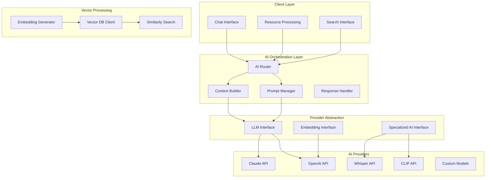

# RAGBOARD AI Integration Architecture

## Overview

RAGBOARD integrates multiple AI services to provide intelligent content processing, semantic search, and context-aware conversations. The architecture supports multiple LLM providers, embedding models, and specialized AI services for media processing.

## AI Service Architecture



## Multi-Provider LLM Support

### Provider Interface

```typescript
// Base LLM provider interface
interface LLMProvider {
  name: string
  models: string[]
  
  // Core methods
  complete(prompt: string, options: CompletionOptions): Promise<CompletionResponse>
  stream(prompt: string, options: StreamOptions): AsyncGenerator<string>
  embed(text: string): Promise<number[]>
  
  // Utility methods
  countTokens(text: string): Promise<number>
  validateApiKey(key: string): Promise<boolean>
  getModelInfo(model: string): ModelInfo
}

interface CompletionOptions {
  model: string
  temperature?: number
  maxTokens?: number
  topP?: number
  stopSequences?: string[]
  systemPrompt?: string
  responseFormat?: 'text' | 'json'
}

interface CompletionResponse {
  text: string
  usage: {
    promptTokens: number
    completionTokens: number
    totalTokens: number
  }
  model: string
  finishReason: 'stop' | 'length' | 'content_filter'
}
```

### Claude Provider Implementation

```typescript
import Anthropic from '@anthropic-ai/sdk'

export class ClaudeProvider implements LLMProvider {
  name = 'claude'
  models = ['claude-3-opus-20240229', 'claude-3-sonnet-20240229', 'claude-3-haiku-20240307']
  
  private client: Anthropic
  
  constructor(apiKey: string) {
    this.client = new Anthropic({ apiKey })
  }
  
  async complete(prompt: string, options: CompletionOptions): Promise<CompletionResponse> {
    const response = await this.client.messages.create({
      model: options.model,
      messages: [
        ...(options.systemPrompt ? [{ role: 'system', content: options.systemPrompt }] : []),
        { role: 'user', content: prompt }
      ],
      max_tokens: options.maxTokens || 4000,
      temperature: options.temperature || 0.7,
      top_p: options.topP || 1,
      stop_sequences: options.stopSequences,
    })
    
    return {
      text: response.content[0].text,
      usage: {
        promptTokens: response.usage.input_tokens,
        completionTokens: response.usage.output_tokens,
        totalTokens: response.usage.input_tokens + response.usage.output_tokens,
      },
      model: response.model,
      finishReason: response.stop_reason === 'end_turn' ? 'stop' : response.stop_reason,
    }
  }
  
  async *stream(prompt: string, options: StreamOptions): AsyncGenerator<string> {
    const stream = await this.client.messages.create({
      model: options.model,
      messages: [{ role: 'user', content: prompt }],
      max_tokens: options.maxTokens || 4000,
      stream: true,
    })
    
    for await (const chunk of stream) {
      if (chunk.type === 'content_block_delta') {
        yield chunk.delta.text
      }
    }
  }
  
  async countTokens(text: string): Promise<number> {
    // Use tiktoken or Claude's token counting endpoint
    const response = await this.client.countTokens({ text })
    return response.tokens
  }
}
```

### OpenAI Provider Implementation

```typescript
import OpenAI from 'openai'

export class OpenAIProvider implements LLMProvider {
  name = 'openai'
  models = ['gpt-4-turbo-preview', 'gpt-4', 'gpt-3.5-turbo']
  
  private client: OpenAI
  
  constructor(apiKey: string) {
    this.client = new OpenAI({ apiKey })
  }
  
  async complete(prompt: string, options: CompletionOptions): Promise<CompletionResponse> {
    const response = await this.client.chat.completions.create({
      model: options.model,
      messages: [
        ...(options.systemPrompt ? [{ role: 'system', content: options.systemPrompt }] : []),
        { role: 'user', content: prompt }
      ],
      max_tokens: options.maxTokens,
      temperature: options.temperature,
      top_p: options.topP,
      stop: options.stopSequences,
      response_format: options.responseFormat === 'json' ? { type: 'json_object' } : undefined,
    })
    
    return {
      text: response.choices[0].message.content!,
      usage: {
        promptTokens: response.usage!.prompt_tokens,
        completionTokens: response.usage!.completion_tokens,
        totalTokens: response.usage!.total_tokens,
      },
      model: response.model,
      finishReason: response.choices[0].finish_reason as any,
    }
  }
  
  async embed(text: string): Promise<number[]> {
    const response = await this.client.embeddings.create({
      model: 'text-embedding-3-small',
      input: text,
    })
    
    return response.data[0].embedding
  }
}
```

### Provider Factory

```typescript
export class AIProviderFactory {
  private static providers = new Map<string, LLMProvider>()
  
  static registerProvider(name: string, provider: LLMProvider) {
    this.providers.set(name, provider)
  }
  
  static getProvider(name: string): LLMProvider {
    const provider = this.providers.get(name)
    if (!provider) {
      throw new Error(`Provider ${name} not found`)
    }
    return provider
  }
  
  static initialize(config: AIConfig) {
    if (config.claude?.apiKey) {
      this.registerProvider('claude', new ClaudeProvider(config.claude.apiKey))
    }
    
    if (config.openai?.apiKey) {
      this.registerProvider('openai', new OpenAIProvider(config.openai.apiKey))
    }
    
    if (config.custom?.providers) {
      config.custom.providers.forEach(p => {
        this.registerProvider(p.name, new CustomProvider(p))
      })
    }
  }
}
```

## RAG (Retrieval-Augmented Generation) System

### Context Building Pipeline

```typescript
export class RAGContextBuilder {
  constructor(
    private vectorDB: VectorDBClient,
    private nodeService: NodeService,
    private embeddingService: EmbeddingService
  ) {}
  
  async buildContext(chatNodeId: string, userQuery: string): Promise<RAGContext> {
    // 1. Get directly connected resources
    const directResources = await this.getConnectedResources(chatNodeId)
    
    // 2. Generate query embedding
    const queryEmbedding = await this.embeddingService.embed(userQuery)
    
    // 3. Perform vector similarity search
    const similarChunks = await this.searchSimilarContent(
      queryEmbedding,
      directResources[0]?.boardId,
      {
        topK: 20,
        threshold: 0.7,
      }
    )
    
    // 4. Rerank results using cross-encoder
    const rerankedChunks = await this.rerankResults(userQuery, similarChunks)
    
    // 5. Build structured context
    const context = this.structureContext(directResources, rerankedChunks)
    
    // 6. Optimize for token limits
    return this.optimizeContext(context, 8000) // Reserve tokens for response
  }
  
  private async searchSimilarContent(
    queryEmbedding: number[],
    boardId: string,
    options: SearchOptions
  ): Promise<VectorSearchResult[]> {
    const results = await this.vectorDB.search({
      vector: queryEmbedding,
      filter: {
        boardId,
        // Only search in completed resources
        processingStatus: 'completed',
      },
      topK: options.topK,
      includeMetadata: true,
    })
    
    return results.filter(r => r.score >= options.threshold)
  }
  
  private async rerankResults(
    query: string,
    chunks: VectorSearchResult[]
  ): Promise<RankedChunk[]> {
    // Use a cross-encoder model for more accurate ranking
    const rankings = await Promise.all(
      chunks.map(async chunk => {
        const score = await this.crossEncoder.score(query, chunk.metadata.content)
        return { ...chunk, rerankScore: score }
      })
    )
    
    return rankings
      .sort((a, b) => b.rerankScore - a.rerankScore)
      .slice(0, 10) // Top 10 most relevant
  }
  
  private structureContext(
    directResources: Resource[],
    similarChunks: RankedChunk[]
  ): StructuredContext {
    return {
      direct: directResources.map(r => ({
        id: r.id,
        type: r.type,
        title: r.title,
        summary: r.summary || this.generateQuickSummary(r.content),
        content: r.extractedText || r.content,
        metadata: r.metadata,
      })),
      
      similar: similarChunks.map(chunk => ({
        source: chunk.metadata.nodeId,
        title: chunk.metadata.title,
        snippet: this.extractRelevantSnippet(chunk.metadata.content, 500),
        score: chunk.rerankScore,
        type: chunk.metadata.type,
      })),
      
      summary: this.generateContextSummary(directResources, similarChunks),
    }
  }
  
  private optimizeContext(context: StructuredContext, maxTokens: number): RAGContext {
    let currentTokens = this.estimateTokens(context)
    
    // Progressively trim content if over limit
    while (currentTokens > maxTokens && context.similar.length > 0) {
      // Remove least relevant similar content
      context.similar.pop()
      currentTokens = this.estimateTokens(context)
    }
    
    // Trim direct content if still over limit
    if (currentTokens > maxTokens) {
      context.direct.forEach(resource => {
        if (resource.content.length > 1000) {
          resource.content = resource.content.substring(0, 1000) + '...'
        }
      })
    }
    
    return {
      ...context,
      tokenCount: currentTokens,
      timestamp: new Date(),
    }
  }
}
```

### Prompt Engineering

```typescript
export class PromptManager {
  private templates = new Map<string, PromptTemplate>()
  
  constructor() {
    this.registerDefaultTemplates()
  }
  
  private registerDefaultTemplates() {
    // RAG conversation template
    this.templates.set('rag_conversation', {
      system: `You are a helpful AI assistant with access to specific resources provided by the user. 
Your responses should be based primarily on the provided context. If asked about something 
not covered in the context, acknowledge this limitation.

Available resources:
{{#direct}}
- {{title}} ({{type}}): {{summary}}
{{/direct}}

Related content from the knowledge base:
{{#similar}}
- From "{{title}}": {{snippet}} (relevance: {{score}})
{{/similar}}

Context summary: {{summary}}`,
      
      user: `{{query}}

Please provide a response based on the available context.`,
    })
    
    // Document Q&A template
    this.templates.set('document_qa', {
      system: `You are analyzing the following document: "{{document.title}}"

Document type: {{document.type}}
Summary: {{document.summary}}

Full content:
{{document.content}}`,
      
      user: `Question: {{question}}

Please answer based solely on the document content.`,
    })
    
    // Comparative analysis template
    this.templates.set('comparative_analysis', {
      system: `You are comparing multiple resources:

{{#resources}}
Resource {{@index}}: {{title}}
Type: {{type}}
Key points: {{keyPoints}}
{{/resources}}`,
      
      user: `{{instruction}}

Provide a detailed comparative analysis.`,
    })
  }
  
  buildPrompt(
    templateName: string,
    context: any,
    customizations?: PromptCustomization
  ): GeneratedPrompt {
    const template = this.templates.get(templateName)
    if (!template) {
      throw new Error(`Template ${templateName} not found`)
    }
    
    // Apply customizations
    let systemPrompt = this.renderTemplate(template.system, context)
    let userPrompt = this.renderTemplate(template.user, context)
    
    if (customizations?.additionalContext) {
      systemPrompt += `\n\nAdditional context:\n${customizations.additionalContext}`
    }
    
    if (customizations?.outputFormat) {
      userPrompt += `\n\nPlease format your response as: ${customizations.outputFormat}`
    }
    
    return {
      system: systemPrompt,
      user: userPrompt,
      metadata: {
        template: templateName,
        contextSize: JSON.stringify(context).length,
        timestamp: new Date(),
      },
    }
  }
  
  private renderTemplate(template: string, context: any): string {
    // Simple Mustache-like template rendering
    return template.replace(/\{\{([^}]+)\}\}/g, (match, path) => {
      const value = this.getNestedValue(context, path.trim())
      return value !== undefined ? String(value) : match
    })
  }
}
```

## Media Processing AI Services

### Transcription Service (Whisper)

```typescript
export class TranscriptionService {
  private whisperClient: WhisperClient
  
  async transcribeAudio(
    audioBuffer: Buffer,
    options: TranscriptionOptions = {}
  ): Promise<TranscriptionResult> {
    try {
      // Prepare audio for Whisper
      const preparedAudio = await this.prepareAudio(audioBuffer)
      
      // Call Whisper API
      const transcription = await this.whisperClient.transcribe({
        audio: preparedAudio,
        language: options.language || 'auto',
        task: options.translate ? 'translate' : 'transcribe',
        response_format: 'verbose_json',
      })
      
      // Process segments for better structure
      const segments = this.processSegments(transcription.segments)
      
      // Extract key topics
      const topics = await this.extractTopics(transcription.text)
      
      return {
        text: transcription.text,
        segments,
        language: transcription.language,
        duration: transcription.duration,
        topics,
        confidence: this.calculateConfidence(transcription.segments),
      }
    } catch (error) {
      console.error('Transcription failed:', error)
      throw new AIServiceError('Transcription failed', error)
    }
  }
  
  private async prepareAudio(buffer: Buffer): Promise<Buffer> {
    // Convert to required format (16kHz, mono, WAV)
    const ffmpeg = new FFmpeg()
    return ffmpeg.convert(buffer, {
      sampleRate: 16000,
      channels: 1,
      format: 'wav',
    })
  }
  
  private processSegments(segments: WhisperSegment[]): ProcessedSegment[] {
    return segments.map(segment => ({
      start: segment.start,
      end: segment.end,
      text: segment.text.trim(),
      confidence: segment.avg_logprob,
      speaker: this.detectSpeaker(segment), // Speaker diarization
    }))
  }
  
  private async extractTopics(text: string): Promise<string[]> {
    // Use NLP to extract key topics
    const topics = await this.nlpService.extractKeyPhrases(text)
    return topics.slice(0, 5) // Top 5 topics
  }
}
```

### Image Analysis Service (CLIP + OCR)

```typescript
export class ImageAnalysisService {
  private clipClient: CLIPClient
  private ocrClient: OCRClient
  
  async analyzeImage(
    imageBuffer: Buffer,
    options: ImageAnalysisOptions = {}
  ): Promise<ImageAnalysisResult> {
    const [clipAnalysis, ocrResult] = await Promise.all([
      this.analyzeWithCLIP(imageBuffer, options),
      this.performOCR(imageBuffer, options),
    ])
    
    // Combine results
    return {
      description: clipAnalysis.description,
      objects: clipAnalysis.objects,
      scenes: clipAnalysis.scenes,
      colors: await this.extractColors(imageBuffer),
      text: ocrResult.text,
      textRegions: ocrResult.regions,
      metadata: await this.extractMetadata(imageBuffer),
      embeddings: clipAnalysis.embeddings,
    }
  }
  
  private async analyzeWithCLIP(
    imageBuffer: Buffer,
    options: ImageAnalysisOptions
  ): Promise<CLIPAnalysis> {
    // Generate image embeddings
    const embeddings = await this.clipClient.encodeImage(imageBuffer)
    
    // Compare with text prompts for classification
    const classifications = await this.classifyImage(embeddings, options.categories)
    
    // Generate natural language description
    const description = await this.generateDescription(embeddings)
    
    // Detect objects
    const objects = await this.detectObjects(imageBuffer)
    
    return {
      embeddings,
      description,
      objects,
      scenes: classifications.scenes,
      attributes: classifications.attributes,
    }
  }
  
  private async performOCR(
    imageBuffer: Buffer,
    options: ImageAnalysisOptions
  ): Promise<OCRResult> {
    // Preprocess image for better OCR
    const processed = await this.preprocessForOCR(imageBuffer)
    
    // Perform OCR
    const result = await this.ocrClient.recognize(processed, {
      lang: options.ocrLanguage || 'eng',
      mode: 'accurate',
    })
    
    // Post-process text
    const cleanedText = this.cleanOCRText(result.text)
    
    // Extract structured data
    const structured = this.extractStructuredData(cleanedText)
    
    return {
      text: cleanedText,
      regions: result.regions,
      confidence: result.confidence,
      structured,
    }
  }
  
  private async generateDescription(embeddings: number[]): Promise<string> {
    // Use a vision-language model to generate description
    const candidates = [
      "A photo showing",
      "An image containing",
      "A picture of",
      "This image depicts",
    ]
    
    const scores = await Promise.all(
      candidates.map(prefix => 
        this.clipClient.scoreTextImage(prefix, embeddings)
      )
    )
    
    // Continue generation with best prefix
    const bestPrefix = candidates[scores.indexOf(Math.max(...scores))]
    return this.completeDescription(bestPrefix, embeddings)
  }
}
```

### Video Processing Service

```typescript
export class VideoProcessingService {
  async processVideo(
    videoBuffer: Buffer,
    options: VideoProcessingOptions = {}
  ): Promise<VideoAnalysisResult> {
    // Extract key frames
    const keyFrames = await this.extractKeyFrames(videoBuffer, {
      interval: options.frameInterval || 1000, // Every second
      maxFrames: options.maxFrames || 60,
    })
    
    // Analyze each frame
    const frameAnalyses = await Promise.all(
      keyFrames.map(frame => this.imageAnalysis.analyzeImage(frame.buffer))
    )
    
    // Extract audio track
    const audioTrack = await this.extractAudio(videoBuffer)
    
    // Transcribe audio
    const transcription = await this.transcriptionService.transcribeAudio(audioTrack)
    
    // Detect scene changes
    const scenes = this.detectScenes(frameAnalyses)
    
    // Generate video summary
    const summary = await this.generateVideoSummary({
      frames: frameAnalyses,
      transcription,
      scenes,
      duration: await this.getVideoDuration(videoBuffer),
    })
    
    return {
      duration: summary.duration,
      frameCount: keyFrames.length,
      scenes,
      transcription,
      keyFrames: keyFrames.map((frame, i) => ({
        timestamp: frame.timestamp,
        analysis: frameAnalyses[i],
      })),
      summary: summary.text,
      topics: summary.topics,
      highlights: summary.highlights,
    }
  }
  
  private async generateVideoSummary(data: VideoData): Promise<VideoSummary> {
    const prompt = `
Analyze this video content:

Duration: ${data.duration} seconds
Scenes: ${data.scenes.length}

Transcription excerpts:
${data.transcription.text.substring(0, 1000)}...

Key visual elements:
${data.frames.slice(0, 5).map(f => f.description).join('\n')}

Generate a comprehensive summary including:
1. Main topics covered
2. Key highlights with timestamps
3. Overall description
`
    
    const response = await this.llmService.complete(prompt, {
      model: 'gpt-4-vision-preview',
      maxTokens: 1000,
    })
    
    return this.parseVideoSummary(response.text)
  }
}
```

## Embedding Generation and Management

### Embedding Service

```typescript
export class EmbeddingService {
  private providers: Map<string, EmbeddingProvider> = new Map()
  private cache: EmbeddingCache
  
  constructor(private config: EmbeddingConfig) {
    this.initializeProviders()
    this.cache = new EmbeddingCache(config.cacheSize || 10000)
  }
  
  async generateEmbeddings(
    content: string | string[],
    options: EmbeddingOptions = {}
  ): Promise<EmbeddingResult> {
    const provider = this.providers.get(options.provider || 'openai')
    if (!provider) {
      throw new Error(`Embedding provider ${options.provider} not found`)
    }
    
    // Handle batching for multiple texts
    const texts = Array.isArray(content) ? content : [content]
    const chunks = this.chunkTexts(texts, provider.maxBatchSize)
    
    const embeddings: number[][] = []
    let totalTokens = 0
    
    for (const chunk of chunks) {
      // Check cache
      const cached = chunk.map(text => this.cache.get(text)).filter(Boolean)
      const uncached = chunk.filter(text => !this.cache.has(text))
      
      if (uncached.length > 0) {
        // Generate embeddings for uncached texts
        const response = await provider.embed(uncached)
        
        // Cache results
        uncached.forEach((text, i) => {
          this.cache.set(text, response.embeddings[i])
        })
        
        embeddings.push(...cached, ...response.embeddings)
        totalTokens += response.usage.totalTokens
      } else {
        embeddings.push(...cached)
      }
    }
    
    return {
      embeddings: Array.isArray(content) ? embeddings : embeddings[0],
      model: provider.model,
      dimensions: provider.dimensions,
      usage: { totalTokens },
    }
  }
  
  async generateChunkedEmbeddings(
    text: string,
    options: ChunkedEmbeddingOptions = {}
  ): Promise<ChunkedEmbedding[]> {
    // Split text into overlapping chunks
    const chunks = this.createOverlappingChunks(text, {
      chunkSize: options.chunkSize || 512,
      overlap: options.overlap || 128,
    })
    
    // Generate embeddings for each chunk
    const embeddings = await this.generateEmbeddings(
      chunks.map(c => c.text),
      options
    )
    
    return chunks.map((chunk, i) => ({
      text: chunk.text,
      embedding: embeddings.embeddings[i],
      start: chunk.start,
      end: chunk.end,
      index: i,
      metadata: {
        totalChunks: chunks.length,
        overlap: options.overlap || 128,
      },
    }))
  }
  
  private createOverlappingChunks(
    text: string,
    options: ChunkingOptions
  ): TextChunk[] {
    const chunks: TextChunk[] = []
    const sentences = this.splitIntoSentences(text)
    
    let currentChunk = ''
    let currentStart = 0
    let sentenceStart = 0
    
    for (const sentence of sentences) {
      if (currentChunk.length + sentence.length > options.chunkSize) {
        // Save current chunk
        chunks.push({
          text: currentChunk.trim(),
          start: currentStart,
          end: sentenceStart,
        })
        
        // Start new chunk with overlap
        const overlapStart = Math.max(0, sentences.indexOf(sentence) - 2)
        currentChunk = sentences.slice(overlapStart, sentences.indexOf(sentence) + 1).join(' ')
        currentStart = sentenceStart - currentChunk.length + sentence.length
      } else {
        currentChunk += ' ' + sentence
      }
      
      sentenceStart += sentence.length + 1
    }
    
    // Add final chunk
    if (currentChunk.trim()) {
      chunks.push({
        text: currentChunk.trim(),
        start: currentStart,
        end: text.length,
      })
    }
    
    return chunks
  }
}
```

### Vector Storage Integration

```typescript
export class VectorStorageService {
  constructor(
    private pinecone: PineconeClient,
    private config: VectorStorageConfig
  ) {}
  
  async storeEmbeddings(
    embeddings: VectorDocument[],
    namespace?: string
  ): Promise<void> {
    const index = this.pinecone.Index(this.config.indexName)
    
    // Batch upsert for efficiency
    const batches = this.batchDocuments(embeddings, 100)
    
    for (const batch of batches) {
      const vectors = batch.map(doc => ({
        id: doc.id,
        values: doc.embedding,
        metadata: {
          ...doc.metadata,
          text: doc.text.substring(0, 1000), // Truncate for metadata limit
          timestamp: Date.now(),
        },
      }))
      
      await index.namespace(namespace || 'default').upsert(vectors)
    }
  }
  
  async search(
    query: VectorQuery,
    options: SearchOptions = {}
  ): Promise<SearchResult[]> {
    const index = this.pinecone.Index(this.config.indexName)
    
    // Prepare filter
    const filter: any = {}
    if (options.filter?.boardId) {
      filter.boardId = options.filter.boardId
    }
    if (options.filter?.resourceTypes) {
      filter.type = { $in: options.filter.resourceTypes }
    }
    if (options.filter?.dateRange) {
      filter.timestamp = {
        $gte: options.filter.dateRange.start.getTime(),
        $lte: options.filter.dateRange.end.getTime(),
      }
    }
    
    // Execute search
    const response = await index.namespace(options.namespace || 'default').query({
      vector: query.embedding,
      topK: options.topK || 10,
      includeMetadata: true,
      filter: Object.keys(filter).length > 0 ? filter : undefined,
    })
    
    // Process results
    return response.matches.map(match => ({
      id: match.id,
      score: match.score,
      metadata: match.metadata as any,
      highlights: options.includeHighlights 
        ? this.generateHighlights(query.text, match.metadata.text)
        : undefined,
    }))
  }
  
  async hybridSearch(
    query: HybridQuery,
    options: SearchOptions = {}
  ): Promise<SearchResult[]> {
    // Combine vector and keyword search
    const [vectorResults, keywordResults] = await Promise.all([
      this.search({ embedding: query.embedding, text: query.text }, options),
      this.keywordSearch(query.text, options),
    ])
    
    // Merge and rerank results
    return this.mergeResults(vectorResults, keywordResults, {
      vectorWeight: query.vectorWeight || 0.7,
      keywordWeight: query.keywordWeight || 0.3,
    })
  }
  
  private mergeResults(
    vectorResults: SearchResult[],
    keywordResults: SearchResult[],
    weights: { vectorWeight: number; keywordWeight: number }
  ): SearchResult[] {
    const merged = new Map<string, SearchResult>()
    
    // Add vector results with weighted scores
    vectorResults.forEach(result => {
      merged.set(result.id, {
        ...result,
        score: result.score * weights.vectorWeight,
        source: 'vector',
      })
    })
    
    // Merge keyword results
    keywordResults.forEach(result => {
      const existing = merged.get(result.id)
      if (existing) {
        existing.score += result.score * weights.keywordWeight
        existing.source = 'hybrid'
      } else {
        merged.set(result.id, {
          ...result,
          score: result.score * weights.keywordWeight,
          source: 'keyword',
        })
      }
    })
    
    // Sort by combined score
    return Array.from(merged.values())
      .sort((a, b) => b.score - a.score)
  }
}
```

## AI Response Streaming

### Stream Handler

```typescript
export class AIStreamHandler {
  async *streamCompletion(
    prompt: string,
    options: StreamOptions,
    callbacks?: StreamCallbacks
  ): AsyncGenerator<StreamChunk> {
    const provider = AIProviderFactory.getProvider(options.provider || 'claude')
    
    try {
      callbacks?.onStart?.()
      
      let fullText = ''
      let chunkCount = 0
      
      for await (const chunk of provider.stream(prompt, options)) {
        fullText += chunk
        chunkCount++
        
        // Yield chunk with metadata
        yield {
          text: chunk,
          fullText,
          chunkIndex: chunkCount,
          timestamp: Date.now(),
        }
        
        // Call progress callback
        callbacks?.onProgress?.(fullText, chunkCount)
      }
      
      callbacks?.onComplete?.(fullText)
      
    } catch (error) {
      callbacks?.onError?.(error)
      throw error
    }
  }
  
  createStreamResponse(
    stream: AsyncGenerator<StreamChunk>,
    response: Response
  ) {
    const encoder = new TextEncoder()
    const readable = new ReadableStream({
      async start(controller) {
        try {
          for await (const chunk of stream) {
            // Format as SSE
            const sseData = `data: ${JSON.stringify(chunk)}\n\n`
            controller.enqueue(encoder.encode(sseData))
          }
          
          // Send completion event
          controller.enqueue(encoder.encode('data: [DONE]\n\n'))
          controller.close()
        } catch (error) {
          controller.error(error)
        }
      },
    })
    
    return new Response(readable, {
      headers: {
        'Content-Type': 'text/event-stream',
        'Cache-Control': 'no-cache',
        'Connection': 'keep-alive',
      },
    })
  }
}

// Client-side stream consumer
export class StreamConsumer {
  async consumeStream(
    url: string,
    options: RequestInit,
    callbacks: StreamCallbacks
  ) {
    const response = await fetch(url, {
      ...options,
      headers: {
        ...options.headers,
        'Accept': 'text/event-stream',
      },
    })
    
    if (!response.body) throw new Error('No response body')
    
    const reader = response.body.getReader()
    const decoder = new TextDecoder()
    let buffer = ''
    
    try {
      while (true) {
        const { done, value } = await reader.read()
        if (done) break
        
        buffer += decoder.decode(value, { stream: true })
        const lines = buffer.split('\n')
        buffer = lines.pop() || ''
        
        for (const line of lines) {
          if (line.startsWith('data: ')) {
            const data = line.slice(6)
            if (data === '[DONE]') {
              callbacks.onComplete?.()
              return
            }
            
            try {
              const chunk = JSON.parse(data) as StreamChunk
              callbacks.onChunk?.(chunk)
            } catch (e) {
              console.error('Failed to parse SSE data:', e)
            }
          }
        }
      }
    } catch (error) {
      callbacks.onError?.(error)
      throw error
    } finally {
      reader.releaseLock()
    }
  }
}
```

## AI Safety and Moderation

### Content Moderation

```typescript
export class AIContentModerator {
  async moderateContent(
    content: string,
    options: ModerationOptions = {}
  ): Promise<ModerationResult> {
    // Use OpenAI's moderation API or custom model
    const response = await this.openaiClient.moderations.create({
      input: content,
      model: 'text-moderation-latest',
    })
    
    const results = response.results[0]
    
    // Check against thresholds
    const flagged = Object.entries(results.category_scores).some(
      ([category, score]) => score > (options.thresholds?.[category] || 0.8)
    )
    
    return {
      flagged,
      categories: results.categories,
      scores: results.category_scores,
      action: this.determineAction(results, options),
    }
  }
  
  private determineAction(
    results: OpenAIModerationResult,
    options: ModerationOptions
  ): ModerationAction {
    const severityScores = {
      'hate': 0.9,
      'hate/threatening': 1.0,
      'self-harm': 1.0,
      'sexual': 0.8,
      'sexual/minors': 1.0,
      'violence': 0.8,
      'violence/graphic': 0.9,
    }
    
    let maxSeverity = 0
    for (const [category, flagged] of Object.entries(results.categories)) {
      if (flagged) {
        maxSeverity = Math.max(maxSeverity, severityScores[category] || 0.5)
      }
    }
    
    if (maxSeverity >= 0.9) return 'block'
    if (maxSeverity >= 0.7) return 'flag'
    if (maxSeverity >= 0.5) return 'warn'
    return 'allow'
  }
  
  async sanitizeResponse(
    response: string,
    context: SanitizationContext
  ): Promise<string> {
    // Remove potential PII
    let sanitized = this.removePII(response)
    
    // Check for prompt injection attempts
    if (this.detectPromptInjection(response)) {
      return "I cannot provide that response."
    }
    
    // Apply content filters
    sanitized = this.applyContentFilters(sanitized, context.filters)
    
    return sanitized
  }
}
```

## Performance Optimization

### Caching Strategy

```typescript
export class AIResponseCache {
  private cache: LRUCache<string, CachedResponse>
  private embedCache: Map<string, number[]>
  
  constructor(private config: CacheConfig) {
    this.cache = new LRUCache({
      max: config.maxEntries || 1000,
      ttl: config.ttl || 1000 * 60 * 60, // 1 hour
      updateAgeOnGet: true,
    })
    
    this.embedCache = new Map()
  }
  
  async getCachedResponse(
    prompt: string,
    options: CompletionOptions
  ): Promise<CachedResponse | null> {
    const key = this.generateCacheKey(prompt, options)
    const cached = this.cache.get(key)
    
    if (cached && this.isValidCache(cached, options)) {
      // Check semantic similarity for fuzzy matching
      if (options.fuzzyMatch) {
        const similarity = await this.checkSimilarity(prompt, cached.prompt)
        if (similarity > 0.95) {
          return cached
        }
      } else {
        return cached
      }
    }
    
    return null
  }
  
  private async checkSimilarity(prompt1: string, prompt2: string): Promise<number> {
    const [embed1, embed2] = await Promise.all([
      this.getEmbedding(prompt1),
      this.getEmbedding(prompt2),
    ])
    
    return this.cosineSimilarity(embed1, embed2)
  }
  
  private async getEmbedding(text: string): Promise<number[]> {
    if (this.embedCache.has(text)) {
      return this.embedCache.get(text)!
    }
    
    const embedding = await this.embeddingService.embed(text)
    this.embedCache.set(text, embedding)
    
    // Limit embed cache size
    if (this.embedCache.size > 10000) {
      const firstKey = this.embedCache.keys().next().value
      this.embedCache.delete(firstKey)
    }
    
    return embedding
  }
}
```

### Batch Processing

```typescript
export class AIBatchProcessor {
  private queue: BatchItem[] = []
  private processing = false
  
  async addToBatch(
    request: AIRequest,
    callback: (response: AIResponse) => void
  ): Promise<void> {
    this.queue.push({ request, callback })
    
    if (!this.processing) {
      this.processBatch()
    }
  }
  
  private async processBatch() {
    this.processing = true
    
    while (this.queue.length > 0) {
      // Group by similar requests
      const batch = this.extractBatch(this.config.batchSize)
      
      if (batch.length >= this.config.minBatchSize || 
          this.shouldProcessImmediately(batch)) {
        await this.executeBatch(batch)
      } else {
        // Wait for more items
        await this.delay(this.config.batchDelay)
      }
    }
    
    this.processing = false
  }
  
  private async executeBatch(batch: BatchItem[]) {
    try {
      // Combine prompts for batch processing
      const batchRequest = this.combineBatchRequests(batch)
      
      // Execute batch request
      const responses = await this.provider.batchComplete(batchRequest)
      
      // Distribute responses
      batch.forEach((item, index) => {
        item.callback({
          success: true,
          data: responses[index],
        })
      })
    } catch (error) {
      // Handle batch failure
      batch.forEach(item => {
        item.callback({
          success: false,
          error: error.message,
        })
      })
    }
  }
}
```

## Monitoring and Analytics

### AI Usage Tracking

```typescript
export class AIUsageTracker {
  async trackUsage(
    userId: string,
    usage: AIUsageEvent
  ): Promise<void> {
    const record: UsageRecord = {
      userId,
      timestamp: new Date(),
      provider: usage.provider,
      model: usage.model,
      operation: usage.operation,
      tokens: {
        prompt: usage.promptTokens,
        completion: usage.completionTokens,
        total: usage.promptTokens + usage.completionTokens,
      },
      cost: this.calculateCost(usage),
      duration: usage.duration,
      success: usage.success,
      error: usage.error,
    }
    
    // Store in database
    await this.db.usage.create(record)
    
    // Update real-time metrics
    this.metrics.increment('ai.requests', {
      provider: usage.provider,
      model: usage.model,
      status: usage.success ? 'success' : 'failure',
    })
    
    this.metrics.histogram('ai.tokens', usage.promptTokens + usage.completionTokens, {
      provider: usage.provider,
      model: usage.model,
    })
    
    this.metrics.histogram('ai.duration', usage.duration, {
      provider: usage.provider,
      operation: usage.operation,
    })
    
    // Check usage limits
    await this.checkUsageLimits(userId, record)
  }
  
  private calculateCost(usage: AIUsageEvent): number {
    const pricing = {
      'claude-3-opus': { prompt: 0.015, completion: 0.075 },
      'claude-3-sonnet': { prompt: 0.003, completion: 0.015 },
      'gpt-4-turbo': { prompt: 0.01, completion: 0.03 },
      'gpt-3.5-turbo': { prompt: 0.0005, completion: 0.0015 },
    }
    
    const modelPricing = pricing[usage.model] || { prompt: 0, completion: 0 }
    
    return (
      (usage.promptTokens / 1000) * modelPricing.prompt +
      (usage.completionTokens / 1000) * modelPricing.completion
    )
  }
}
```

### Quality Metrics

```typescript
export class AIQualityMetrics {
  async evaluateResponse(
    request: AIRequest,
    response: AIResponse,
    feedback?: UserFeedback
  ): Promise<QualityScore> {
    const metrics = {
      relevance: await this.calculateRelevance(request, response),
      coherence: await this.calculateCoherence(response),
      completeness: await this.calculateCompleteness(request, response),
      accuracy: feedback?.accuracy,
      helpfulness: feedback?.helpfulness,
    }
    
    const overallScore = this.calculateOverallScore(metrics)
    
    // Store for analysis
    await this.db.qualityMetrics.create({
      requestId: request.id,
      metrics,
      overallScore,
      feedback,
      timestamp: new Date(),
    })
    
    return {
      ...metrics,
      overall: overallScore,
    }
  }
  
  private async calculateRelevance(
    request: AIRequest,
    response: AIResponse
  ): Promise<number> {
    // Use embeddings to calculate semantic similarity
    const [requestEmbed, responseEmbed] = await Promise.all([
      this.embedService.embed(request.prompt),
      this.embedService.embed(response.text),
    ])
    
    return this.cosineSimilarity(requestEmbed, responseEmbed)
  }
  
  private async calculateCoherence(response: AIResponse): Promise<number> {
    // Use NLP metrics to evaluate text coherence
    const sentences = this.nlp.splitSentences(response.text)
    
    if (sentences.length < 2) return 1.0
    
    let coherenceScore = 0
    for (let i = 1; i < sentences.length; i++) {
      const similarity = await this.sentenceSimilarity(sentences[i-1], sentences[i])
      coherenceScore += similarity
    }
    
    return coherenceScore / (sentences.length - 1)
  }
}
```