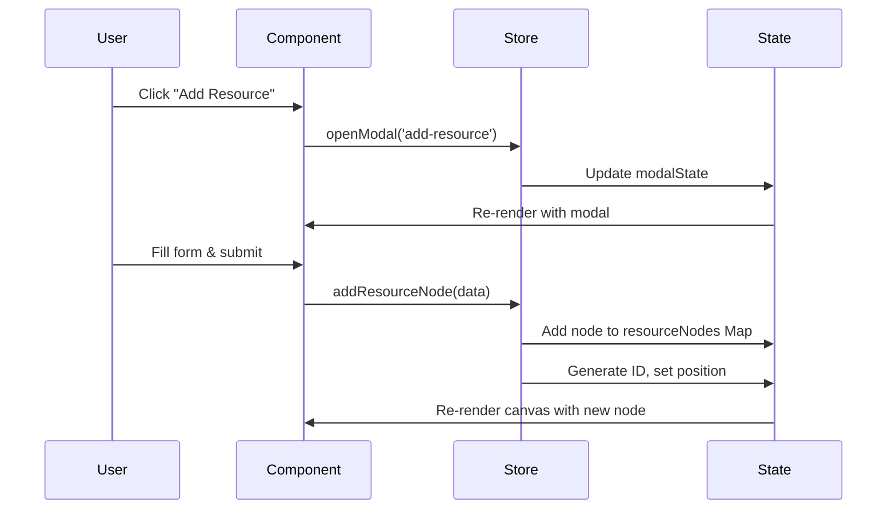
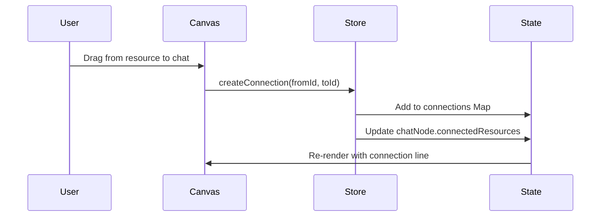

# RAGBoard Architecture & Data Flow

## Overview

RAGBoard uses a unidirectional data flow architecture with Zustand for state management. The application follows React best practices with TypeScript for type safety.

## Core Architecture

```
┌─────────────────────────────────────────────────────────────┐
│                        RAGBoard App                         │
├─────────────────────────────────────────────────────────────┤
│                                                             │
│  ┌─────────────┐     ┌──────────────┐    ┌──────────────┐ │
│  │  SidebarMenu │     │  BoardCanvas │    │    Modals    │ │
│  │             │     │              │    │              │ │
│  │  - Add      │     │  - Nodes     │    │  - Add       │ │
│  │    Resources│     │  - Connections│   │    Resource  │ │
│  │  - Add Chat │     │  - Drag/Drop │    │  - Settings  │ │
│  └──────┬──────┘     └──────┬───────┘    └──────┬───────┘ │
│         │                   │                    │         │
│         └───────────────────┴────────────────────┘         │
│                             │                               │
│                             ▼                               │
│  ┌─────────────────────────────────────────────────────┐  │
│  │                   Zustand Store                      │  │
│  │                                                      │  │
│  │  State:                Actions:                      │  │
│  │  - resourceNodes       - addResourceNode            │  │
│  │  - chatNodes          - addChatNode                │  │
│  │  - connections        - updateNode                  │  │
│  │  - viewState          - deleteNode                  │  │
│  │  - modalState         - createConnection            │  │
│  │  - selectedNodes      - etc...                      │  │
│  └─────────────────────────────────────────────────────┘  │
│                                                             │
└─────────────────────────────────────────────────────────────┘
```

## Data Flow

### 1. User Interaction Flow



### 2. Node Connection Flow



## State Management Design

### 1. Store Structure

```typescript
interface BoardState {
  // Entity Collections (using Maps for O(1) lookups)
  resourceNodes: Map<string, ResourceNode>
  chatNodes: Map<string, AIChatNode>
  connections: Map<string, Connection>
  
  // UI State
  viewState: ViewState        // zoom, pan offset
  modalState: ModalState      // current modal
  selectedNodes: string[]     // multi-selection
  isDragging: boolean
  draggedNode: string | null
  
  // Actions (grouped by domain)
  // ... see types/index.ts
}
```

### 2. Key Design Decisions

#### Using Maps vs Arrays
- **Maps** for nodes and connections enable O(1) lookups by ID
- Better performance for frequent updates and deletions
- Serialization handled by custom persist middleware

#### Immer for Immutability
- Simplifies complex nested updates
- Maintains immutability without manual spreading
- Better developer experience

#### Persist Middleware
- Automatic localStorage persistence
- Custom serialization for Map objects
- Preserves full application state between sessions

### 3. Action Patterns

#### Node Operations
```typescript
// Adding nodes
addResourceNode: (node) => {
  const id = uuidv4()
  set(state => {
    state.resourceNodes.set(id, {
      ...node,
      id,
      isSelected: false,
      metadata: {
        ...node.metadata,
        createdAt: new Date(),
        updatedAt: new Date()
      }
    })
  })
  return id
}
```

#### Connection Management
```typescript
// Creating connections with side effects
createConnection: (from, to) => {
  const id = uuidv4()
  set(state => {
    // Create connection
    state.connections.set(id, { id, from, to, ... })
    
    // Update chat node if applicable
    if (isChatConnection) {
      chatNode.connectedResources.push(from)
    }
  })
}
```

## Component Integration

### 1. SidebarMenu Integration

```typescript
const SidebarMenu = () => {
  const { openModal, addChatNode } = useBoardStore()
  
  // Direct state updates through actions
  const handleAddResource = (type) => {
    openModal('add-resource', { type })
  }
}
```

### 2. Modal State Management

```typescript
const AddResourceModal = () => {
  const { modalState, closeModal, addResourceNode } = useBoardStore()
  
  // Modal visibility controlled by store
  if (!modalState.isOpen) return null
  
  // Form submission updates store
  const handleSubmit = async (data) => {
    const nodeId = addResourceNode(data)
    closeModal()
  }
}
```

## Performance Optimizations

### 1. Selective Subscriptions
```typescript
// Subscribe only to needed state slices
const selectedNodes = useBoardStore(state => state.selectedNodes)
const viewState = useBoardStore(state => state.viewState)
```

### 2. Memoized Selectors
```typescript
// For expensive computations
const connectedResources = useBoardStore(
  state => state.getConnectedResources(chatId)
)
```

### 3. Batch Updates
```typescript
// Multiple state changes in one action
updateNode: (id, updates) => {
  set(state => {
    // All updates happen in single render cycle
    const node = state.resourceNodes.get(id)
    if (node) {
      Object.assign(node, updates)
      node.metadata.updatedAt = new Date()
    }
  })
}
```

## Folder Hierarchy Management

### Parent-Child Relationships
- Folders maintain `children` array of node IDs
- Child nodes have `parentId` reference
- Bidirectional updates ensure consistency

### Deletion Cascading
- Deleting folder orphans children (removes parentId)
- Children remain on canvas at same position
- Connections preserved

## Connection System

### Connection Types
1. **resource-to-chat**: Dashed lines, updates chat's connectedResources
2. **resource-to-resource**: Solid lines, visual grouping only

### Connection Lifecycle
1. Create: Validate nodes exist, determine type, update references
2. Delete: Remove from Map, update chat references
3. Node deletion: Cascade delete all related connections

## Error Handling

### Store Actions
- Validate inputs before state mutations
- Guard against missing nodes
- Maintain referential integrity

### Component Level
- Form validation before submission
- Loading states during async operations
- User feedback for errors

## Future Considerations

### Scalability
- Consider virtualization for large numbers of nodes
- Implement viewport culling for performance
- Add indexing for complex queries

### Collaboration
- Design supports multi-user with conflict resolution
- Connection IDs enable operation ordering
- Timestamps support last-write-wins

### Extensibility
- Plugin system for custom node types
- Middleware for logging/analytics
- Export/import for sharing boards