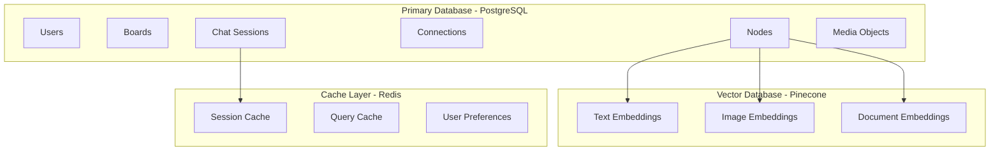

# RAGBOARD Database Schema Design

## Overview

RAGBOARD uses a hybrid database architecture combining PostgreSQL for structured data and a vector database (Pinecone/Weaviate) for semantic search capabilities.

## Database Architecture



## PostgreSQL Schema

### Core Tables

#### users
Stores user account information.

```sql
CREATE TABLE users (
    id UUID PRIMARY KEY DEFAULT gen_random_uuid(),
    email VARCHAR(255) UNIQUE NOT NULL,
    password_hash VARCHAR(255) NOT NULL,
    name VARCHAR(255),
    avatar_url TEXT,
    email_verified BOOLEAN DEFAULT false,
    settings JSONB DEFAULT '{}',
    subscription_tier VARCHAR(50) DEFAULT 'free',
    created_at TIMESTAMP WITH TIME ZONE DEFAULT CURRENT_TIMESTAMP,
    updated_at TIMESTAMP WITH TIME ZONE DEFAULT CURRENT_TIMESTAMP,
    last_login_at TIMESTAMP WITH TIME ZONE,
    is_active BOOLEAN DEFAULT true
);

CREATE INDEX idx_users_email ON users(email);
CREATE INDEX idx_users_active ON users(is_active) WHERE is_active = true;
```

#### boards
Stores board metadata and settings.

```sql
CREATE TABLE boards (
    id UUID PRIMARY KEY DEFAULT gen_random_uuid(),
    user_id UUID NOT NULL REFERENCES users(id) ON DELETE CASCADE,
    name VARCHAR(255) NOT NULL,
    description TEXT,
    thumbnail_url TEXT,
    settings JSONB DEFAULT '{
        "theme": "light",
        "gridSnap": true,
        "gridSize": 20,
        "showMinimap": true,
        "autoSave": true
    }',
    is_public BOOLEAN DEFAULT false,
    is_template BOOLEAN DEFAULT false,
    view_count INTEGER DEFAULT 0,
    created_at TIMESTAMP WITH TIME ZONE DEFAULT CURRENT_TIMESTAMP,
    updated_at TIMESTAMP WITH TIME ZONE DEFAULT CURRENT_TIMESTAMP,
    deleted_at TIMESTAMP WITH TIME ZONE,
    CONSTRAINT boards_user_name_unique UNIQUE(user_id, name) WHERE deleted_at IS NULL
);

CREATE INDEX idx_boards_user ON boards(user_id);
CREATE INDEX idx_boards_public ON boards(is_public) WHERE is_public = true;
CREATE INDEX idx_boards_template ON boards(is_template) WHERE is_template = true;
CREATE INDEX idx_boards_active ON boards(deleted_at) WHERE deleted_at IS NULL;
```

#### nodes
Polymorphic table for all node types.

```sql
CREATE TYPE node_type AS ENUM ('resource', 'chat', 'folder');
CREATE TYPE processing_status AS ENUM ('pending', 'processing', 'completed', 'failed');

CREATE TABLE nodes (
    id UUID PRIMARY KEY DEFAULT gen_random_uuid(),
    board_id UUID NOT NULL REFERENCES boards(id) ON DELETE CASCADE,
    type node_type NOT NULL,
    position JSONB NOT NULL DEFAULT '{"x": 0, "y": 0}',
    size JSONB DEFAULT '{"width": 300, "height": 200}',
    z_index INTEGER DEFAULT 0,
    is_locked BOOLEAN DEFAULT false,
    metadata JSONB DEFAULT '{}',
    created_at TIMESTAMP WITH TIME ZONE DEFAULT CURRENT_TIMESTAMP,
    updated_at TIMESTAMP WITH TIME ZONE DEFAULT CURRENT_TIMESTAMP,
    deleted_at TIMESTAMP WITH TIME ZONE
);

CREATE INDEX idx_nodes_board ON nodes(board_id);
CREATE INDEX idx_nodes_type ON nodes(type);
CREATE INDEX idx_nodes_active ON nodes(deleted_at) WHERE deleted_at IS NULL;
```

#### resource_nodes
Stores resource-specific data.

```sql
CREATE TYPE resource_type AS ENUM (
    'text', 'url', 'pdf', 'image', 'video', 'audio', 
    'youtube', 'twitter', 'linkedin', 'document'
);

CREATE TABLE resource_nodes (
    node_id UUID PRIMARY KEY REFERENCES nodes(id) ON DELETE CASCADE,
    resource_type resource_type NOT NULL,
    title VARCHAR(500),
    content TEXT,
    url TEXT,
    media_id UUID REFERENCES media_objects(id),
    processing_status processing_status DEFAULT 'pending',
    processing_error TEXT,
    extracted_text TEXT,
    summary TEXT,
    key_points TEXT[],
    language VARCHAR(10),
    word_count INTEGER,
    reading_time INTEGER, -- in seconds
    embeddings_generated BOOLEAN DEFAULT false,
    metadata JSONB DEFAULT '{}' -- Store type-specific data
);

CREATE INDEX idx_resource_nodes_type ON resource_nodes(resource_type);
CREATE INDEX idx_resource_nodes_status ON resource_nodes(processing_status);
CREATE INDEX idx_resource_nodes_media ON resource_nodes(media_id);
```

#### chat_nodes
Stores AI chat configuration.

```sql
CREATE TYPE ai_model AS ENUM (
    'claude-3-opus', 'claude-3-sonnet', 'claude-3-haiku',
    'gpt-4', 'gpt-4-turbo', 'gpt-3.5-turbo',
    'custom'
);

CREATE TABLE chat_nodes (
    node_id UUID PRIMARY KEY REFERENCES nodes(id) ON DELETE CASCADE,
    ai_model ai_model DEFAULT 'claude-3-sonnet',
    custom_model_endpoint TEXT,
    system_prompt TEXT,
    temperature DECIMAL(3,2) DEFAULT 0.7 CHECK (temperature >= 0 AND temperature <= 2),
    max_tokens INTEGER DEFAULT 4000,
    top_p DECIMAL(3,2) DEFAULT 1.0,
    frequency_penalty DECIMAL(3,2) DEFAULT 0,
    presence_penalty DECIMAL(3,2) DEFAULT 0,
    stop_sequences TEXT[],
    response_format VARCHAR(50) DEFAULT 'text', -- 'text', 'json', 'markdown'
    tools_enabled BOOLEAN DEFAULT false,
    memory_enabled BOOLEAN DEFAULT true,
    context_window_size INTEGER DEFAULT 10
);

CREATE INDEX idx_chat_nodes_model ON chat_nodes(ai_model);
```

#### folder_nodes
Stores folder/container information.

```sql
CREATE TABLE folder_nodes (
    node_id UUID PRIMARY KEY REFERENCES nodes(id) ON DELETE CASCADE,
    name VARCHAR(255) NOT NULL,
    description TEXT,
    color VARCHAR(7) DEFAULT '#6B7280', -- Hex color
    icon VARCHAR(50) DEFAULT 'folder',
    expanded BOOLEAN DEFAULT true,
    sort_order VARCHAR(50) DEFAULT 'manual', -- 'manual', 'name', 'date', 'type'
    max_items INTEGER,
    password_protected BOOLEAN DEFAULT false,
    password_hash VARCHAR(255)
);
```

#### node_hierarchy
Manages parent-child relationships for folders.

```sql
CREATE TABLE node_hierarchy (
    id UUID PRIMARY KEY DEFAULT gen_random_uuid(),
    parent_id UUID NOT NULL REFERENCES nodes(id) ON DELETE CASCADE,
    child_id UUID NOT NULL REFERENCES nodes(id) ON DELETE CASCADE,
    position INTEGER NOT NULL DEFAULT 0,
    created_at TIMESTAMP WITH TIME ZONE DEFAULT CURRENT_TIMESTAMP,
    CONSTRAINT unique_parent_child UNIQUE(parent_id, child_id),
    CONSTRAINT no_self_reference CHECK(parent_id != child_id)
);

CREATE INDEX idx_hierarchy_parent ON node_hierarchy(parent_id);
CREATE INDEX idx_hierarchy_child ON node_hierarchy(child_id);
```

#### connections
Stores connections between nodes.

```sql
CREATE TYPE connection_type AS ENUM ('data_flow', 'reference', 'hierarchy');

CREATE TABLE connections (
    id UUID PRIMARY KEY DEFAULT gen_random_uuid(),
    board_id UUID NOT NULL REFERENCES boards(id) ON DELETE CASCADE,
    from_node_id UUID NOT NULL REFERENCES nodes(id) ON DELETE CASCADE,
    to_node_id UUID NOT NULL REFERENCES nodes(id) ON DELETE CASCADE,
    connection_type connection_type DEFAULT 'data_flow',
    label VARCHAR(255),
    style JSONB DEFAULT '{"stroke": "dashed", "color": "#9CA3AF"}',
    metadata JSONB DEFAULT '{}',
    created_at TIMESTAMP WITH TIME ZONE DEFAULT CURRENT_TIMESTAMP,
    CONSTRAINT unique_connection UNIQUE(from_node_id, to_node_id, connection_type),
    CONSTRAINT no_self_connection CHECK(from_node_id != to_node_id)
);

CREATE INDEX idx_connections_board ON connections(board_id);
CREATE INDEX idx_connections_from ON connections(from_node_id);
CREATE INDEX idx_connections_to ON connections(to_node_id);
```

### Chat and Messaging Tables

#### chat_sessions
Stores chat session information.

```sql
CREATE TABLE chat_sessions (
    id UUID PRIMARY KEY DEFAULT gen_random_uuid(),
    chat_node_id UUID NOT NULL REFERENCES chat_nodes(node_id) ON DELETE CASCADE,
    user_id UUID NOT NULL REFERENCES users(id),
    title VARCHAR(255),
    context JSONB NOT NULL, -- Snapshot of connected resources
    token_count INTEGER DEFAULT 0,
    message_count INTEGER DEFAULT 0,
    started_at TIMESTAMP WITH TIME ZONE DEFAULT CURRENT_TIMESTAMP,
    ended_at TIMESTAMP WITH TIME ZONE,
    last_message_at TIMESTAMP WITH TIME ZONE
);

CREATE INDEX idx_sessions_chat_node ON chat_sessions(chat_node_id);
CREATE INDEX idx_sessions_user ON chat_sessions(user_id);
CREATE INDEX idx_sessions_active ON chat_sessions(ended_at) WHERE ended_at IS NULL;
```

#### chat_messages
Stores individual chat messages.

```sql
CREATE TYPE message_role AS ENUM ('system', 'user', 'assistant', 'function');

CREATE TABLE chat_messages (
    id UUID PRIMARY KEY DEFAULT gen_random_uuid(),
    session_id UUID NOT NULL REFERENCES chat_sessions(id) ON DELETE CASCADE,
    role message_role NOT NULL,
    content TEXT NOT NULL,
    function_name VARCHAR(255),
    function_args JSONB,
    token_count INTEGER,
    processing_time_ms INTEGER,
    metadata JSONB DEFAULT '{}',
    created_at TIMESTAMP WITH TIME ZONE DEFAULT CURRENT_TIMESTAMP
);

CREATE INDEX idx_messages_session ON chat_messages(session_id);
CREATE INDEX idx_messages_created ON chat_messages(created_at);
```

### Media and File Storage Tables

#### media_objects
Stores uploaded media files.

```sql
CREATE TYPE media_type AS ENUM ('image', 'video', 'audio', 'document', 'other');
CREATE TYPE storage_tier AS ENUM ('hot', 'cool', 'archive');

CREATE TABLE media_objects (
    id UUID PRIMARY KEY DEFAULT gen_random_uuid(),
    user_id UUID NOT NULL REFERENCES users(id),
    original_filename VARCHAR(500),
    s3_key VARCHAR(1000) NOT NULL UNIQUE,
    s3_bucket VARCHAR(255) NOT NULL,
    cdn_url TEXT,
    mime_type VARCHAR(255),
    media_type media_type,
    size_bytes BIGINT,
    duration_seconds INTEGER, -- For video/audio
    dimensions JSONB, -- {"width": 1920, "height": 1080}
    thumbnail_s3_key VARCHAR(1000),
    storage_tier storage_tier DEFAULT 'hot',
    checksum VARCHAR(64), -- SHA-256
    metadata JSONB DEFAULT '{}',
    virus_scan_status VARCHAR(50) DEFAULT 'pending',
    virus_scan_result JSONB,
    created_at TIMESTAMP WITH TIME ZONE DEFAULT CURRENT_TIMESTAMP,
    accessed_at TIMESTAMP WITH TIME ZONE DEFAULT CURRENT_TIMESTAMP
);

CREATE INDEX idx_media_user ON media_objects(user_id);
CREATE INDEX idx_media_type ON media_objects(media_type);
CREATE INDEX idx_media_created ON media_objects(created_at);
```

### Processing and Analytics Tables

#### processing_jobs
Tracks background processing jobs.

```sql
CREATE TYPE job_type AS ENUM (
    'extract_text', 'generate_summary', 'create_embeddings',
    'transcribe_audio', 'analyze_image', 'process_video',
    'scrape_url', 'virus_scan'
);

CREATE TYPE job_status AS ENUM ('pending', 'running', 'completed', 'failed', 'cancelled');

CREATE TABLE processing_jobs (
    id UUID PRIMARY KEY DEFAULT gen_random_uuid(),
    job_type job_type NOT NULL,
    status job_status DEFAULT 'pending',
    priority INTEGER DEFAULT 5 CHECK (priority >= 1 AND priority <= 10),
    resource_id UUID,
    payload JSONB NOT NULL,
    result JSONB,
    error_message TEXT,
    attempts INTEGER DEFAULT 0,
    max_attempts INTEGER DEFAULT 3,
    started_at TIMESTAMP WITH TIME ZONE,
    completed_at TIMESTAMP WITH TIME ZONE,
    created_at TIMESTAMP WITH TIME ZONE DEFAULT CURRENT_TIMESTAMP,
    scheduled_for TIMESTAMP WITH TIME ZONE DEFAULT CURRENT_TIMESTAMP
);

CREATE INDEX idx_jobs_status ON processing_jobs(status);
CREATE INDEX idx_jobs_type ON processing_jobs(job_type);
CREATE INDEX idx_jobs_scheduled ON processing_jobs(scheduled_for) WHERE status = 'pending';
```

#### embeddings
Stores vector embeddings metadata.

```sql
CREATE TABLE embeddings (
    id UUID PRIMARY KEY DEFAULT gen_random_uuid(),
    source_id UUID NOT NULL, -- References node or resource
    source_type VARCHAR(50) NOT NULL, -- 'node', 'message', 'document'
    embedding_model VARCHAR(100) NOT NULL,
    vector_db_id VARCHAR(255) NOT NULL, -- ID in Pinecone/Weaviate
    chunk_index INTEGER DEFAULT 0,
    chunk_text TEXT,
    token_count INTEGER,
    created_at TIMESTAMP WITH TIME ZONE DEFAULT CURRENT_TIMESTAMP
);

CREATE INDEX idx_embeddings_source ON embeddings(source_id, source_type);
CREATE INDEX idx_embeddings_vector ON embeddings(vector_db_id);
```

### Sharing and Collaboration Tables

#### board_shares
Manages board sharing.

```sql
CREATE TYPE share_permission AS ENUM ('view', 'comment', 'edit');

CREATE TABLE board_shares (
    id UUID PRIMARY KEY DEFAULT gen_random_uuid(),
    board_id UUID NOT NULL REFERENCES boards(id) ON DELETE CASCADE,
    shared_by UUID NOT NULL REFERENCES users(id),
    share_token VARCHAR(255) UNIQUE NOT NULL,
    permission share_permission DEFAULT 'view',
    password_hash VARCHAR(255),
    max_uses INTEGER,
    use_count INTEGER DEFAULT 0,
    expires_at TIMESTAMP WITH TIME ZONE,
    created_at TIMESTAMP WITH TIME ZONE DEFAULT CURRENT_TIMESTAMP,
    last_accessed_at TIMESTAMP WITH TIME ZONE
);

CREATE INDEX idx_shares_board ON board_shares(board_id);
CREATE INDEX idx_shares_token ON board_shares(share_token);
CREATE INDEX idx_shares_active ON board_shares(expires_at) WHERE expires_at > CURRENT_TIMESTAMP OR expires_at IS NULL;
```

#### board_collaborators
Tracks board collaborators.

```sql
CREATE TABLE board_collaborators (
    id UUID PRIMARY KEY DEFAULT gen_random_uuid(),
    board_id UUID NOT NULL REFERENCES boards(id) ON DELETE CASCADE,
    user_id UUID NOT NULL REFERENCES users(id) ON DELETE CASCADE,
    role share_permission NOT NULL,
    invited_by UUID REFERENCES users(id),
    accepted_at TIMESTAMP WITH TIME ZONE,
    created_at TIMESTAMP WITH TIME ZONE DEFAULT CURRENT_TIMESTAMP,
    CONSTRAINT unique_board_user UNIQUE(board_id, user_id)
);

CREATE INDEX idx_collaborators_board ON board_collaborators(board_id);
CREATE INDEX idx_collaborators_user ON board_collaborators(user_id);
```

### Activity and Analytics Tables

#### activity_logs
Tracks user activities.

```sql
CREATE TYPE activity_type AS ENUM (
    'board_created', 'board_deleted', 'board_shared',
    'node_created', 'node_updated', 'node_deleted',
    'connection_created', 'connection_deleted',
    'chat_started', 'file_uploaded', 'export_created'
);

CREATE TABLE activity_logs (
    id UUID PRIMARY KEY DEFAULT gen_random_uuid(),
    user_id UUID NOT NULL REFERENCES users(id),
    activity_type activity_type NOT NULL,
    resource_type VARCHAR(50),
    resource_id UUID,
    metadata JSONB DEFAULT '{}',
    ip_address INET,
    user_agent TEXT,
    created_at TIMESTAMP WITH TIME ZONE DEFAULT CURRENT_TIMESTAMP
);

CREATE INDEX idx_activity_user ON activity_logs(user_id);
CREATE INDEX idx_activity_type ON activity_logs(activity_type);
CREATE INDEX idx_activity_created ON activity_logs(created_at);
CREATE INDEX idx_activity_resource ON activity_logs(resource_type, resource_id);
```

#### usage_metrics
Tracks usage for billing and analytics.

```sql
CREATE TABLE usage_metrics (
    id UUID PRIMARY KEY DEFAULT gen_random_uuid(),
    user_id UUID NOT NULL REFERENCES users(id),
    metric_type VARCHAR(100) NOT NULL, -- 'api_calls', 'storage_bytes', 'ai_tokens'
    value BIGINT NOT NULL,
    metadata JSONB DEFAULT '{}',
    period_start TIMESTAMP WITH TIME ZONE NOT NULL,
    period_end TIMESTAMP WITH TIME ZONE NOT NULL,
    created_at TIMESTAMP WITH TIME ZONE DEFAULT CURRENT_TIMESTAMP
);

CREATE INDEX idx_usage_user ON usage_metrics(user_id);
CREATE INDEX idx_usage_type ON usage_metrics(metric_type);
CREATE INDEX idx_usage_period ON usage_metrics(period_start, period_end);
```

## Vector Database Schema (Pinecone)

### Index Configuration

```yaml
indexes:
  - name: ragboard-embeddings
    dimension: 1536  # OpenAI embedding dimension
    metric: cosine
    pods: 1
    replicas: 1
    pod_type: p1.x1
```

### Vector Metadata Schema

```typescript
interface VectorMetadata {
  // Identifiers
  id: string           // UUID matching database record
  boardId: string
  nodeId: string
  userId: string
  
  // Content info
  type: 'text' | 'image' | 'video' | 'audio' | 'document'
  title: string
  content: string      // First 1000 characters
  url?: string
  
  // Chunk info (for large documents)
  chunkIndex: number
  totalChunks: number
  startChar: number
  endChar: number
  
  // Timestamps
  createdAt: number
  updatedAt: number
  
  // Search optimization
  keywords: string[]
  language: string
  domain?: string      // For URLs
}
```

### Namespace Strategy

```
Namespaces:
- boards/{boardId}     # Isolate vectors by board
- users/{userId}       # User's global search space
- public              # Publicly shared content
```

## Redis Cache Schema

### Key Patterns

```
# User sessions
session:{sessionId} -> User session data (TTL: 24h)

# Board state cache
board:{boardId}:state -> Current board state (TTL: 5m)
board:{boardId}:nodes -> Node list cache (TTL: 5m)
board:{boardId}:connections -> Connection cache (TTL: 5m)

# User preferences
user:{userId}:preferences -> User settings (TTL: 1h)
user:{userId}:recent -> Recent boards (TTL: 7d)

# Search cache
search:{queryHash} -> Search results (TTL: 15m)

# Rate limiting
ratelimit:{userId}:{endpoint} -> Request count (TTL: 60s)

# Processing locks
lock:process:{resourceId} -> Processing lock (TTL: 5m)

# Real-time presence
presence:board:{boardId} -> Active users set
cursor:{boardId}:{userId} -> Cursor position (TTL: 30s)
```

### Data Structures

```typescript
// Session data
interface SessionData {
  userId: string
  boardId?: string
  permissions: string[]
  expiresAt: number
}

// Board state cache
interface BoardStateCache {
  nodes: {
    resources: Record<string, ResourceNode>
    chats: Record<string, ChatNode>
    folders: Record<string, FolderNode>
  }
  connections: Record<string, Connection>
  version: number
  lastModified: number
}

// Search cache entry
interface SearchCache {
  query: string
  results: SearchResult[]
  totalCount: number
  cached: number
}
```

## Database Optimization

### Indexes Strategy

1. **Primary Access Patterns**
   - User → Boards: `idx_boards_user`
   - Board → Nodes: `idx_nodes_board`
   - Node → Connections: `idx_connections_from`, `idx_connections_to`

2. **Search Optimization**
   - Active records: Partial indexes with `WHERE deleted_at IS NULL`
   - Type filtering: Indexes on enum columns
   - Time-based queries: Indexes on timestamp columns

3. **Performance Indexes**
   ```sql
   -- Composite indexes for common queries
   CREATE INDEX idx_nodes_board_type ON nodes(board_id, type) WHERE deleted_at IS NULL;
   CREATE INDEX idx_resources_status_created ON resource_nodes(processing_status, created_at);
   CREATE INDEX idx_messages_session_created ON chat_messages(session_id, created_at);
   ```

### Partitioning Strategy

For large tables, implement partitioning:

```sql
-- Partition activity_logs by month
CREATE TABLE activity_logs_2024_01 PARTITION OF activity_logs
    FOR VALUES FROM ('2024-01-01') TO ('2024-02-01');

-- Partition chat_messages by session_id range
CREATE TABLE chat_messages_part_1 PARTITION OF chat_messages
    FOR VALUES WITH (modulus 4, remainder 0);
```

### Query Optimization

```sql
-- Materialized view for board statistics
CREATE MATERIALIZED VIEW board_stats AS
SELECT 
    b.id as board_id,
    COUNT(DISTINCT n.id) as node_count,
    COUNT(DISTINCT c.id) as connection_count,
    COUNT(DISTINCT CASE WHEN n.type = 'resource' THEN n.id END) as resource_count,
    COUNT(DISTINCT CASE WHEN n.type = 'chat' THEN n.id END) as chat_count,
    MAX(n.updated_at) as last_modified
FROM boards b
LEFT JOIN nodes n ON b.id = n.board_id AND n.deleted_at IS NULL
LEFT JOIN connections c ON b.id = c.board_id
WHERE b.deleted_at IS NULL
GROUP BY b.id;

CREATE UNIQUE INDEX ON board_stats(board_id);
```

## Migration Strategy

### Version Control

```sql
CREATE TABLE schema_migrations (
    version VARCHAR(255) PRIMARY KEY,
    applied_at TIMESTAMP WITH TIME ZONE DEFAULT CURRENT_TIMESTAMP
);
```

### Sample Migration

```sql
-- Migration: 001_initial_schema.sql
BEGIN;

-- Create tables...

INSERT INTO schema_migrations (version) VALUES ('001_initial_schema');

COMMIT;
```

## Backup and Recovery

### Backup Strategy

1. **PostgreSQL**
   - Full daily backups with pg_dump
   - Continuous archiving with WAL
   - Point-in-time recovery capability

2. **Vector Database**
   - Weekly full index exports
   - Incremental vector updates logged

3. **Redis**
   - RDB snapshots every hour
   - AOF for critical data

### Recovery Procedures

```bash
# PostgreSQL recovery
pg_restore -d ragboard_prod /backups/daily/ragboard_2024_01_25.dump

# Pinecone recovery
pinecone index restore --name ragboard-embeddings --backup s3://backups/vectors/

# Redis recovery
redis-cli --rdb /backups/redis/dump.rdb
```

## Performance Considerations

### Connection Pooling

```typescript
// PostgreSQL connection pool
const pool = new Pool({
  max: 20,                  // Maximum connections
  idleTimeoutMillis: 30000,
  connectionTimeoutMillis: 2000,
});
```

### Query Optimization Tips

1. Use prepared statements
2. Batch inserts for bulk operations
3. Use EXPLAIN ANALYZE for slow queries
4. Monitor pg_stat_statements
5. Regular VACUUM and ANALYZE

### Caching Strategy

1. **Read-through cache** for frequently accessed data
2. **Write-through cache** for real-time updates
3. **Cache invalidation** on mutations
4. **TTL strategy** based on data volatility