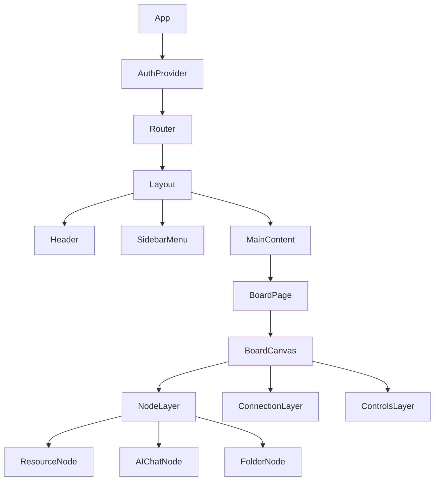

# RAGBOARD Frontend Architecture

## Overview

The RAGBOARD frontend is built with React, TypeScript, and TailwindCSS, utilizing Zustand for state management and D3.js/React Flow for canvas rendering. The architecture emphasizes modularity, performance, and developer experience.

## Technology Stack

| Category | Technology | Purpose |
|----------|------------|---------|
| Framework | React 18 | UI library with concurrent features |
| Language | TypeScript | Type safety and better DX |
| Styling | TailwindCSS | Utility-first CSS framework |
| State | Zustand | Lightweight state management |
| Canvas | React Flow / D3.js | Node graph visualization |
| Routing | React Router v6 | Client-side routing |
| Forms | React Hook Form | Form handling with validation |
| API | Axios / TanStack Query | HTTP client with caching |
| WebSocket | Socket.io Client | Real-time communication |
| Testing | Jest + React Testing Library | Unit and integration tests |
| Build | Vite | Fast development and building |

## Project Structure

```
src/
├── components/           # Reusable UI components
│   ├── board/           # Board-specific components
│   │   ├── BoardCanvas.tsx
│   │   ├── MiniMap.tsx
│   │   └── GridBackground.tsx
│   ├── nodes/           # Node components
│   │   ├── ResourceNode/
│   │   ├── AIChatNode/
│   │   └── FolderNode/
│   ├── connections/     # Connection rendering
│   │   ├── ConnectionLine.tsx
│   │   └── ConnectionHandle.tsx
│   ├── ui/              # Generic UI components
│   │   ├── Button/
│   │   ├── Modal/
│   │   ├── Dropdown/
│   │   └── Toast/
│   └── layout/          # Layout components
│       ├── Header.tsx
│       ├── SidebarMenu.tsx
│       └── Layout.tsx
├── hooks/               # Custom React hooks
│   ├── useBoard.ts
│   ├── useWebSocket.ts
│   ├── useKeyboardShortcuts.ts
│   └── useMediaUpload.ts
├── store/               # Zustand stores
│   ├── boardStore.ts
│   ├── uiStore.ts
│   ├── authStore.ts
│   └── types.ts
├── services/            # API and external services
│   ├── api/
│   ├── websocket/
│   └── media/
├── utils/               # Utility functions
│   ├── canvas/
│   ├── validation/
│   └── formatting/
├── types/               # TypeScript type definitions
│   ├── models/
│   ├── api/
│   └── global.d.ts
├── styles/              # Global styles
│   ├── globals.css
│   └── themes/
├── pages/               # Page components
│   ├── Board/
│   ├── Dashboard/
│   └── Settings/
└── App.tsx              # Root component
```

## Component Architecture

### Core Component Hierarchy



### Component Design Patterns

#### 1. Compound Components

```typescript
// Example: Modal compound component
export const Modal = {
  Root: ModalRoot,
  Header: ModalHeader,
  Body: ModalBody,
  Footer: ModalFooter,
}

// Usage
<Modal.Root open={isOpen} onClose={handleClose}>
  <Modal.Header>
    <h2>Add Resource</h2>
  </Modal.Header>
  <Modal.Body>
    <ResourceForm />
  </Modal.Body>
  <Modal.Footer>
    <Button onClick={handleClose}>Cancel</Button>
    <Button variant="primary" onClick={handleSubmit}>Add</Button>
  </Modal.Footer>
</Modal.Root>
```

#### 2. Render Props Pattern

```typescript
// DragDropProvider with render props
interface DragDropProviderProps {
  children: (props: {
    isDragging: boolean
    draggedItem: DraggedItem | null
    handleDragStart: (item: DraggedItem) => void
    handleDragEnd: () => void
  }) => React.ReactNode
}

export const DragDropProvider: React.FC<DragDropProviderProps> = ({ children }) => {
  const [isDragging, setIsDragging] = useState(false)
  const [draggedItem, setDraggedItem] = useState<DraggedItem | null>(null)
  
  return children({
    isDragging,
    draggedItem,
    handleDragStart: (item) => {
      setDraggedItem(item)
      setIsDragging(true)
    },
    handleDragEnd: () => {
      setDraggedItem(null)
      setIsDragging(false)
    }
  })
}
```

#### 3. Custom Hooks Pattern

```typescript
// useBoard hook for board operations
export const useBoard = (boardId: string) => {
  const { data, isLoading, error } = useQuery({
    queryKey: ['board', boardId],
    queryFn: () => boardService.getBoard(boardId),
  })
  
  const addNodeMutation = useMutation({
    mutationFn: (node: CreateNodeDto) => boardService.addNode(boardId, node),
    onSuccess: () => {
      queryClient.invalidateQueries(['board', boardId])
    },
  })
  
  return {
    board: data,
    isLoading,
    error,
    addNode: addNodeMutation.mutate,
    isAddingNode: addNodeMutation.isLoading,
  }
}
```

## State Management

### Zustand Store Architecture

#### Board Store

```typescript
interface BoardStore {
  // State
  board: Board | null
  nodes: Map<string, AnyNode>
  connections: Map<string, Connection>
  viewport: Viewport
  selection: Selection
  
  // Actions
  actions: {
    // Board operations
    loadBoard: (boardId: string) => Promise<void>
    saveBoard: () => Promise<void>
    
    // Node operations
    addNode: (type: NodeType, data: NodeData) => string
    updateNode: (id: string, updates: Partial<AnyNode>) => void
    deleteNode: (id: string) => void
    moveNode: (id: string, position: Position) => void
    
    // Connection operations
    connect: (source: string, target: string) => void
    disconnect: (connectionId: string) => void
    
    // Selection operations
    selectNode: (id: string, multi?: boolean) => void
    selectAll: () => void
    clearSelection: () => void
    
    // Canvas operations
    setViewport: (viewport: Viewport) => void
    fitToScreen: () => void
    zoomIn: () => void
    zoomOut: () => void
  }
}

export const useBoardStore = create<BoardStore>()(
  devtools(
    persist(
      immer((set, get) => ({
        // Initial state
        board: null,
        nodes: new Map(),
        connections: new Map(),
        viewport: { x: 0, y: 0, zoom: 1 },
        selection: { nodes: new Set(), connections: new Set() },
        
        actions: {
          loadBoard: async (boardId) => {
            const board = await boardService.getBoard(boardId)
            set(state => {
              state.board = board
              state.nodes = new Map(board.nodes.map(n => [n.id, n]))
              state.connections = new Map(board.connections.map(c => [c.id, c]))
            })
          },
          
          addNode: (type, data) => {
            const id = generateId()
            const node = createNode(id, type, data)
            set(state => {
              state.nodes.set(id, node)
            })
            return id
          },
          
          // ... other actions
        }
      })),
      {
        name: 'board-store',
        partialize: (state) => ({
          viewport: state.viewport,
          // Don't persist nodes/connections (loaded from server)
        }),
      }
    )
  )
)
```

#### UI Store

```typescript
interface UIStore {
  // Modal state
  modals: {
    addResource: { open: boolean; data?: any }
    chatInterface: { open: boolean; nodeId?: string }
    settings: { open: boolean }
  }
  
  // UI preferences
  theme: 'light' | 'dark' | 'system'
  sidebarCollapsed: boolean
  showMinimap: boolean
  showGrid: boolean
  snapToGrid: boolean
  
  // Actions
  openModal: (modal: ModalType, data?: any) => void
  closeModal: (modal: ModalType) => void
  toggleSidebar: () => void
  setTheme: (theme: Theme) => void
  updatePreference: (key: string, value: any) => void
}
```

### Store Patterns

#### 1. Selective Subscriptions

```typescript
// Subscribe to specific state slices
const MyComponent = () => {
  // Only re-render when these specific values change
  const nodes = useBoardStore(state => state.nodes)
  const selectedNodes = useBoardStore(state => state.selection.nodes)
  const addNode = useBoardStore(state => state.actions.addNode)
  
  return <div>...</div>
}
```

#### 2. Computed Values

```typescript
// Memoized selectors for derived state
const useSelectedNodes = () => {
  const nodes = useBoardStore(state => state.nodes)
  const selectedIds = useBoardStore(state => state.selection.nodes)
  
  return useMemo(
    () => Array.from(selectedIds).map(id => nodes.get(id)).filter(Boolean),
    [nodes, selectedIds]
  )
}
```

#### 3. Middleware Integration

```typescript
// Custom middleware for logging
const logger = (config) => (set, get, api) =>
  config(
    (...args) => {
      console.log('Previous state:', get())
      set(...args)
      console.log('New state:', get())
    },
    get,
    api
  )

// Apply middleware
const useBoardStore = create(
  logger(
    devtools(
      persist(
        immer(() => ({ /* store */ }))
      )
    )
  )
)
```

## Canvas Implementation

### React Flow Integration

```typescript
// BoardCanvas component with React Flow
import ReactFlow, {
  Background,
  Controls,
  MiniMap,
  useNodesState,
  useEdgesState,
} from 'reactflow'

const nodeTypes = {
  resource: ResourceNode,
  chat: AIChatNode,
  folder: FolderNode,
}

const BoardCanvas: React.FC = () => {
  const { nodes, connections, actions } = useBoardStore()
  const [rfNodes, setRfNodes, onNodesChange] = useNodesState(
    Array.from(nodes.values())
  )
  const [rfEdges, setRfEdges, onEdgesChange] = useEdgesState(
    Array.from(connections.values())
  )
  
  const onConnect = useCallback((params) => {
    actions.connect(params.source, params.target)
  }, [actions])
  
  const onNodeDragStop = useCallback((event, node) => {
    actions.moveNode(node.id, node.position)
  }, [actions])
  
  return (
    <ReactFlow
      nodes={rfNodes}
      edges={rfEdges}
      nodeTypes={nodeTypes}
      onNodesChange={onNodesChange}
      onEdgesChange={onEdgesChange}
      onConnect={onConnect}
      onNodeDragStop={onNodeDragStop}
      fitView
    >
      <Background variant="dots" gap={20} size={1} />
      <Controls />
      <MiniMap />
    </ReactFlow>
  )
}
```

### Custom Node Implementation

```typescript
// ResourceNode component
interface ResourceNodeProps {
  data: ResourceNodeData
  selected: boolean
}

export const ResourceNode: React.FC<ResourceNodeProps> = ({ data, selected }) => {
  const [isHovered, setIsHovered] = useState(false)
  const { updateNode, deleteNode } = useBoardStore(state => state.actions)
  
  return (
    <NodeContainer
      selected={selected}
      onMouseEnter={() => setIsHovered(true)}
      onMouseLeave={() => setIsHovered(false)}
    >
      <Handle type="source" position={Position.Right} />
      
      <NodeHeader>
        <NodeIcon type={data.resourceType} />
        <NodeTitle>{data.title}</NodeTitle>
        {isHovered && (
          <NodeActions>
            <IconButton icon="edit" onClick={() => {/* edit */}} />
            <IconButton icon="delete" onClick={() => deleteNode(data.id)} />
          </NodeActions>
        )}
      </NodeHeader>
      
      <NodeBody>
        <ResourcePreview type={data.resourceType} content={data.content} />
        {data.processingStatus === 'processing' && <ProcessingIndicator />}
      </NodeBody>
      
      <NodeFooter>
        <NodeMetadata>
          {data.wordCount && <span>{data.wordCount} words</span>}
          {data.duration && <span>{formatDuration(data.duration)}</span>}
        </NodeMetadata>
      </NodeFooter>
      
      <Handle type="target" position={Position.Left} />
    </NodeContainer>
  )
}
```

## API Integration

### Service Layer Architecture

```typescript
// Base API service
class ApiService {
  private client: AxiosInstance
  
  constructor() {
    this.client = axios.create({
      baseURL: import.meta.env.VITE_API_URL,
      timeout: 10000,
    })
    
    this.setupInterceptors()
  }
  
  private setupInterceptors() {
    // Request interceptor
    this.client.interceptors.request.use(
      (config) => {
        const token = authStore.getState().token
        if (token) {
          config.headers.Authorization = `Bearer ${token}`
        }
        return config
      },
      (error) => Promise.reject(error)
    )
    
    // Response interceptor
    this.client.interceptors.response.use(
      (response) => response.data,
      async (error) => {
        if (error.response?.status === 401) {
          await authStore.getState().refreshToken()
          return this.client.request(error.config)
        }
        return Promise.reject(error)
      }
    )
  }
  
  protected get<T>(url: string, config?: AxiosRequestConfig): Promise<T> {
    return this.client.get(url, config)
  }
  
  protected post<T>(url: string, data?: any, config?: AxiosRequestConfig): Promise<T> {
    return this.client.post(url, data, config)
  }
  
  // ... other methods
}
```

### TanStack Query Integration

```typescript
// Query client configuration
export const queryClient = new QueryClient({
  defaultOptions: {
    queries: {
      staleTime: 5 * 60 * 1000, // 5 minutes
      cacheTime: 10 * 60 * 1000, // 10 minutes
      retry: (failureCount, error) => {
        if (error.status === 404) return false
        if (failureCount >= 3) return false
        return true
      },
    },
  },
})

// Board queries
export const boardQueries = {
  all: () => ['boards'],
  lists: () => [...boardQueries.all(), 'list'],
  list: (filters: BoardFilters) => [...boardQueries.lists(), { filters }],
  details: () => [...boardQueries.all(), 'detail'],
  detail: (id: string) => [...boardQueries.details(), id],
}

// Usage in components
const BoardList = () => {
  const { data, isLoading, error } = useQuery({
    queryKey: boardQueries.list({ userId: currentUser.id }),
    queryFn: () => boardService.getUserBoards(currentUser.id),
  })
  
  if (isLoading) return <LoadingSpinner />
  if (error) return <ErrorMessage error={error} />
  
  return <BoardGrid boards={data} />
}
```

## WebSocket Integration

### Socket Manager

```typescript
class SocketManager {
  private socket: Socket | null = null
  private boardId: string | null = null
  private listeners: Map<string, Set<Function>> = new Map()
  
  connect(boardId: string) {
    if (this.socket?.connected && this.boardId === boardId) return
    
    this.disconnect()
    this.boardId = boardId
    
    this.socket = io(import.meta.env.VITE_WS_URL, {
      auth: { token: authStore.getState().token },
      transports: ['websocket'],
    })
    
    this.setupEventHandlers()
    this.socket.emit('join-board', boardId)
  }
  
  private setupEventHandlers() {
    if (!this.socket) return
    
    // Connection events
    this.socket.on('connect', () => {
      console.log('Connected to WebSocket')
      uiStore.getState().setConnectionStatus('connected')
    })
    
    this.socket.on('disconnect', () => {
      console.log('Disconnected from WebSocket')
      uiStore.getState().setConnectionStatus('disconnected')
    })
    
    // Board events
    this.socket.on('node-updated', (data) => {
      this.emit('node-updated', data)
    })
    
    this.socket.on('node-created', (data) => {
      this.emit('node-created', data)
    })
    
    this.socket.on('cursor-moved', (data) => {
      this.emit('cursor-moved', data)
    })
  }
  
  on(event: string, callback: Function) {
    if (!this.listeners.has(event)) {
      this.listeners.set(event, new Set())
    }
    this.listeners.get(event)!.add(callback)
    
    return () => {
      this.listeners.get(event)?.delete(callback)
    }
  }
  
  private emit(event: string, data: any) {
    this.listeners.get(event)?.forEach(callback => callback(data))
  }
  
  sendUpdate(type: string, data: any) {
    if (!this.socket?.connected) return
    
    this.socket.emit(type, {
      boardId: this.boardId,
      ...data,
      timestamp: Date.now(),
    })
  }
  
  disconnect() {
    if (this.socket) {
      this.socket.disconnect()
      this.socket = null
      this.boardId = null
    }
  }
}

export const socketManager = new SocketManager()
```

### WebSocket Hook

```typescript
export const useWebSocket = (boardId: string) => {
  const { actions } = useBoardStore()
  
  useEffect(() => {
    socketManager.connect(boardId)
    
    // Set up event listeners
    const unsubscribers = [
      socketManager.on('node-updated', (data) => {
        actions.handleRemoteNodeUpdate(data)
      }),
      
      socketManager.on('node-created', (data) => {
        actions.handleRemoteNodeCreation(data)
      }),
      
      socketManager.on('connection-created', (data) => {
        actions.handleRemoteConnectionCreation(data)
      }),
    ]
    
    return () => {
      unsubscribers.forEach(unsub => unsub())
      socketManager.disconnect()
    }
  }, [boardId, actions])
  
  return {
    sendNodeUpdate: (nodeId: string, updates: any) => {
      socketManager.sendUpdate('node-update', { nodeId, updates })
    },
    sendCursorPosition: (position: Position) => {
      socketManager.sendUpdate('cursor-move', { position })
    },
  }
}
```

## Performance Optimization

### Code Splitting

```typescript
// Lazy load heavy components
const BoardCanvas = lazy(() => import('./components/board/BoardCanvas'))
const AIChatInterface = lazy(() => import('./components/chat/AIChatInterface'))
const MediaProcessor = lazy(() => import('./components/media/MediaProcessor'))

// Route-based code splitting
const routes = [
  {
    path: '/board/:id',
    element: (
      <Suspense fallback={<BoardSkeleton />}>
        <BoardCanvas />
      </Suspense>
    ),
  },
]
```

### Memoization Strategies

```typescript
// Memoize expensive computations
const ConnectedResourcesList = memo(({ chatNodeId }: Props) => {
  const connections = useBoardStore(state => 
    Array.from(state.connections.values())
      .filter(c => c.to === chatNodeId)
  )
  
  const resources = useBoardStore(state => 
    connections.map(c => state.nodes.get(c.from))
      .filter(Boolean)
  )
  
  return (
    <ResourceList>
      {resources.map(resource => (
        <ResourceItem key={resource.id} resource={resource} />
      ))}
    </ResourceList>
  )
})

// Memoize callbacks
const BoardToolbar = () => {
  const { addNode, deleteNode } = useBoardStore(state => state.actions)
  
  const handleAddResource = useCallback((type: ResourceType) => {
    const nodeId = addNode('resource', { resourceType: type })
    // Additional logic...
  }, [addNode])
  
  const handleDelete = useCallback(() => {
    const selected = useBoardStore.getState().selection.nodes
    selected.forEach(id => deleteNode(id))
  }, [deleteNode])
  
  return (
    <Toolbar>
      <ToolbarButton onClick={() => handleAddResource('text')}>
        Add Text
      </ToolbarButton>
      <ToolbarButton onClick={handleDelete}>
        Delete Selected
      </ToolbarButton>
    </Toolbar>
  )
}
```

### Virtual Scrolling

```typescript
// Virtual scrolling for large lists
import { FixedSizeList } from 'react-window'

const ResourceLibrary = ({ resources }: { resources: Resource[] }) => {
  const Row = ({ index, style }) => (
    <div style={style}>
      <ResourceCard resource={resources[index]} />
    </div>
  )
  
  return (
    <FixedSizeList
      height={600}
      itemCount={resources.length}
      itemSize={120}
      width="100%"
    >
      {Row}
    </FixedSizeList>
  )
}
```

### Web Workers

```typescript
// Offload heavy computations to Web Workers
// worker.ts
self.addEventListener('message', (event) => {
  const { type, data } = event.data
  
  switch (type) {
    case 'PROCESS_EMBEDDINGS':
      const embeddings = generateEmbeddings(data.text)
      self.postMessage({ type: 'EMBEDDINGS_COMPLETE', data: embeddings })
      break
      
    case 'ANALYZE_IMAGE':
      const analysis = analyzeImage(data.imageData)
      self.postMessage({ type: 'ANALYSIS_COMPLETE', data: analysis })
      break
  }
})

// Usage in component
const useWebWorker = () => {
  const workerRef = useRef<Worker>()
  
  useEffect(() => {
    workerRef.current = new Worker(
      new URL('./worker.ts', import.meta.url),
      { type: 'module' }
    )
    
    workerRef.current.addEventListener('message', (event) => {
      const { type, data } = event.data
      // Handle worker responses
    })
    
    return () => workerRef.current?.terminate()
  }, [])
  
  const processInWorker = (type: string, data: any) => {
    workerRef.current?.postMessage({ type, data })
  }
  
  return { processInWorker }
}
```

## Testing Strategy

### Component Testing

```typescript
// ResourceNode.test.tsx
import { render, screen, fireEvent } from '@testing-library/react'
import { ResourceNode } from './ResourceNode'

describe('ResourceNode', () => {
  const mockNode = {
    id: 'node-1',
    type: 'resource',
    resourceType: 'pdf',
    title: 'Test PDF',
    position: { x: 0, y: 0 },
  }
  
  it('renders node with correct title', () => {
    render(<ResourceNode data={mockNode} selected={false} />)
    expect(screen.getByText('Test PDF')).toBeInTheDocument()
  })
  
  it('shows actions on hover', async () => {
    render(<ResourceNode data={mockNode} selected={false} />)
    
    const node = screen.getByRole('article')
    fireEvent.mouseEnter(node)
    
    expect(await screen.findByRole('button', { name: /edit/i })).toBeVisible()
    expect(await screen.findByRole('button', { name: /delete/i })).toBeVisible()
  })
  
  it('calls delete handler when delete button clicked', () => {
    const mockDelete = jest.fn()
    jest.mocked(useBoardStore).mockReturnValue({ deleteNode: mockDelete })
    
    render(<ResourceNode data={mockNode} selected={false} />)
    
    const node = screen.getByRole('article')
    fireEvent.mouseEnter(node)
    
    const deleteButton = screen.getByRole('button', { name: /delete/i })
    fireEvent.click(deleteButton)
    
    expect(mockDelete).toHaveBeenCalledWith('node-1')
  })
})
```

### Integration Testing

```typescript
// Board integration test
import { renderWithProviders } from '@/test-utils'
import { BoardPage } from './BoardPage'
import { server } from '@/mocks/server'
import { rest } from 'msw'

describe('BoardPage Integration', () => {
  it('loads and displays board content', async () => {
    server.use(
      rest.get('/api/boards/:id', (req, res, ctx) => {
        return res(ctx.json({
          success: true,
          data: {
            board: mockBoard,
          },
        }))
      })
    )
    
    renderWithProviders(<BoardPage />, {
      route: '/board/board-123',
    })
    
    // Wait for board to load
    expect(await screen.findByText('Test Board')).toBeInTheDocument()
    
    // Check nodes are rendered
    expect(screen.getByText('Resource Node 1')).toBeInTheDocument()
    expect(screen.getByText('Chat Node')).toBeInTheDocument()
  })
})
```

### E2E Testing

```typescript
// Playwright E2E test
import { test, expect } from '@playwright/test'

test.describe('Board Creation Flow', () => {
  test('user can create and edit a board', async ({ page }) => {
    // Login
    await page.goto('/login')
    await page.fill('[name="email"]', 'test@example.com')
    await page.fill('[name="password"]', 'password123')
    await page.click('button[type="submit"]')
    
    // Create new board
    await page.click('button:has-text("New Board")')
    await page.fill('[name="boardName"]', 'My Test Board')
    await page.click('button:has-text("Create")')
    
    // Verify board created
    await expect(page).toHaveURL(/\/board\//)
    await expect(page.locator('h1')).toHaveText('My Test Board')
    
    // Add a resource node
    await page.click('button[aria-label="Add Resource"]')
    await page.click('button:has-text("Add URL")')
    await page.fill('[name="url"]', 'https://example.com')
    await page.click('button:has-text("Add")')
    
    // Verify node added
    await expect(page.locator('[data-testid="resource-node"]')).toBeVisible()
  })
})
```

## Accessibility

### ARIA Implementation

```typescript
// Accessible modal component
const Modal: React.FC<ModalProps> = ({ open, onClose, children, title }) => {
  const modalRef = useRef<HTMLDivElement>(null)
  
  // Focus management
  useEffect(() => {
    if (open) {
      const previouslyFocused = document.activeElement as HTMLElement
      modalRef.current?.focus()
      
      return () => {
        previouslyFocused?.focus()
      }
    }
  }, [open])
  
  // Keyboard navigation
  const handleKeyDown = (e: KeyboardEvent) => {
    if (e.key === 'Escape') {
      onClose()
    }
  }
  
  if (!open) return null
  
  return createPortal(
    <div
      role="dialog"
      aria-modal="true"
      aria-labelledby="modal-title"
      className="modal-overlay"
      onClick={onClose}
    >
      <div
        ref={modalRef}
        className="modal-content"
        onClick={(e) => e.stopPropagation()}
        onKeyDown={handleKeyDown}
        tabIndex={-1}
      >
        <h2 id="modal-title">{title}</h2>
        <button
          aria-label="Close modal"
          onClick={onClose}
          className="modal-close"
        >
          ×
        </button>
        {children}
      </div>
    </div>,
    document.body
  )
}
```

### Keyboard Navigation

```typescript
// Keyboard shortcuts hook
export const useKeyboardShortcuts = () => {
  const { actions } = useBoardStore()
  
  useEffect(() => {
    const handleKeyDown = (e: KeyboardEvent) => {
      // Check if user is typing in an input
      if (e.target instanceof HTMLInputElement || 
          e.target instanceof HTMLTextAreaElement) {
        return
      }
      
      // Command/Ctrl shortcuts
      if (e.metaKey || e.ctrlKey) {
        switch (e.key) {
          case 'a':
            e.preventDefault()
            actions.selectAll()
            break
          case 'c':
            e.preventDefault()
            actions.copy()
            break
          case 'v':
            e.preventDefault()
            actions.paste()
            break
          case 'z':
            e.preventDefault()
            actions.undo()
            break
          case 'y':
            e.preventDefault()
            actions.redo()
            break
        }
      } else {
        // Single key shortcuts
        switch (e.key) {
          case 'Delete':
          case 'Backspace':
            actions.deleteSelected()
            break
          case 'Escape':
            actions.clearSelection()
            break
        }
      }
    }
    
    window.addEventListener('keydown', handleKeyDown)
    return () => window.removeEventListener('keydown', handleKeyDown)
  }, [actions])
}
```

## Build Configuration

### Vite Configuration

```typescript
// vite.config.ts
import { defineConfig } from 'vite'
import react from '@vitejs/plugin-react'
import { visualizer } from 'rollup-plugin-visualizer'

export default defineConfig({
  plugins: [
    react(),
    visualizer({
      template: 'treemap',
      open: true,
      gzipSize: true,
      brotliSize: true,
    }),
  ],
  
  resolve: {
    alias: {
      '@': '/src',
      '@components': '/src/components',
      '@hooks': '/src/hooks',
      '@utils': '/src/utils',
      '@store': '/src/store',
      '@services': '/src/services',
      '@types': '/src/types',
    },
  },
  
  build: {
    target: 'es2020',
    minify: 'terser',
    terserOptions: {
      compress: {
        drop_console: true,
        drop_debugger: true,
      },
    },
    rollupOptions: {
      output: {
        manualChunks: {
          'react-vendor': ['react', 'react-dom', 'react-router-dom'],
          'ui-vendor': ['@headlessui/react', '@radix-ui/react-*'],
          'state-vendor': ['zustand', 'immer'],
          'utils-vendor': ['axios', 'date-fns', 'lodash-es'],
        },
      },
    },
  },
  
  optimizeDeps: {
    include: ['react', 'react-dom', 'zustand'],
  },
})
```

## Deployment

### Environment Configuration

```typescript
// env.d.ts
interface ImportMetaEnv {
  readonly VITE_API_URL: string
  readonly VITE_WS_URL: string
  readonly VITE_SENTRY_DSN: string
  readonly VITE_GA_ID: string
  readonly VITE_STRIPE_KEY: string
}

interface ImportMeta {
  readonly env: ImportMetaEnv
}
```

### Production Optimizations

```typescript
// Service Worker for offline support
// sw.ts
import { precacheAndRoute } from 'workbox-precaching'
import { registerRoute } from 'workbox-routing'
import { StaleWhileRevalidate, CacheFirst } from 'workbox-strategies'

// Precache all static assets
precacheAndRoute(self.__WB_MANIFEST)

// Cache API responses
registerRoute(
  ({ url }) => url.pathname.startsWith('/api/'),
  new StaleWhileRevalidate({
    cacheName: 'api-cache',
  })
)

// Cache images
registerRoute(
  ({ request }) => request.destination === 'image',
  new CacheFirst({
    cacheName: 'images',
    plugins: [
      new ExpirationPlugin({
        maxEntries: 60,
        maxAgeSeconds: 30 * 24 * 60 * 60, // 30 days
      }),
    ],
  })
)
```

## Monitoring and Analytics

### Error Tracking

```typescript
// Sentry integration
import * as Sentry from '@sentry/react'
import { BrowserTracing } from '@sentry/tracing'

Sentry.init({
  dsn: import.meta.env.VITE_SENTRY_DSN,
  integrations: [
    new BrowserTracing(),
    new Sentry.Replay(),
  ],
  tracesSampleRate: 1.0,
  replaysSessionSampleRate: 0.1,
  replaysOnErrorSampleRate: 1.0,
})

// Error boundary
export const ErrorBoundary = Sentry.withErrorBoundary(
  ({ children }) => children,
  {
    fallback: ({ error, resetError }) => (
      <ErrorFallback error={error} resetError={resetError} />
    ),
    showDialog: true,
  }
)
```

### Performance Monitoring

```typescript
// Web Vitals tracking
import { getCLS, getFID, getFCP, getLCP, getTTFB } from 'web-vitals'

const sendToAnalytics = (metric) => {
  // Send to your analytics endpoint
  const body = JSON.stringify({
    name: metric.name,
    value: metric.value,
    rating: metric.rating,
    delta: metric.delta,
    id: metric.id,
  })
  
  // Use `navigator.sendBeacon()` if available, fall back to `fetch()`
  if (navigator.sendBeacon) {
    navigator.sendBeacon('/analytics', body)
  } else {
    fetch('/analytics', { body, method: 'POST', keepalive: true })
  }
}

getCLS(sendToAnalytics)
getFID(sendToAnalytics)
getFCP(sendToAnalytics)
getLCP(sendToAnalytics)
getTTFB(sendToAnalytics)
```