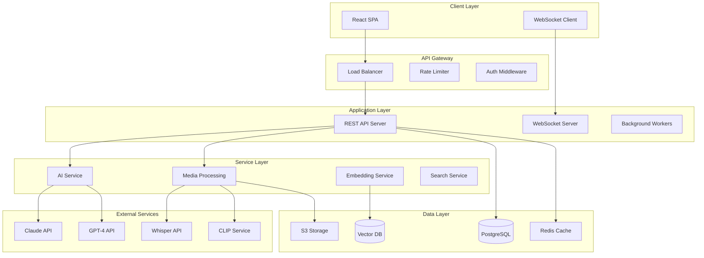
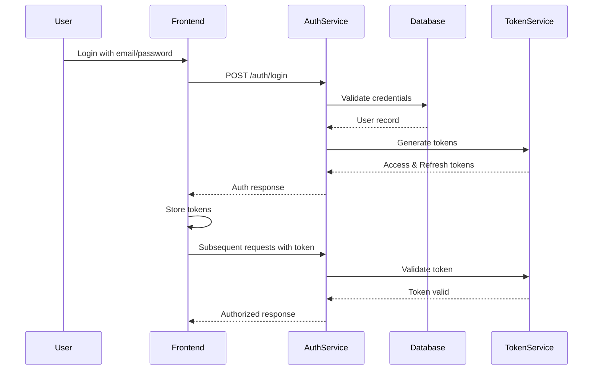

# RAGBOARD System Architecture

## Table of Contents
1. [System Overview](#system-overview)
2. [Architecture Principles](#architecture-principles)
3. [System Components](#system-components)
4. [Frontend Architecture](#frontend-architecture)
5. [Backend Architecture](#backend-architecture)
6. [Database Design](#database-design)
7. [AI Integration Layer](#ai-integration-layer)
8. [File Storage Architecture](#file-storage-architecture)
9. [Authentication & Authorization](#authentication--authorization)
10. [Real-time Communication](#real-time-communication)
11. [Deployment Architecture](#deployment-architecture)
12. [Security Considerations](#security-considerations)
13. [Performance & Scalability](#performance--scalability)

## System Overview

RAGBoard is a visual knowledge mapping platform that enables users to create interactive boards where multimodal content can be connected to AI chat interfaces for context-aware conversations.

### High-Level Architecture



## Architecture Principles

### 1. Modularity
- Clear separation of concerns
- Microservice-ready architecture
- Plugin-based extensibility

### 2. Scalability
- Horizontal scaling capabilities
- Distributed processing
- Caching at multiple layers

### 3. Security
- Zero-trust architecture
- End-to-end encryption for sensitive data
- Regular security audits

### 4. Performance
- Optimistic UI updates
- Lazy loading and virtualization
- CDN for static assets

### 5. Maintainability
- Comprehensive logging
- Monitoring and alerting
- Clear documentation

## System Components

### Core Components

| Component | Technology | Purpose |
|-----------|------------|---------|
| Frontend | React, TypeScript, TailwindCSS | Interactive UI |
| State Management | Zustand | Client-side state |
| Canvas Rendering | D3.js / React Flow | Node visualization |
| API Server | Node.js, Express | REST endpoints |
| WebSocket Server | Socket.io | Real-time updates |
| Database | PostgreSQL | Structured data |
| Vector Database | Pinecone/Weaviate | Embeddings |
| File Storage | AWS S3 | Media files |
| Cache | Redis | Performance |
| Queue | Bull/RabbitMQ | Background jobs |
| AI Integration | OpenAI, Anthropic SDKs | LLM access |

## Frontend Architecture

### Component Hierarchy

```
App
├── Layout
│   ├── Header
│   ├── SidebarMenu
│   └── MainContent
├── BoardCanvas
│   ├── ViewportControls
│   ├── NodeRenderer
│   │   ├── ResourceNode
│   │   ├── AIChatNode
│   │   └── FolderNode
│   └── ConnectionRenderer
├── Modals
│   ├── AddResourceModal
│   ├── ChatInterfaceModal
│   └── SettingsModal
└── Providers
    ├── AuthProvider
    ├── ThemeProvider
    └── WebSocketProvider
```

### State Management Design

```typescript
// Core State Structure
interface BoardStore {
  // Entities
  nodes: {
    resources: Map<string, ResourceNode>
    chats: Map<string, AIChatNode>
    folders: Map<string, FolderNode>
  }
  connections: Map<string, Connection>
  
  // UI State
  canvas: {
    zoom: number
    pan: { x: number, y: number }
    gridSnap: boolean
  }
  selection: {
    selected: Set<string>
    hovering: string | null
    dragging: DragState | null
  }
  
  // Session
  user: User | null
  board: Board | null
  permissions: Permissions
  
  // Actions
  actions: {
    // Node operations
    addNode: (type, data) => string
    updateNode: (id, updates) => void
    deleteNode: (id) => void
    
    // Connection operations
    connect: (from, to) => string
    disconnect: (connectionId) => void
    
    // Canvas operations
    pan: (delta) => void
    zoom: (level) => void
    
    // Selection
    select: (ids) => void
    clearSelection: () => void
  }
}
```

### Routing Structure

```typescript
const routes = {
  '/': HomePage,
  '/board/:id': BoardView,
  '/boards': BoardsList,
  '/profile': UserProfile,
  '/settings': Settings,
  '/shared/:shareId': SharedBoard,
}
```

## Backend Architecture

### API Design

#### REST Endpoints

```yaml
# Boards
GET    /api/boards              # List user's boards
POST   /api/boards              # Create new board
GET    /api/boards/:id          # Get board details
PUT    /api/boards/:id          # Update board
DELETE /api/boards/:id          # Delete board

# Nodes
POST   /api/boards/:id/nodes    # Add node to board
PUT    /api/nodes/:id           # Update node
DELETE /api/nodes/:id           # Delete node
POST   /api/nodes/:id/process   # Process node content

# Connections
POST   /api/connections         # Create connection
DELETE /api/connections/:id     # Remove connection

# AI Chat
POST   /api/chat/sessions       # Start chat session
POST   /api/chat/:id/messages   # Send message
GET    /api/chat/:id/history    # Get chat history

# Media
POST   /api/upload              # Upload file
GET    /api/media/:id           # Get media file
POST   /api/transcribe          # Transcribe audio
POST   /api/analyze-image       # Analyze image

# Search
POST   /api/search              # Vector search
GET    /api/suggestions         # Get suggestions
```

### Service Layer Architecture

```typescript
// Service Interfaces
interface BoardService {
  create(userId: string, data: CreateBoardDto): Promise<Board>
  findByUser(userId: string): Promise<Board[]>
  update(id: string, data: UpdateBoardDto): Promise<Board>
  delete(id: string): Promise<void>
  share(id: string, permissions: SharePermissions): Promise<ShareLink>
}

interface NodeService {
  add(boardId: string, type: NodeType, data: any): Promise<Node>
  update(id: string, updates: any): Promise<Node>
  delete(id: string): Promise<void>
  process(id: string): Promise<ProcessingResult>
}

interface AIService {
  createSession(context: AIContext): Promise<Session>
  sendMessage(sessionId: string, message: string): Promise<Response>
  generateEmbedding(text: string): Promise<number[]>
  analyzeImage(buffer: Buffer): Promise<ImageAnalysis>
  transcribeAudio(buffer: Buffer): Promise<Transcription>
}

interface MediaService {
  upload(file: MulterFile): Promise<MediaObject>
  process(mediaId: string): Promise<ProcessingResult>
  extractText(mediaId: string): Promise<string>
  generateThumbnail(mediaId: string): Promise<string>
}
```

### Background Job Processing

```typescript
// Job Queues
enum JobType {
  PROCESS_VIDEO = 'process_video',
  TRANSCRIBE_AUDIO = 'transcribe_audio',
  EXTRACT_PDF_TEXT = 'extract_pdf_text',
  GENERATE_EMBEDDINGS = 'generate_embeddings',
  ANALYZE_IMAGE = 'analyze_image',
  SCRAPE_URL = 'scrape_url',
}

// Worker Implementation
class MediaProcessor {
  async processVideo(job: Job) {
    const { videoId } = job.data
    // 1. Download from S3
    // 2. Extract frames
    // 3. Generate transcript
    // 4. Create embeddings
    // 5. Update database
  }
}
```

## Database Design

### PostgreSQL Schema

```sql
-- Users and Authentication
CREATE TABLE users (
  id UUID PRIMARY KEY DEFAULT gen_random_uuid(),
  email VARCHAR(255) UNIQUE NOT NULL,
  name VARCHAR(255),
  avatar_url TEXT,
  created_at TIMESTAMP DEFAULT NOW(),
  updated_at TIMESTAMP DEFAULT NOW()
);

-- Boards
CREATE TABLE boards (
  id UUID PRIMARY KEY DEFAULT gen_random_uuid(),
  user_id UUID REFERENCES users(id) ON DELETE CASCADE,
  name VARCHAR(255) NOT NULL,
  description TEXT,
  thumbnail_url TEXT,
  settings JSONB DEFAULT '{}',
  created_at TIMESTAMP DEFAULT NOW(),
  updated_at TIMESTAMP DEFAULT NOW()
);

-- Nodes (polymorphic)
CREATE TABLE nodes (
  id UUID PRIMARY KEY DEFAULT gen_random_uuid(),
  board_id UUID REFERENCES boards(id) ON DELETE CASCADE,
  type VARCHAR(50) NOT NULL, -- 'resource', 'chat', 'folder'
  position JSONB NOT NULL, -- {x, y}
  size JSONB, -- {width, height}
  metadata JSONB DEFAULT '{}',
  created_at TIMESTAMP DEFAULT NOW(),
  updated_at TIMESTAMP DEFAULT NOW()
);

-- Resource Nodes
CREATE TABLE resource_nodes (
  node_id UUID PRIMARY KEY REFERENCES nodes(id) ON DELETE CASCADE,
  resource_type VARCHAR(50) NOT NULL, -- 'video', 'image', 'text', etc
  title VARCHAR(255),
  content TEXT,
  url TEXT,
  media_id UUID,
  processing_status VARCHAR(50) DEFAULT 'pending',
  extracted_text TEXT,
  summary TEXT,
  embeddings_id UUID
);

-- Chat Nodes
CREATE TABLE chat_nodes (
  node_id UUID PRIMARY KEY REFERENCES nodes(id) ON DELETE CASCADE,
  ai_model VARCHAR(50) DEFAULT 'claude-3-sonnet',
  system_prompt TEXT,
  temperature FLOAT DEFAULT 0.7,
  max_tokens INTEGER DEFAULT 4000
);

-- Folder Nodes
CREATE TABLE folder_nodes (
  node_id UUID PRIMARY KEY REFERENCES nodes(id) ON DELETE CASCADE,
  name VARCHAR(255) NOT NULL,
  color VARCHAR(7),
  expanded BOOLEAN DEFAULT true
);

-- Node Hierarchy (for folders)
CREATE TABLE node_hierarchy (
  parent_id UUID REFERENCES nodes(id) ON DELETE CASCADE,
  child_id UUID REFERENCES nodes(id) ON DELETE CASCADE,
  position INTEGER,
  PRIMARY KEY (parent_id, child_id)
);

-- Connections
CREATE TABLE connections (
  id UUID PRIMARY KEY DEFAULT gen_random_uuid(),
  board_id UUID REFERENCES boards(id) ON DELETE CASCADE,
  from_node_id UUID REFERENCES nodes(id) ON DELETE CASCADE,
  to_node_id UUID REFERENCES nodes(id) ON DELETE CASCADE,
  connection_type VARCHAR(50), -- 'data_flow', 'reference'
  metadata JSONB DEFAULT '{}',
  created_at TIMESTAMP DEFAULT NOW()
);

-- Chat Sessions
CREATE TABLE chat_sessions (
  id UUID PRIMARY KEY DEFAULT gen_random_uuid(),
  chat_node_id UUID REFERENCES chat_nodes(node_id) ON DELETE CASCADE,
  user_id UUID REFERENCES users(id),
  context JSONB, -- Connected resources at session start
  started_at TIMESTAMP DEFAULT NOW(),
  ended_at TIMESTAMP
);

-- Chat Messages
CREATE TABLE chat_messages (
  id UUID PRIMARY KEY DEFAULT gen_random_uuid(),
  session_id UUID REFERENCES chat_sessions(id) ON DELETE CASCADE,
  role VARCHAR(50) NOT NULL, -- 'user', 'assistant', 'system'
  content TEXT NOT NULL,
  metadata JSONB DEFAULT '{}',
  created_at TIMESTAMP DEFAULT NOW()
);

-- Media Storage
CREATE TABLE media_objects (
  id UUID PRIMARY KEY DEFAULT gen_random_uuid(),
  user_id UUID REFERENCES users(id),
  s3_key VARCHAR(500) NOT NULL,
  bucket VARCHAR(255) NOT NULL,
  mime_type VARCHAR(100),
  size_bytes BIGINT,
  metadata JSONB DEFAULT '{}',
  created_at TIMESTAMP DEFAULT NOW()
);

-- Indexes
CREATE INDEX idx_boards_user ON boards(user_id);
CREATE INDEX idx_nodes_board ON nodes(board_id);
CREATE INDEX idx_connections_board ON connections(board_id);
CREATE INDEX idx_connections_nodes ON connections(from_node_id, to_node_id);
CREATE INDEX idx_chat_sessions_node ON chat_sessions(chat_node_id);
CREATE INDEX idx_chat_messages_session ON chat_messages(session_id);
```

### Vector Database Schema

```typescript
// Pinecone Index Structure
interface VectorIndex {
  id: string              // UUID matching resource_node.id
  values: number[]        // 1536-dim embedding vector
  metadata: {
    boardId: string
    nodeId: string
    type: 'text' | 'image' | 'video' | 'audio'
    title: string
    content: string      // First 1000 chars
    timestamp: number
  }
}

// Query Interface
interface VectorQuery {
  vector: number[]
  topK: number
  filter: {
    boardId?: string
    type?: string[]
  }
}
```

## AI Integration Layer

### Multi-Model Support

```typescript
// AI Provider Interface
interface AIProvider {
  name: string
  generateCompletion(prompt: string, options: CompletionOptions): Promise<string>
  generateEmbedding(text: string): Promise<number[]>
  streamCompletion(prompt: string, onChunk: (chunk: string) => void): Promise<void>
}

// Provider Implementations
class ClaudeProvider implements AIProvider {
  private client: Anthropic
  
  async generateCompletion(prompt: string, options: CompletionOptions) {
    const response = await this.client.messages.create({
      model: 'claude-3-sonnet-20240229',
      messages: [{ role: 'user', content: prompt }],
      max_tokens: options.maxTokens || 4000,
      temperature: options.temperature || 0.7,
    })
    return response.content[0].text
  }
}

class OpenAIProvider implements AIProvider {
  private client: OpenAI
  
  async generateCompletion(prompt: string, options: CompletionOptions) {
    const response = await this.client.chat.completions.create({
      model: 'gpt-4-turbo-preview',
      messages: [{ role: 'user', content: prompt }],
      max_tokens: options.maxTokens || 4000,
      temperature: options.temperature || 0.7,
    })
    return response.choices[0].message.content
  }
}

// Provider Factory
class AIProviderFactory {
  static create(type: 'claude' | 'openai' | 'custom'): AIProvider {
    switch(type) {
      case 'claude': return new ClaudeProvider()
      case 'openai': return new OpenAIProvider()
      default: throw new Error(`Unknown provider: ${type}`)
    }
  }
}
```

### Context Building

```typescript
// RAG Context Builder
class ContextBuilder {
  async buildContext(chatNodeId: string): Promise<AIContext> {
    // 1. Get connected resource nodes
    const connections = await this.getConnections(chatNodeId)
    const resourceIds = connections.map(c => c.fromNodeId)
    
    // 2. Fetch resource content
    const resources = await this.getResources(resourceIds)
    
    // 3. Perform vector search for relevant content
    const query = await this.generateQueryVector(resources)
    const similarContent = await this.vectorSearch(query, {
      filter: { boardId: resources[0].boardId },
      topK: 10
    })
    
    // 4. Build structured context
    return {
      directResources: resources.map(r => ({
        type: r.type,
        title: r.title,
        content: r.extractedText || r.content,
        metadata: r.metadata
      })),
      relatedContent: similarContent.map(s => ({
        score: s.score,
        content: s.metadata.content,
        source: s.metadata.title
      })),
      systemPrompt: this.buildSystemPrompt(resources)
    }
  }
  
  private buildSystemPrompt(resources: Resource[]): string {
    return `You are an AI assistant with access to the following resources:
    
${resources.map(r => `- ${r.title} (${r.type}): ${r.summary || 'No summary available'}`).join('\n')}

Please provide responses based on this context. If asked about something not in the context, acknowledge the limitation.`
  }
}
```

## File Storage Architecture

### S3 Bucket Structure

```
ragboard-production/
├── users/
│   └── {user-id}/
│       ├── avatars/
│       └── uploads/
│           ├── images/
│           ├── videos/
│           ├── audio/
│           └── documents/
├── boards/
│   └── {board-id}/
│       ├── thumbnails/
│       └── exports/
└── temp/
    └── processing/
```

### Media Processing Pipeline

```typescript
class MediaProcessingPipeline {
  async process(file: UploadedFile): Promise<ProcessedMedia> {
    const mediaId = uuid()
    
    // 1. Upload original to S3
    const s3Key = await this.uploadToS3(file, mediaId)
    
    // 2. Create database record
    const media = await this.createMediaRecord({
      id: mediaId,
      s3Key,
      mimeType: file.mimetype,
      size: file.size,
      userId: file.userId
    })
    
    // 3. Queue processing based on type
    switch(file.mimetype.split('/')[0]) {
      case 'image':
        await this.queueImageProcessing(mediaId)
        break
      case 'video':
        await this.queueVideoProcessing(mediaId)
        break
      case 'audio':
        await this.queueAudioProcessing(mediaId)
        break
      case 'application':
        await this.queueDocumentProcessing(mediaId)
        break
    }
    
    return media
  }
  
  private async processImage(mediaId: string) {
    const image = await this.downloadFromS3(mediaId)
    
    // Generate thumbnail
    const thumbnail = await sharp(image)
      .resize(300, 300, { fit: 'cover' })
      .toBuffer()
    
    // OCR text extraction
    const text = await this.performOCR(image)
    
    // Visual analysis with CLIP
    const analysis = await this.analyzeWithCLIP(image)
    
    // Generate embeddings
    const embeddings = await this.generateEmbeddings(
      `${text} ${analysis.description}`
    )
    
    // Update database
    await this.updateMediaRecord(mediaId, {
      thumbnailUrl: await this.uploadThumbnail(thumbnail),
      extractedText: text,
      analysis,
      embeddingsId: await this.storeEmbeddings(embeddings)
    })
  }
}
```

## Authentication & Authorization

### Auth Flow



### Permission Model

```typescript
// Role-Based Access Control
enum Role {
  VIEWER = 'viewer',
  EDITOR = 'editor',
  OWNER = 'owner',
  ADMIN = 'admin'
}

// Resource Permissions
interface Permissions {
  board: {
    view: boolean
    edit: boolean
    delete: boolean
    share: boolean
  }
  node: {
    create: boolean
    edit: boolean
    delete: boolean
    connect: boolean
  }
  chat: {
    use: boolean
    configure: boolean
    viewHistory: boolean
  }
}

// Permission Check Middleware
const requirePermission = (resource: string, action: string) => {
  return async (req: Request, res: Response, next: NextFunction) => {
    const user = req.user
    const resourceId = req.params.id
    
    const hasPermission = await permissionService.check(
      user.id,
      resourceId,
      `${resource}.${action}`
    )
    
    if (!hasPermission) {
      return res.status(403).json({ error: 'Forbidden' })
    }
    
    next()
  }
}
```

## Real-time Communication

### WebSocket Architecture

```typescript
// Socket.io Server Setup
class RealtimeServer {
  private io: Server
  
  initialize(httpServer: HttpServer) {
    this.io = new Server(httpServer, {
      cors: { origin: process.env.CLIENT_URL },
      adapter: createAdapter(redisClient)
    })
    
    this.io.use(this.authenticate)
    this.io.on('connection', this.handleConnection)
  }
  
  private handleConnection(socket: Socket) {
    // Join board room
    socket.on('join-board', async (boardId: string) => {
      const hasAccess = await this.checkBoardAccess(socket.userId, boardId)
      if (hasAccess) {
        socket.join(`board:${boardId}`)
        socket.emit('board-joined', { boardId })
      }
    })
    
    // Handle real-time updates
    socket.on('node-update', async (data) => {
      await this.handleNodeUpdate(socket, data)
      socket.to(`board:${data.boardId}`).emit('node-updated', data)
    })
    
    socket.on('cursor-move', (data) => {
      socket.to(`board:${data.boardId}`).emit('cursor-moved', {
        userId: socket.userId,
        position: data.position
      })
    })
  }
}

// Client-side Socket Manager
class SocketManager {
  private socket: Socket
  private boardId: string
  
  connect(boardId: string) {
    this.boardId = boardId
    this.socket = io(SERVER_URL, {
      auth: { token: getAuthToken() }
    })
    
    this.socket.emit('join-board', boardId)
    this.setupListeners()
  }
  
  private setupListeners() {
    this.socket.on('node-updated', (data) => {
      boardStore.getState().handleRemoteUpdate(data)
    })
    
    this.socket.on('cursor-moved', (data) => {
      boardStore.getState().updateCursor(data.userId, data.position)
    })
  }
  
  emitNodeUpdate(nodeId: string, updates: any) {
    this.socket.emit('node-update', {
      boardId: this.boardId,
      nodeId,
      updates,
      timestamp: Date.now()
    })
  }
}
```

## Deployment Architecture

### Container Strategy

```yaml
# docker-compose.yml
version: '3.8'

services:
  frontend:
    build: ./frontend
    environment:
      - REACT_APP_API_URL=${API_URL}
      - REACT_APP_WS_URL=${WS_URL}
    
  api:
    build: ./backend
    environment:
      - DATABASE_URL=${DATABASE_URL}
      - REDIS_URL=${REDIS_URL}
      - S3_BUCKET=${S3_BUCKET}
    depends_on:
      - postgres
      - redis
    
  worker:
    build: ./backend
    command: npm run worker
    environment:
      - DATABASE_URL=${DATABASE_URL}
      - REDIS_URL=${REDIS_URL}
    depends_on:
      - postgres
      - redis
    
  postgres:
    image: postgres:15
    volumes:
      - postgres_data:/var/lib/postgresql/data
    
  redis:
    image: redis:7-alpine
    volumes:
      - redis_data:/data
    
  nginx:
    image: nginx:alpine
    volumes:
      - ./nginx.conf:/etc/nginx/nginx.conf
    ports:
      - "80:80"
      - "443:443"
    depends_on:
      - frontend
      - api

volumes:
  postgres_data:
  redis_data:
```

### Kubernetes Architecture

```yaml
# deployment.yaml
apiVersion: apps/v1
kind: Deployment
metadata:
  name: ragboard-api
spec:
  replicas: 3
  selector:
    matchLabels:
      app: ragboard-api
  template:
    metadata:
      labels:
        app: ragboard-api
    spec:
      containers:
      - name: api
        image: ragboard/api:latest
        ports:
        - containerPort: 3000
        env:
        - name: DATABASE_URL
          valueFrom:
            secretKeyRef:
              name: ragboard-secrets
              key: database-url
        resources:
          requests:
            memory: "256Mi"
            cpu: "250m"
          limits:
            memory: "512Mi"
            cpu: "500m"
---
apiVersion: v1
kind: Service
metadata:
  name: ragboard-api
spec:
  selector:
    app: ragboard-api
  ports:
  - port: 80
    targetPort: 3000
  type: LoadBalancer
```

## Security Considerations

### Security Layers

1. **Network Security**
   - WAF (Web Application Firewall)
   - DDoS protection
   - Rate limiting
   - IP whitelisting for admin endpoints

2. **Application Security**
   - Input validation and sanitization
   - SQL injection prevention
   - XSS protection
   - CSRF tokens
   - Content Security Policy

3. **Data Security**
   - Encryption at rest (AES-256)
   - Encryption in transit (TLS 1.3)
   - Sensitive data masking
   - PII handling compliance

4. **Access Control**
   - JWT with short expiration
   - Refresh token rotation
   - Session management
   - API key management

### Security Checklist

```typescript
// Security Middleware Stack
app.use(helmet()) // Security headers
app.use(cors(corsOptions)) // CORS configuration
app.use(rateLimiter) // Rate limiting
app.use(inputValidator) // Input validation
app.use(authenticateToken) // JWT validation
app.use(authorizeRequest) // Permission checks
app.use(auditLogger) // Audit logging
```

## Performance & Scalability

### Optimization Strategies

1. **Frontend Optimizations**
   - Code splitting and lazy loading
   - Virtual scrolling for large boards
   - Web Workers for heavy computations
   - Service Worker for offline support
   - Optimistic UI updates

2. **Backend Optimizations**
   - Database query optimization
   - Connection pooling
   - Caching strategy (Redis)
   - CDN for static assets
   - Horizontal scaling

3. **AI Service Optimizations**
   - Response streaming
   - Context caching
   - Embedding pre-computation
   - Batch processing
   - Model selection based on use case

### Monitoring & Observability

```typescript
// Monitoring Setup
class MonitoringService {
  // Performance metrics
  trackApiLatency(endpoint: string, duration: number) {
    prometheus.histogram('api_latency', duration, { endpoint })
  }
  
  // Business metrics
  trackNodeCreation(type: string) {
    prometheus.counter('nodes_created', 1, { type })
  }
  
  // Error tracking
  trackError(error: Error, context: any) {
    sentry.captureException(error, { extra: context })
  }
  
  // Health checks
  async healthCheck(): Promise<HealthStatus> {
    return {
      api: await this.checkApi(),
      database: await this.checkDatabase(),
      redis: await this.checkRedis(),
      s3: await this.checkS3(),
      ai: await this.checkAIServices()
    }
  }
}
```

### Load Testing Scenarios

```typescript
// K6 Load Test Script
import http from 'k6/http'
import { check } from 'k6'

export const options = {
  stages: [
    { duration: '2m', target: 100 }, // Ramp up
    { duration: '5m', target: 100 }, // Stay at 100 users
    { duration: '2m', target: 200 }, // Ramp up
    { duration: '5m', target: 200 }, // Stay at 200 users
    { duration: '2m', target: 0 },   // Ramp down
  ],
  thresholds: {
    http_req_duration: ['p(95)<500'], // 95% of requests under 500ms
    http_req_failed: ['rate<0.01'],   // Error rate under 1%
  },
}

export default function() {
  // Test board creation
  const boardRes = http.post(`${BASE_URL}/api/boards`, {
    name: 'Test Board',
  })
  check(boardRes, { 'board created': (r) => r.status === 201 })
  
  // Test node operations
  const nodeRes = http.post(`${BASE_URL}/api/boards/${boardId}/nodes`, {
    type: 'resource',
    data: { title: 'Test Resource' }
  })
  check(nodeRes, { 'node created': (r) => r.status === 201 })
}
```

## Future Enhancements

1. **Collaboration Features**
   - Real-time collaborative editing
   - Presence indicators
   - Comment threads on nodes
   - Version history

2. **Advanced AI Features**
   - Custom model fine-tuning
   - Multi-modal understanding
   - Agent-based workflows
   - Automated knowledge extraction

3. **Enterprise Features**
   - SSO integration
   - Advanced permissions
   - Audit logs
   - Compliance tools

4. **Platform Extensions**
   - Plugin marketplace
   - Custom node types
   - Workflow automation
   - API webhooks