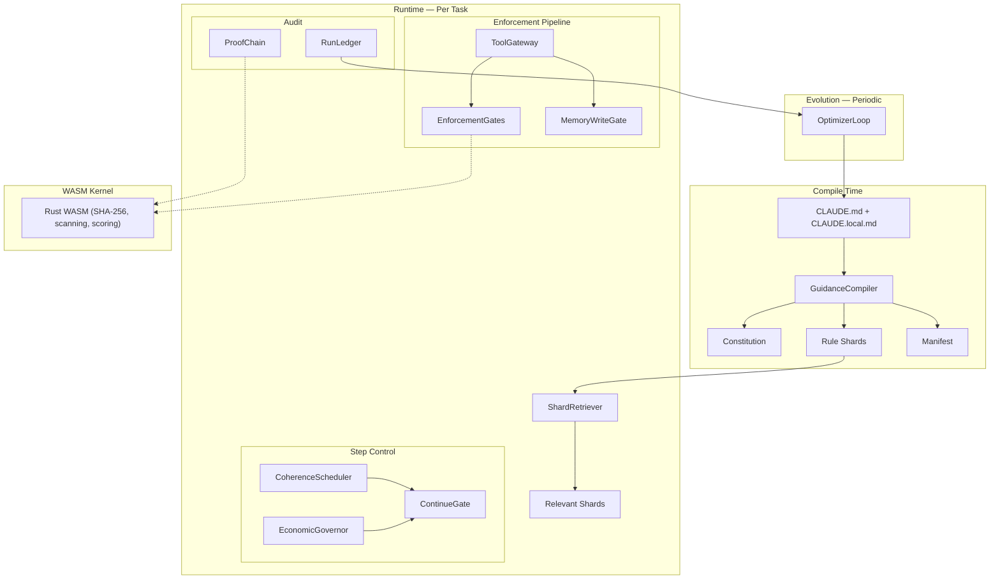
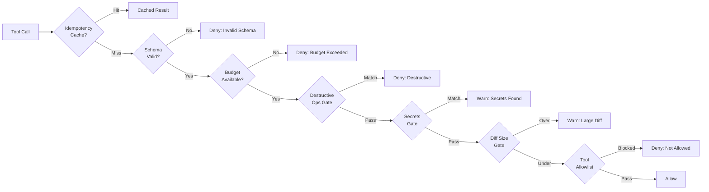
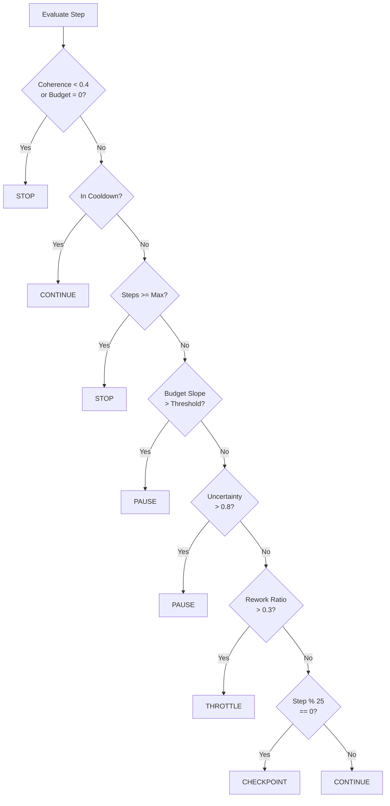
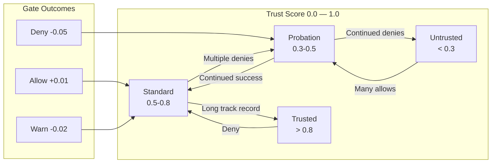
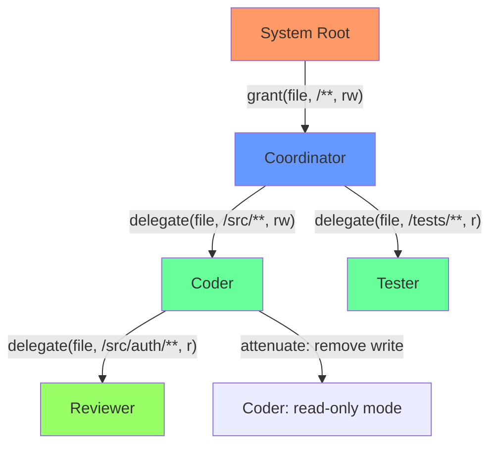
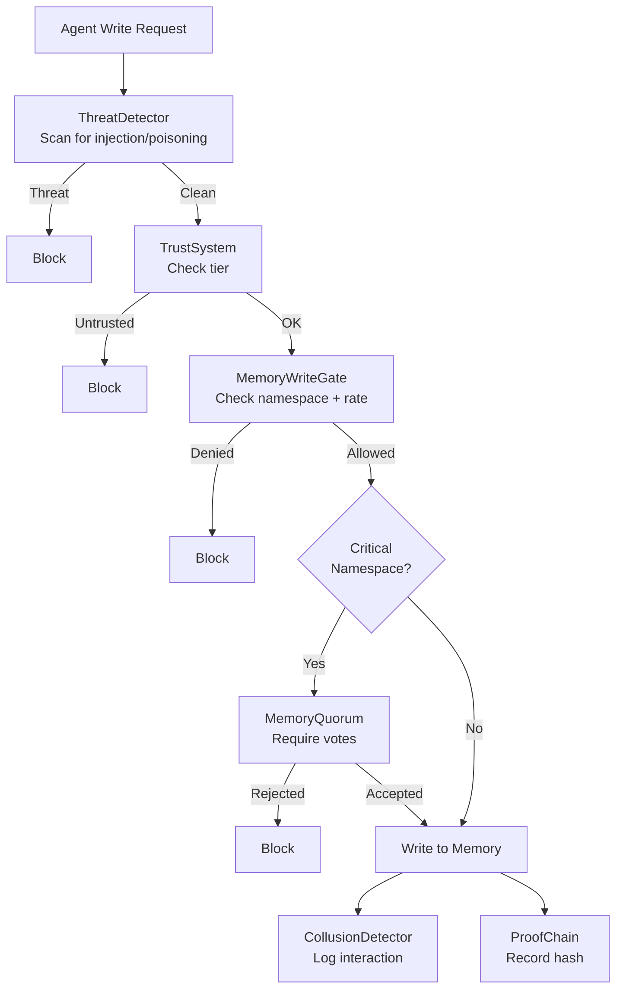
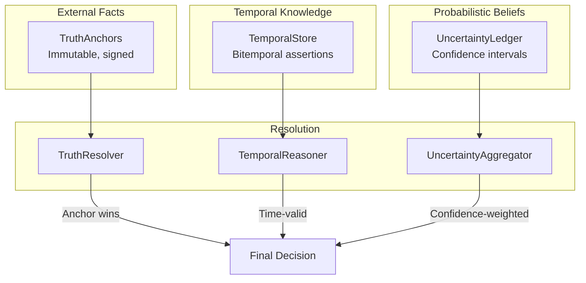
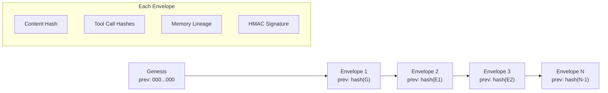
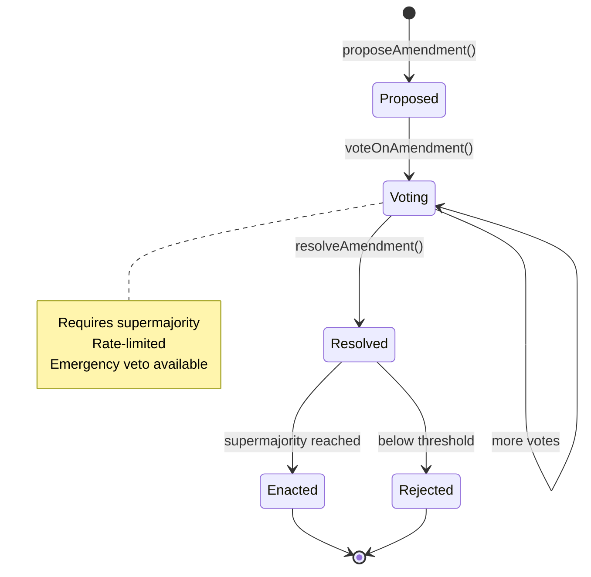

# System Diagrams

Mermaid diagrams for the Guidance Control Plane. Render with any Mermaid-compatible viewer (GitHub, VS Code, etc.).

## 1. Full System Overview



## 2. Enforcement Pipeline Detail



## 3. ContinueGate Decision Tree



## 4. Trust Accumulation



## 5. Capability Delegation Chain



## 6. Memory Security Layers



## 7. Knowledge Management Stack



## 8. Proof Chain Structure



## 9. Meta-Governance Amendment Lifecycle



## 10. Compile → Retrieve → Gate Lifecycle

```mermaid
sequenceDiagram
    participant Dev as Developer
    participant CP as ControlPlane
    participant Comp as Compiler
    participant Ret as Retriever
    participant G as Gates
    participant Led as Ledger
    participant Opt as Optimizer

    Dev->>CP: initialize()
    CP->>Comp: compile(CLAUDE.md)
    Comp-->>CP: PolicyBundle
    CP->>Ret: loadBundle(bundle)
    CP->>G: setActiveRules(rules)

    loop Per Agent Task
        Dev->>CP: retrieveForTask(description)
        CP->>Ret: retrieve(request)
        Ret-->>Dev: constitution + shards

        Dev->>CP: evaluateCommand(cmd)
        CP->>G: evaluateCommand(cmd)
        G-->>Dev: allow/deny/warn

        Dev->>CP: startRun()
        Note over Dev: agent works...
        Dev->>CP: finalizeRun()
        CP->>Led: evaluate(event)
    end

    Note over Opt: Weekly
    CP->>Opt: runCycle(ledger, bundle)
    Opt-->>CP: promoted[], demoted[], ADRs[]
```
